<!-- 说实话根本不知道自己在写什么。 -->
## 基本信息
题目：基于Apriori算法的Web数据挖掘
学生姓名：庞晓宇
学号：2020118100
指导教师：郝星星
院系：软件学院
专业：软件工程
年级：2020级


## 摘要
本文从算法的优势以及应用方面简单讲述了数据挖掘领域的相关技术，随后分析了如今的数据挖掘算法并引出了本文讲述的Apriori算法。该算法在进行完常规的数据采集和预处理操作后，构建了一种近邻和决策树两种数据挖掘分类模型，利用逐层搜索的迭代方法找出数据中项集的关系，在搜索频繁项集的过程中进行数据建模，从而形成规则。同时对每个元素进行技术，对数值小于项集阶数的特征进行记录。最后利用混淆矩阵对两种模型的准确率进行评估，得出准确率较高的数据模型。

In this paper, the advantages of the algorithm and the application of the relevant technology in the field of data mining is briefly described, and then the analysis of today's data mining algorithm and led to the Apriori algorithm described in this article. After the conventional data acquisition and preprocessing operations, the algorithm constructs two kinds of data mining classification models, namely the nearest neighbor and the decision tree. It uses the iterative method of layer by layer search to find out the relation of item sets in the data, and conducts data modeling in the process of searching frequent item sets, so as to form rules. At the same time, the technique is carried out for each element, and the characteristics whose value is less than the order of the item set are recorded. Finally, the accuracy of the two models is evaluated by the confusion matrix, and the data model with high accuracy is obtained.

关键词：Apriori算法、Web数据挖掘、关联规则分析、Python

Apriori, Web Data mining, Association rule analysis, Python

## 正文

### 1 引言
近年来，随着互联网的兴起，数据挖掘在信息产业界的关注度显著提高。主要是因为如今的网络中充斥着大量的数据，但是这些数据通常包含着大量的无用信息，我们迫切需要一种将这些数据转化成规则和知识的算法。
数据挖掘应运而生，其是一种从大量数据中通过算法搜索隐藏在其中知识的过程，通常在计算机科学领域被应用，通过与应用统计、机器学习和专家系统相结合来实现目标。
Python 是一种解释型、面向对象、动态数据类型的高级程序设计语言，由荷兰数学和计算机科学研究学会的吉多·范罗苏姆设计。其语法结构简单，并且拥有丰富的标准库，可以帮助处理各种工作。
使用Python，应用Apriori算法进行数据挖掘在各个领域都有一定的用武之地，其促使信息收集、分析和处理速度得到提升，并且增强的数据挖掘技术的效率。


### 2 算法优势
Apriori关联规则挖掘算法目前是数据挖掘领域的一个有效手段，其主要原理是通过特定的关联规则，首先找出所有支持度大于等于最小支持度间值的频繁项集，然后由频繁模式生成满足可信度阀值的关联规则。
对于数据挖掘，常用的算法还有FP-growth。该算法没有生成候选项集，树的子节点过多，如果只生成了包含前缀的树，那么会导致算法的效率大大下降。该算法需要递归生成树，内存开销大，且只适用于简单的关联规则的挖掘。
而Apriori算法因为采用逐层搜索的方式，可读性较高，没有复杂的理论推导过程，易于实现。采用水平的数据组织方式，适合事物数据库的关联规则挖掘。
Web数据挖掘是使用数据挖掘的技术从存储在因特网计算机中的超文本数据中发现潜在的、有用的模式和信息。基于对已有信息的分析，完成对事务的预测和判断。
随着互联网和数字化终端设备的普及，网络数据呈现出爆炸式的指数增长。截止到2021年初，全球的网民已经突破45亿，据IDC发布《数据时代2025》的报告显示，全球每年产生的数据将从2018年的33ZB增长到175ZB，相当于每天产生491EB的数据。
在过去的20年中，互联网的迅速发展使其成为世界上最大的公共数据源，数据挖掘使用前景逐渐扩大。其上的数据量非常巨大并且在不断的增长，包含的数据有着各种各样的类型并且没有统一的结构形式，通过浏览网页的方式来进行资料的搜集无疑会浪费大量的时间。
与传统数据和数据仓库相比，Web上的信息是非结构化或半结构化的、动态的、并且是容易造成混淆的，所以很难直接以Web网页上的数据进行数据挖掘，而必须经过必要的数据处理。
在互联网技术逐渐普及中，通过利用数据挖掘，把分散的数据集中起来，按照用户所需功能选择进行信息筛选挖掘。此项技术的数据整合效率极高，并且适应性优秀，借此可反映出各挖掘内容之间的统筹效果，从不同视角发现问题。
基于Python，使用经过优化后的Apriori算法，设置网络系统，可控制传送信息期间的错误率，支持筛查遗漏，自动完成补充。特别在面对大量的待处理任务中，可迅速实现归类对接，按照用户动作，改变运行程序。
综上所述，数据挖掘技术拥有显著的开发优势，并且经过今后的发展和研究，技术会更加成熟、应用会更加广泛。

### 3 应用原理
Web数据挖掘技术在网络条件下通过对用户信息的锁定，在实际使用中通过分析每个数据，对搜集到的各类资料进行过滤、预处理，基于用户的实际需求对结果进行排序，组成有效资料集合。在进一步经过资料的筛选和整合之后，对其中的信息进行归类及整合，在此基础上应用数据挖掘技术。
在数据挖掘的过程中，可能运用到多种爬虫算法，算法的选择可能会影响到数据挖掘的效率和准确度。对挖掘功能的实现方面，模拟用户进入页面之后进行文本和链接的提取，之后不断向外扩展，直至到达设定的深度或者形成闭环，以此完成对原始信息的获取。在信息获取的过程中，应明确信息来源，以方便进行后续的分析。之后将过滤和排序之后的数据传输到指定的动能模块，完成整合。最后利用搜索分系技术以获取到最终的知识。

Apriori算法是种最有影响的挖掘布尔关联规则频繁项集的算法。生成所有频繁项集和从频繁项集中生成所有可信关联规则是Apriori算法的两大核心步骤。该关联规则在分类上属于单维、单层、布尔关联规则。
算法的核心思想就是从原始数据中找到所有满足最小支持度的事务。如果一个事务包含一个项目集合X，那么它显然包含X的任何非空子集。这个属性被称为向下封闭属性，根据这个属性和最小支持度的阈值就可以快速的排除那些不可能是频繁项集的项集。
另外就是一定要对待挖掘的数据进行预处理，原始数据通常因为包含噪声和异常，通常都不适合直接被拿来进行数据挖掘。为了算法的高效性，一定要在预处理中对那些对最终结果影响不大的属性进行过滤，对长文本进行简化或编码，对数字进行归一化等。经过预处理之后，可以显著的降低在大量数据进行数据挖掘的计算资源消耗。
随后，根据经过优化后的Apriori算法的步骤，将预处理过后的数据按照预先设定的参数方案导入事先设计好的函数，对参数进行多次优化以取得最佳计算比对效率。
最后，将使用该Apriori算法的关联规则进行深入细致的分析和检验，以获得更多的实用性结论并将其应用到实际的数据挖掘实践和决策中去，切实提高其在数据挖掘领域的应用。

### 4 数据挖掘的爬虫算法

#### 4.1 优先算法
优先算法通常指的是广度优先算法和深度优先算法。其中，广度优先算法会建立一个队列，从初始给定的结点开始逐层进行遍历，在遍历的过程中将超文本和链接进行汇总，方便对各项目进行统计和分析，确保对挖掘对象的全面覆盖。
基于这种算法编写的爬虫的运算精准性较高，但是由于逐层遍历需要分析大量的目录，使得运算时间延长。使用广度优先算法可以精准的对一个页面进行分析，完成对链接的挖掘，同时队列方便进行多线程并行处理以提高运行速度。不过如果挖掘牵扯牵扯到了深层目录可能会对最终结果产生一定的影响。
在宽度优先搜索中，由于其是基于栈的结构，依据排序由浅至深进行访问，在每个结点上执行相同的操作，由于该算法搜索深度受到硬件设备的制约，且不好给定明确的结束条件，利用该算法实施深层的数据挖掘，尤其是互联网的数据挖掘，势必会造成大量的计算资源的消耗。

<!-- 
第一步：产生频繁项集，发现满足最小支持度阀值的所有项集，其原理是：如果一个项集是频繁的，则它的所有子集一定也是频繁的，反之，如果一个项集是非频繁项集，那么它的所有超集也是非频繁的。
第二步：产生规则，从上一步发现的频察项集中提取所有高置信度的规则，这些规则称作强规则，通常，须禁项集产生所需的计算资源远大于产生规则所需的计算资源。其具体原理为：由频繁项集生成k+1候选项集，即如果一个项集是频繁的，则它的所有子集一定也是频繁的。反之，如果一个项集是非频繁项集，那么它的所有超集也是非频繁的。特别重要，体现算法原理，节约计算资源，有3个关键点。
第三步：从k候选项集生成k+1候选项集。目标是频繁项集，此时，为节约计算资源，非频繁项集能不参与计算，而是让频繁k项集两两组合，保留k+1候选项集，逐步计算。
 -->
算法的主要步骤：
第1步：扫描全部数据，产生候选`1-项集`的集合 $C_1$
第2步：根据最小支持度，由候选`1-项集`的集合 $C_1$ 产生频繁`1-项集`的集合 $L_1$
第3步：对$k > 1$，重复步骤(4)(5)(6)
第4步：由 $L_k$ 执行连接和剪枝操作，产生候选`(k+1)-项集` $C_{k+1}$
第5步：根据最小支持度，由候选`(k+1)-项集`的集合 $C_{k+1}$ 产生频繁`(k+1)-项集`的集合 $L_{k+1}$
第6步：若L不为空集，则 $k = k+1$，跳往步骤(4)，否则跳往步骤(7)
第7步：根据最小置信度，由频繁项集产生强关联规则

#### 4.2 实验准备
Web爬虫从给定的起始页面开始，获取到页面数据后对其可用性进行评估。基于该评估，先对评估分值较大的页面进行遍历，以提高爬虫的效率。但是采用这种效率优化可能会导致实际的遍历与预期出现明显的偏差，从而导致挖掘到的信息准确性下降。对此，我们可以在计算之前为所有待选择的页面赋予一个初始的权值，等到数据获取完成之后的处理中将分值分配到各个链接的页面，之后进行一次计算并锁定该分数。然后令爬虫根据该锁定分数确定的优先级，优先去爬取那些下载值更大的页面。在该评估方法中，不涉及迭代等复杂的计算，是一种比较高效的评估方式，可以应用到具体的运算当中。
在整个挖掘过程中，一般都要经过多轮的迭代才能获取到最终的结果，这就必须要用到持久化技术。其中结构化存储能分类整合原本毫无章法可言的信息，以呈现明显的结构化特征，属于比较常用的技术方法。其能类从无结构数据中提取信息，处理成一种规则化的链接形式，并保存起来。对数据进行结构化的存储之后，挖掘算法的速率和准确性得到很大的提升。使其不仅适应了多链接信息的挖掘要求，而且可以按照存储结构进行调节，确保所有链接能迅速整合。
通过结构化存储，将来自Web空间中的结构化的表格、半结构化的网页以及其他超文本数据和多媒体，利用结构完成有效转换。与此同时，必须明确结构只是保存信息的形式，在数据挖掘的过程中我们还应当注重数据本身的类型，确保数据挖掘具备极高的准确性，以实现有效的功能整合。

#### 4.3 正则表达
数据通常是以超文本形式存储在互联网中的计算机中的，对应的页面通常包含着各种不同的语义对象，他们通常有着各自的标识。基于对使用超文本标记语言编写的页面进行分析，搭配适宜的正则表达式，可以方便的对相应字符串信息进行过滤、查找和提取。
当然，更多的使用这种方式从大量的字符串数据中快速的定位需要的内容，即对我们关注的信息进行定位。正则表达式匹配是一种提取信息的常用方法，其具有高可读性和高效性。现在很多语言都有相应的函数库对正则表达式进行支持，虽然表现方式可能不完全相同，但是实现的功能大同小异。
同时，为了适应现在互联网页面的高速变化，确保匹配过程的可靠性，用户能直接利用编程语言中自带的数据库和模型完成对内容的分析和提取。

关联规则就是支持度与置信度分别满足用户给定阈值的规则。所谓关联，反映一个事件与其他事件间关联的知识。支持度揭示了A和B同时出现的频率。置信度揭示了B出现时，A有多大的可能出现。关联规则的挖掘过程主要包括两个阶段：第一阶段为从海量原始数据中找出所有的高频项目组；第二阶段为从这些高频项目组产生关联规则。关联规则的出现通常暗示两件事务之间可能存在很强的关系。关联分析就是这样一种在大规模数据集中寻找关联规则的非监督学习算法，其利用一些量度对数据库中的强规则进行识别。


图1 Apriori算法测试执行驱动流程

Apriori算法的执行流程如图1所示。使用网上公开的情感分析词库，统计评论数据的情感指数，然后对此进行分析。可以先通过词云等可视化的方式来直观感受正向情绪和负向情绪的关键词，将“机器挖掘出的模型”与“人工感官上的评价”相比较，采用LDA等模型对挖掘出的信息进行提取，就可以得到用户的需求和意见。

### 5 Python下的数据挖掘

#### 5.1 爬虫功能
要基于Python语言，使用经过优化后的Apriori算法对Web页面的数据进行挖掘，首先要确定爬虫的具体功能，并按照用户的操作习惯，结合具体的系统功能以及现存的可用爬虫的特点进行基础的分析。在计算期间，使用Python的基础分析功能合理的扩大信息的涵盖范围，在此基础上根据各类信息和关键词在响应的数据挖掘中自动完成信息的定位，以对此进行扩展。
另外，对于信息存储结构的规划设计，不仅要具有稳定性而且要按照获取数据期间的链接统计完成链条的匹配。系统中爬虫的主要功能就是按照用户的访问习惯，对页面的实际情况进行重构，利用服务器的应答机制和数据处理期间获得的超链接对数据进行筛查。在随后的数据处理和信息整合之中，按照要求分析信息完成整合。
面对数据挖掘时牵扯到的所有功能实施合理化的调整，使得挖掘能适应多样化的信息结构。在信息分析中，提取页面的源代码进行进一步的信息整合，以提高信息整合的稳定性。对于不同场景下取得的数据，利用多样性的调整方式，增强数据的粘合度。

#### 5.2 数据表达
关于确定数据的表达方式应该着重考虑两个方面的问题，即数据挖掘和最后的实际应用要保持稳定；结合数据实际的表达水平。
在整体的规划中，通过筛选，找到最优的表达方式对信息的构建形式进行改进。此外，对于数据的表达方面还应当关注页面的访问过程。对此，可以基于元数据的体系加以确定，在表达方式上，反映各个操作之间的关联。
于此同时，在进行数据的筛选和表达构建的过程中，从不同的角度出发进行信息的整合以体现其中的综合控制水准，特别水在数据表达的规划设计环节，只有对不同功能的有效整合，才能发挥出元数据在数据表达多样性过程中的控制作用，基于此，对有用的内容进行捕捉及保存。
数据表达的规划设计环节，使用经过优化后的Apriori算法落实爬虫功能和提取信息挖掘提取中各功能间的有效控制。通过多样性的整合形式，优化信息的分层结构，完成结构化存储，实现信息挖掘、提取与形式构建的充分整合。增强信息综合控制的能力，并有效调整系统运转的状态，保障信息的综合表达效果，进一步优化表达步骤与形式。

#### 5.3 具体实现
基于经过优化的Apriori算法进行爬虫的编写，模型的构建以及运行，在此基础上同时运用结巴分词对数据进行预处理，使用snowNLP等库进行分析，对数据进行统计分析。其核心实现代码如下所示。

```python
C1 = []
for transaction in dataSet:
    for item in transaction:
        if not [item] in C1: # 遍历所有的元素，如果不在C1中，就将Item加入C1
            C1.append([item])
C1.sort() # 对C1中的元素进行排序
list(map(frozenset, C1)) # 使用frozenset是为了后面可以将这些值作为字典的键
```

通过对情感词典或语料库进行替换可以提高检测的精确性，snowNLP是一个功能强大的中文处理类库，其提供了中文分词、词性标注以及情感分析、文本分类、提取关键词等功能。
在数据获取结束后，通过对筛选后的指定页面的URL和网站代码进行分析和分类，经初步清洗、分词后，对噪声和无意义数据进行清洗，以简化数据，便于后续操作。
使用词云进行可视化后，利用清洗后的数据进行分析，运用自然语言处理等模型对数据进行处理进行情感分析。

### 6 结论
著名学者柏拉图曾经说过，需要是发明之母。在如今的网络环境下，我们迫切需要一种工具来满足我们从数据中发现知识的需求。Web数据挖掘逐渐显现出了其不容忽视的作用，其提供的各类数据库与计算，使数据挖掘的推进效率不断提高，并保障结果的准确性。数据挖掘已经并且将继续在我们从数据时代大步跨入信息时代的历程中做出贡献。本文基于优化改进后的Apriori算法，采用决策树等算法构建情感分类模型，对于非结构化的Web数据进行清洗处理，转化为结构化数据，通过词云可视化结果。

### 参考文献
<!-- 这都是瞎扯的，其实根本没扯，这就是原来这篇论文下面的参考资料。说实话我都不知道自己在写什么，我也没看懂这篇文章写的啥。 -->
[1] 杨迎.基于Python语言的Web数据挖掘与分析研究[J].现代信息科技, 2019(23):63-65.
[2] 韦建国,王建勇.基于Python的Web数据挖掘应用[J].浙江水利水电学院学报, 2019(4):79-82.
[3] 何远宏.基于Python语言的Web数据挖掘研究[J].计算机产品与流通, 2019(1):112.
[4] 曾展挺.面向云计算环境下Web数据挖掘技术[J].智能计算机与应用, 2021(1):167-169.
[5] 胡涛.基于关联规则的数据挖掘算法[J].电子技术与软件工程, 2018(2):186.
[6] 牛磊.基于数据挖掘的Web负载测试用户模型研究[D].哈尔滨：哈尔滨工程大学, 2019.
[7] 罗芳,徐阳,蒲秋梅,等.基于PageRank的多维度微博用户影响力度量[J].计算机应用研究, 2020(5):1354-1358.
[8] 齐慧.基于python的WEB数据挖掘技术实现与研究[J].软件工程, 2019(8):21-23.
[9] 黄雪华.基于Python的决策树算法在学生招生录取数据中的应用研究[J].电脑知识与技术, 2018(29):16-17.
[10] 马振宇,张威,吴纬,等.基于Web数据挖掘的个性化网络教学平台的研究[J].计算机时代, 2020(1):84-86+90.
[11] 尚京威,陈平,韩邢健.融合LDA的卷积神经网络主题爬虫研究[J].计算机工程与应用.2019(11):123-128+178.
[12] 景冰.基于主题网络爬虫思想的Web数据挖掘算法探讨[J].景德镇学院学报, 2020(3):66-68.
[13] 郁益斌.基于训练集聚类的KNN算法及其应用研究[D].青岛：山东科技大学,2017.

<!-- 这里才是真正的参考文献 -->
- [百度百科-数据挖掘](https://baike.baidu.com/item/%E6%95%B0%E6%8D%AE%E6%8C%96%E6%8E%98/216477)
- [知乎-什么是数据挖掘？](https://zhuanlan.zhihu.com/p/113445650)
- [知乎-Apriori算法详解](https://zhuanlan.zhihu.com/p/341882260)
- [百度百科-Python](https://baike.baidu.com/item/Python/407313)
- [CSDN-通俗易懂的Apriori算法](https://blog.csdn.net/caechen/article/details/120910229)
- [代码天地-数据挖掘两大经典算法(AP,FP)的优缺点](https://www.codetd.com/article/13340993)
- [CSDN-不可思议的数字：互联网每天到底能产生多少数据？](https://blog.csdn.net/cf2SudS8x8F0v/article/details/89324821)

<!-- 理论上可能要写的东西： -->
<!-- Fast Algorithms for Mining Association Rules -->

### 附录
Apriori算法代码
```python
# -*- coding: utf-8 -*-
from collections import defaultdict
from itertools import combinations
from sys import stdout


class cached_property(object):
    """A cached property only computed once
    """
    def __init__(self, func):
        self.func = func

    def __get__(self, obj, cls):
        if obj is None: return self
        value = obj.__dict__[self.func.__name__] = self.func(obj)
        return value


class Base(object):
    """A base workflow for Apriori algorithm
    """
    def _before_generate_frequent_itemset(self):
        """Invoked before generate_frequent_itemset()
        """
        pass

    def _after_generate_frequent_itemset(self):
        """Invoked before generate_frequent_itemset()
        """
        pass

    def generate_frequent_itemset(self):
        """Generate and return frequent itemset
        """
        raise NotImplementedError("generate_frequent_itemset(self) need to be implemented.")

    def _before_generate_rule(self):
        """Invoked before generate_frequent_itemset()
        """
        pass

    def _after_generate_rule(self):
        """Invoked before generate_frequent_itemset()
        """
        pass

    def generate_rule(self):
        """Generate and return rule
        """
        raise NotImplementedError("generate_rule(self) need to be implemented.")

    def run(self):
        """Run Apriori algorithm and return rules
        """
        # generate frequent itemset
        self._before_generate_frequent_itemset()
        self.generate_frequent_itemset()
        self._after_generate_frequent_itemset()
        # generate rule
        self._before_generate_rule()
        self.generate_rule()
        self._after_generate_rule()


class Apriori(Base):
    """A simple implementation of Apriori algorithm
        Example:
        
        dataset = [
            ['bread', 'milk'],
            ['bread', 'diaper', 'beer', 'egg'],
            ['milk', 'diaper', 'beer', 'cola'],
            ['bread', 'milk', 'diaper', 'beer'],
            ['bread', 'milk', 'diaper', 'cola'],
        ]
        minsup = minconf = 0.6

        apriori = Apriori(dataset, minsup, minconf)
        apriori.run()
        apriori.print_rule()

        Results:
            Rules
            milk --> bread (confidence = 0.75)
            bread --> milk (confidence = 0.75)
            diaper --> bread (confidence = 0.75)
            bread --> diaper (confidence = 0.75)
            beer --> diaper (confidence = 1.0)
            diaper --> beer (confidence = 0.75)
            diaper --> milk (confidence = 0.75)
            milk --> diaper (confidence = 0.75)
    """

    def __init__(self, transaction_list, minsup, minconf, selected_items=None):
        """Initialization
        :param transaction_list: a list cantains transaction
        :param minsup: minimum support
        :param minconf: minimum confidence
        :param selected_items: selected items in frequent itemset, default `None`
        """
        self.transaction_list = transaction_list
        self.transaction_list_full_length = len(transaction_list)
        self.minsup = minsup
        self.minconf = minconf
        if selected_items is not None and selected_items is not []:
            self.selected_items = frozenset(selected_items)
        else:
            self.selected_items = None

        self.frequent_itemset = dict()
        # support for every frequent itemset
        self.frequent_itemset_support = defaultdict(float)
        # convert transaction_list
        self.transaction_list = list([frozenset(transaction) \
            for transaction in transaction_list])

        self.rule = []

    def set_selected_items(self, selected_items):
        """Set selected items
        """
        self.selected_items = frozenset(selected_items)

    @cached_property
    def items(self):
        """Return all items in the self.transaction_list
        """
        items = set()
        for transaction in self.transaction_list:
            for item in transaction:
                items.add(item)
        return items

    def filter_with_minsup(self, itemsets):
        """Return subset of itemsets which satisfies minsup
        and record their support
        """
        local_counter = defaultdict(int)
        for itemset in itemsets:
            for transaction in self.transaction_list:
                if itemset.issubset(transaction):
                    local_counter[itemset] += 1
        # filter with counter
        result = set()
        for itemset, count in local_counter.items():
            support = float(count) / self.transaction_list_full_length
            if support >= self.minsup:
                result.add(itemset)
                self.frequent_itemset_support[itemset] = support
        return result

    def _after_generate_frequent_itemset(self):
        """Filter frequent itemset with selected items
        """
        if self.selected_items is None:
            return
        local_remove = []
        for key, val in self.frequent_itemset.items():
            for itemset in val:
                if not self.selected_items.issubset(itemset):
                    local_remove.append((key, itemset))
        for (key, itemset) in local_remove:
            self.frequent_itemset[key].remove(itemset)

    def generate_frequent_itemset(self):
        """Generate and return frequent itemset
        """
        def _apriori_gen(itemset, length):
            """Return candidate itemset with given itemset and length
            """
            # simply use F(k-1) x F(k-1) (itemset + itemset)
            return set([x.union(y) for x in itemset for y in itemset \
                if len(x.union(y)) == length])

        k = 1
        current_itemset = set()
        # generate 1-frequnt_itemset
        for item in self.items: current_itemset.add(frozenset([item]))
        self.frequent_itemset[k] = self.filter_with_minsup(current_itemset)
        # generate k-frequent_itemset
        while True:
            k += 1
            current_itemset = _apriori_gen(current_itemset, k)
            current_itemset = self.filter_with_minsup(current_itemset)
            if current_itemset != set([]):
                self.frequent_itemset[k] = current_itemset
            else:
                break
        return self.frequent_itemset

    def _generate_rule(self, itemset, frequent_itemset_k):
        """Generate rule with F(k) in DFS style
        """
        # make sure the itemset has at least two element to generate the rule
        if len(itemset) < 2:
            return
        for element in combinations(list(itemset), 1):
            rule_head = itemset - frozenset(element)
            confidence = self.frequent_itemset_support[frequent_itemset_k] / \
                self.frequent_itemset_support[rule_head]
            if confidence >= self.minconf:
                rule = ((rule_head, itemset - rule_head), confidence)
                # if rule not in self.rule, add and recall _generate_rule() in DFS
                if rule not in self.rule:
                    self.rule.append(rule);
                    self._generate_rule(rule_head, frequent_itemset_k)

    def generate_rule(self):
        """Generate and return rule
        """
        # generate frequent itemset if not generated
        if len(self.frequent_itemset) == 0:
            self.generate_frequent_itemset()
        # generate in DFS style
        for key, val in self.frequent_itemset.items():
            if key == 1:
                continue
            for itemset in val:
                self._generate_rule(itemset, itemset)
        return self.rule

    def print_frequent_itemset(self):
        """Print out frequent itemset
        """
        stdout.write('======================================================\n')
        stdout.write('Frequent itemset:\n')
        for key, val in self.frequent_itemset.items():
            #stdout.write('frequent itemset size of {0}:\n'.format(key))
            for itemset in val:
                stdout.write('(')
                stdout.write(', '.join(itemset))
                stdout.write(')')
                stdout.write('  support = {0}\n'.format(round(self.frequent_itemset_support[itemset], 3)))
        stdout.write('======================================================\n')

    def print_rule(self):
        """Print out rules
        """
        stdout.write('======================================================\n')
        stdout.write('Rules:\n')
        for rule in self.rule:
            head = rule[0][0]
            tail = rule[0][1]
            confidence = rule[1]
            stdout.write('(')
            stdout.write(', '.join(head))
            stdout.write(')')
            stdout.write(' ==> ')
            stdout.write('(')
            stdout.write(', '.join(tail))
            stdout.write(')')
            stdout.write('  confidence = {0}\n'.format(round(confidence, 3)))
        stdout.write('======================================================\n')


class ImprovedApriori(Apriori):
    """Use Hash to filter frequent itemsets
    """

    def filter_with_minsup(self, itemsets):
        """Return subset of itemset which satisfies minsup
        and record their support
        """
        for itemset in itemsets:
            k = len(itemset)
            break
        local_counter = defaultdict(int)
        for transaction in self.transaction_list:
            for itemset in combinations(list(transaction), k):
                if frozenset(itemset) in itemsets:
                    local_counter[frozenset(itemset)] += 1
        # filter with counter
        result = set()
        for itemset, count in local_counter.items():
            support = float(count) / self.transaction_list_full_length
            if support >= self.minsup:
                result.add(itemset)
                self.frequent_itemset_support[itemset] = support
        return result
```

<!-- 害怕怕，这课程都没有好好听，不知道老师能不能让我过。┭┮﹏┭┮ -->
