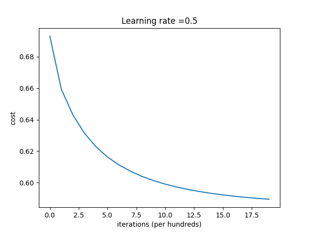

## 代码
```python
import matplotlib.pyplot as plt
import numpy as np
from sklearn.model_selection import train_test_split

# 导入数据
data = np.array([[0.697, 0.460, 1],
                 [0.774, 0.376, 1],
                 [0.634, 0.264, 1],
                 [0.608, 0.318, 1],
                 [0.556, 0.215, 1],
                 [0.403, 0.237, 1],
                 [0.481, 0.149, 1],
                 [0.437, 0.211, 1],
                 [0.666, 0.091, 0],
                 [0.243, 0.267, 0],
                 [0.245, 0.057, 0],
                 [0.343, 0.099, 0],
                 [0.639, 0.161, 0],
                 [0.657, 0.198, 0],
                 [0.360, 0.370, 0],
                 [0.593, 0.042, 0],
                 [0.719, 0.103, 0]])
# 定义变量
X = data[:, 0:2]
y = data[:, 2]
# 随机划分训练集和测试集
X_train, X_test, Y_train, Y_test = train_test_split(
    X, y, test_size=0.25, random_state=33)
# 定义sigmoid


def sigmoid(z):
    s = 1 / (1 + np.exp(-z))
    return s


def initialize_with_zeros(dim):
    """
    This function creates a vector of zeros of shape (dim, 1) for w and initializes b to 0.
    """
    w = np.zeros((dim, 1))
    b = 0
    assert (w.shape == (dim, 1))
    assert (isinstance(b, float) or isinstance(b, int))
    return w, b


def propagate(w, b, X, Y):
    """
    Implement the cost function and its gradient for the propagation explained above
    """
    m = X.shape[1]
    A = sigmoid(np.dot(w.T, X) + b)
    # 计算损失
    cost = -np.sum(Y * np.log(A) + (1 - Y) * np.log(1 - A)) / m

    dw = np.dot(X, (A - Y).T) / m
    db = np.sum(A - Y) / m

    assert (dw.shape == w.shape)
    assert (db.dtype == float)
    cost = np.squeeze(cost)
    assert (cost.shape == ())

    grads = {"dw": dw,
             "db": db}
    return grads, cost


def optimize(w, b, X, Y, num_iterations, learning_rate, print_cost=False):
    """
    This function optimizes w and b by running a gradient descent algorithm
    """
    costs = []

    for i in range(num_iterations):
        grads, cost = propagate(w, b, X, Y)
        # Retrieve derivatives from grads
        dw = grads["dw"]
        db = grads["db"]
        # update rule
        w = w - learning_rate * dw
        b = b - learning_rate * db
        # Record the costs
        if i % 100 == 0:
            costs.append(cost)
        # Print the cost every 100 training iterations
        if print_cost and i % 100 == 0:
            print("Cost after iteration %i: %f" % (i, cost))

    params = {"w": w,
              "b": b}
    grads = {"dw": dw,
             "db": db}
    return params, grads, costs


def predict(w, b, X):
    '''
    Predict whether the label is 0 or 1 using learned logistic regression parameters (w, b)
    '''
    m = X.shape[1]
    Y_prediction = np.zeros((1, m))
    w = w.reshape(X.shape[0], 1)

    # Compute vector "A" predicting the probabilities of a cat being present in the picture
    A = sigmoid(np.dot(w.T, X) + b)
    for i in range(A.shape[1]):
        # Convert probabilities A[0,i] to actual predictions p[0,i]
        if A[0, i] >= 0.5:
            Y_prediction[0, i] = 1
        else:
            Y_prediction[0, i] = 0
        pass
    assert (Y_prediction.shape == (1, m))

    return Y_prediction


def model(X_train, Y_train, X_test, Y_test, num_iterations, learning_rate, print_cost=False):
    # initialize parameters with zeros (≈ 1 line of code)
    w, b = initialize_with_zeros(X_train.shape[0])

    # Gradient descent (≈ 1 line of code)
    parameters, grads, costs = optimize(
        w, b, X_train, Y_train, num_iterations, learning_rate, print_cost)

    # Retrieve parameters w and b from dictionary "parameters"
    w = parameters["w"]
    b = parameters["b"]

    # Predict test/train set examples (≈ 2 lines of code)
    Y_prediction_test = predict(w, b, X_test)
    Y_prediction_train = predict(w, b, X_train)

    # Print train/test Errors
    print("train accuracy: {} %".format(
        100 - np.mean(np.abs(Y_prediction_train - Y_train)) * 100))
    print("test accuracy: {} %".format(
        100 - np.mean(np.abs(Y_prediction_test - Y_test)) * 100))

    d = {"costs": costs,
         "Y_prediction_test": Y_prediction_test,
         "Y_prediction_train": Y_prediction_train,
         "w": w,
         "b": b,
         "learning_rate": learning_rate,
         "num_iterations": num_iterations}

    return d


X_train = X_train.T
Y_train = Y_train.T.reshape(1, X_train.shape[1])
X_test = X_test.T
Y_test = Y_test.T.reshape(1, X_test.shape[1])
d = model(X_train, Y_train, X_test, Y_test, num_iterations=2000,
          learning_rate=0.5, print_cost=True)
# Plot learning curve (with costs)
costs = np.squeeze(d['costs'])
plt.plot(costs)
plt.ylabel('cost')
plt.xlabel('iterations (per hundreds)')
plt.title("Learning rate =" + str(d["learning_rate"]))
plt.show()
```


## 输出
```
Cost after iteration 0: 0.693147
Cost after iteration 100: 0.659299
Cost after iteration 200: 0.643045
Cost after iteration 300: 0.631392
Cost after iteration 400: 0.622790
Cost after iteration 500: 0.616263
Cost after iteration 600: 0.611188
Cost after iteration 700: 0.607159
Cost after iteration 800: 0.603902
Cost after iteration 900: 0.601231
Cost after iteration 1000: 0.599015
Cost after iteration 1100: 0.597158
Cost after iteration 1200: 0.595590
Cost after iteration 1300: 0.594257
Cost after iteration 1400: 0.593118
Cost after iteration 1500: 0.592141
Cost after iteration 1600: 0.591300
Cost after iteration 1700: 0.590574
Cost after iteration 1800: 0.589945
Cost after iteration 1900: 0.589399
train accuracy: 58.33333333333333 %
test accuracy: 80.0 %
```


## 图像

