## 10.1 k近邻学习
k近邻（k-Nearest Neighbor，kNN）学习是一种常用的监督学习方法：
- 确定训练样本，以及某种距离度量。
- 对于某个给定的测试样本，找到训练集中距离最近的k个样本，对于分类问题使用“投票法”获得预测结果，对于回归问题使用“平均法”获得预测结果。还可基于距离远近进行加权平均或加权投票，距离越近的样本权重越大。
  - 投票法：选择这k个样本中出现最多的类别标记作为预测结果。
  - 平均法：将这k个样本的实值输出标记的平均值作为预测结果。

K近邻学习没有显式的训练过程，属于“懒惰学习”。
- “懒惰学习”（lazy learning）：此类学习技术在训练阶段仅仅是把样本保存起来，训练时间开销为零，待收到测试样本后再进行处理。
- “急切学习”（eager learning）：在训练阶段就对样本进行学习处理的方法。

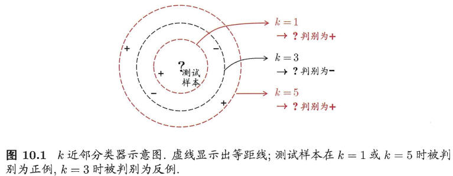
k近邻分类器中的k是一个重要参数，当k取不同值时，分类结果会有显著不同。另一方面，若采用不同的距离计算方式，则找出的“近邻”可能有显著差别，从而也会导致分类结果有显著不同。

暂且假设距离计算是“恰当”的，即能够恰当地找出k个近邻，我们来对“最近邻分类器”（1NN，即k=1）在二分类问题上的性能做一个简单的讨论。
给定测试样本 $\pmb{x}$，若其最近邻样本为 $\pmb{z}$，则最近邻出错的概率就是 $\pmb{x}$ 与 $\pmb{z}$ 类别标记不同的概率，即： $P(err) = 1 - \sum_{c \in \mathcal{Y}} P(c | \pmb{x} P(c | \pmb{z})$ 。
令 $c^* = \argmax_{c \in \mathcal{Y}} P(c | \pmb{x})$ 表示贝叶斯最优分类器的结果，有：
$$
\begin{aligned}
P(e r r) & =1-\sum_{c \in \mathcal{Y}} P(c \mid \boldsymbol{x}) P(c \mid \boldsymbol{z}) \\
& \simeq 1-\sum_{c \in \mathcal{Y}} P^{2}(c \mid \boldsymbol{x}) \\
& \leqslant 1-P^{2}\left(c^{*} \mid \boldsymbol{x}\right) \\
& =\left(1+P\left(c^{*} \mid \boldsymbol{x}\right)\right)\left(1-P\left(c^{*} \mid \boldsymbol{x}\right)\right) \\
& \leqslant 2 \times\left(1-P\left(c^{*} \mid \boldsymbol{x}\right)\right)
\end{aligned}
$$

结论：最近邻分类虽简单，但它的泛化错误率不超过贝叶斯最优分类器错误率的两倍！

## 10.2 低维嵌入
上述讨论基于一个重要的假设：任意测试样本 $\pmb{x}$ 附近的任意小的 $\delta$ 距离范围内总能找到一个训练样本，即训练样本的采样密度足够大，或称为“密采样”。然而，这个假设在现实任务中通常很难满足。
现实应用中属性维数经常成千上万，要满足密采样条件所需的样本数目是无法达到的天文数字。许多学习方法都涉及距离计算，而高维空间会给距离计算带来很大的麻烦，例如当维数很高时甚至连计算内积都不再容易。
在高维情形下出现的数据样本稀疏、距离计算困难等问题，是所有机器学习方法共同面临的严重障碍，被称为“维数灾难”（curse of dimensionality）。

缓解维数灾难的一个重要途径是降维（dimension reduction）/维数约简，即通过某种数学变换，将原始高维属性空间转变为一个低维“子空间”（subspace），在这个子空间中样本密度大幅度提高，距离计算也变得更为容易。

为什么能进行降维？
数据样本虽然是高维的，但与学习任务密切相关的也许仅是某个低维分布，即高维空间中的一个低维“嵌入”（embedding），因而可以对数据进行有效的降维。
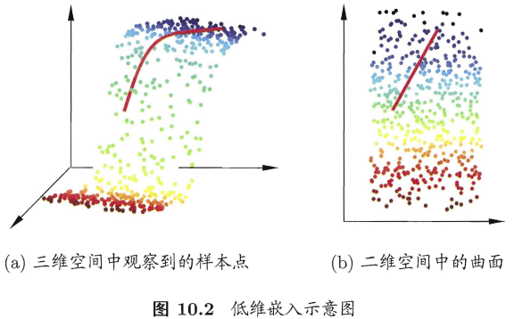

若要求原始空间中样本之间的距离在低维空间中得以保持，即得到“多维缩放”（Multiple Dimensional Scaling，MDS）：
假定有m个样本，在原始空间中的距离矩阵为 $D \in \mathbb{R}^{m \times m}$ ，其第i行j列元素 $\text{dist}_{ij}$ 为样本 $\pmb{x}_i$ 到 $\pmb{x}_j$ 的距离。
目标：获得样本在 $d'$ 维空间中的欧氏距离等于原始空间中的距离，即 $\|\pmb{z}_i-\pmb{z}_j\| = \text{dist}_{ij}$ 。
令 $\pmb{B} = \pmb{Z}^T \pmb{Z} \in \mathbb{R}^{m \times m}$ ，其中 $\pmb{B}$ 为降维后的内积矩阵， $b_{ij} = \pmb{z}_i^T \pmb{z}_j$ ，有：$\text{dist}_{ij}^2 = \|\pmb{z}_i\|^2 + \|\pmb{z}_j\|^2 - 2 \pmb{z}_i^T \pmb{z}_j = b_{ii} + b_{jj} - 2 b_{ij}$ 。

为便于讨论，令降维后的样本 $\pmb{Z}$ 被中心化，即 $\sum_{i=1}^m \pmb{z}_i = 0$ 。显然，矩阵 $\pmb{B}$ 的行与列之和均为零，即： $\sum_{i=1}^m b_{ij} = \sum_{j=1}^m b_{ij} = 0$ 。易知：
- $\sum_{i=1}^m \text{dist}_{ij}^2 = tr(\pmb{B}) + m b_{jj}$ ，
- $\sum_{j=1}^m \text{dist}_{ij}^2 = tr(\pmb{B}) + m b_{ii}$ 。
- $\sum_{i=1}^m \sum_{j=1}^m \text{dist}_{ij}^2 = 2 m \text{tr}(\pmb{B})$ 。

其中 $\text{tr}(\cdot)$ 表示矩阵的迹（trace）， $\text{tr}(\pmb{B}) = \sum_{i=1}^m \| \pmb{z}_i \|^2$ 。令：
- $\text{dist}_{i \cdot}^2 = \frac{1}{m} \sum_{j=1}^m \text{dist}_{ij}^2$ ，
- $\text{dist}_{\cdot j}^2 = \frac{1}{m} \sum_{i=1}^m \text{dist}_{ij}^2$ ，
- $\text{dist}_{\cdot \cdot}^2 = \frac{1}{m^2} \sum_{i=1}^m \sum_{j=1}^m \text{dist}_{ij}^2$ 。

由此即可通过降维前后保持不变的距离矩阵 $\pmb{D}$ 求取内积矩阵 $\pmb{B}$ ： $b_{ij} = -\frac{1}{2} \left( \text{dist}_{ij}^2 - \text{dist}_{i \cdot}^2 - \text{dist}_{\cdot j}^2 + \text{dist}_{\cdot \cdot}^2 \right)$ 。

对矩阵 $\pmb{B}$ 做特征值分解（eigenvalue decomposition）： $\pmb{B} = \pmb{V} \pmb{\Lambda} \pmb{V}^T$ ，其中 $\pmb{\Lambda} = diag(\lambda_1, \lambda_2, \ldots, \lambda_d)$ 为特征值构成的对角矩阵， $\lambda_1 \geq \lambda_2 \geq \cdots \geq \lambda_d$ 为特征向量矩阵，假定其中有 $d^*$ 个非零正特征值，它们构成对角矩阵 $\pmb{\Lambda}_* = diag(\lambda_1, \lambda_2, \ldots, \lambda_{d_*})$ ， $\pmb{V}$ 为特征向量矩阵。
令 $\pmb{V}_*$ 表示相应的特征矩阵，则 $\pmb{Z}$ 可表达为： $\pmb{Z} = \lambda_*^{1/2} \pmb{V}_*^T \in \mathbb{R}^{d^* \times m}$ 。
$$
\mathrm{B}=V\left(\begin{array}{lll}
\lambda_{1} & & 0 \\
& \ddots & \\
0 & & \lambda_{n}
\end{array}\right) V^{\prime}=V\left(\begin{array}{ccc}
\sqrt{\lambda_{1}} & & 0 \\
& \ddots & \\
0 & & \sqrt{\lambda_{n}}
\end{array}\right) \underbrace{\left(\begin{array}{ccc}
\sqrt{\lambda_{1}} & & 0 \\
& \ddots & \\
0 & & \sqrt{\lambda_{n}}
\end{array}\right)}_{Z} V^{\prime}
$$

在现实应用中为了有效降维，往往仅需降维后的距离与原始空间中的距离尽可能接近，而不必严格相等。此时可取 $d' << d$ 个最大特征值构成对角矩阵 $\tilde{\pmb{\Lambda}} = diag(\lambda_1, \lambda_2, \ldots, \lambda_{d'})$ ， 令 $\tilde{\pmb{V}}$ 表示相应的特征向量矩阵，则 $\pmb{Z}$ 可表达为： $\pmb{Z} = \tilde{\lambda}^{1/2} \tilde{\pmb{V}}^T \in \mathbb{R}^{d' \times m}$ 。
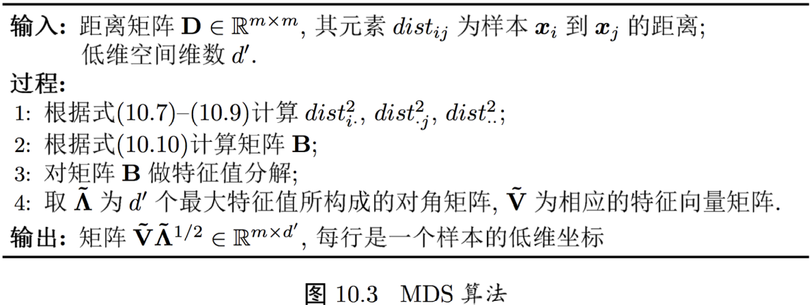

一般来说，欲获得低维子空间，最简单的是对原始高维空间进行线性变换。给定d维空间中的样本 $\pmb{X} = \{\pmb{x}_1, \pmb{x}_2, \ldots, \pmb{x}_m\} \in \mathbb{R}^{d \times m}$ ，变换之后得到 $d' \leq d$ 维空间中的样本 $\pmb{Z} = \pmb{W}^T \pmb{X}$ ，
其中， $\pmb{W} \in \mathbb{R}^{d \times d'}$ 是变换矩阵， $\pmb{Z} \in \mathbb{R}^{d' \times m}$ 是样本在新空间中的表达。

变换矩阵 $\pmb{W}$ 可视为 $d'$ 个d维属性向量。换言之， $\pmb{z}_i$ 是原属性向量 $\pmb{x}_i$ 在新坐标系 $\{\pmb{w}_1, \pmb{w}_2, \ldots, \pmb{w}_{d'}\}$ 中的坐标轴向量。若 $\pmb{w}_i$ 与 $\pmb{w}_j \quad i \neq j)$ 正交，则新坐标系是一个正交坐标系，此时 $\pmb{W}$ 为正交变换。显然，新空间中的属性是原空间中的属性的线性组合。
基于线性变换来进行降维的方法称为线性降维方法，对低维子空间性质的不同要求可通过对 $\pmb{W}$ 施加不同的约束来实现。

## 10.3 主成分分析
主成分分析（Principal Component Analysis，PCA）是最常用的一种降维方法。

对于正交属性空间中的样本点，如何用一个超平面（直线的高维推广）对所有样本进行恰当的表达？
容易想到，若存在这样的超平面，那么它大概应具有这样的性质：
- 最近重构性：样本点到这个超平面的距离都足够近；
- 最大可分性：样本点在这个超平面上的投影能尽可能分开。

基于最近重构性和最大可分性，能分别得到主成分分析的两种等价推导。

最近重构性的推导：
对样本进行中心化， $\sum_i \pmb{x}_i = 0$ ，再假定投影变换后得到的新坐标系为 $\{\pmb{w}_1, \pmb{w}_2, \ldots, \pmb{w}_{d}\}$ ，其中 $\pmb{w}_i$ 是标准正交基向量， $\|\pmb{w}_i\|_2 = 1, \quad \pmb{w}_i^T \pmb{w}_j = 0 \quad (i \neq j)$ 。
若丢弃新坐标系中的部分坐标，即将维度降低到 $d' < d$ ，则样本点在低维坐标系中的投影是 $\pmb{z}_i = (z_{i1}; z_{i2}; \ldots; z_{id'}), \quad z_{ij} = \pmb{w}_i^T \pmb{x}_j$ 是 $\pmb{x}_i$ 在低维坐标下第j维的坐标，若基于 $\pmb{z}_i$ 来重构 $\pmb{x}_i$ ，则会得到： $\hat{\pmb{x}}_i = \sum_{j=1}^{d'} z_{ij} \pmb{w}_j$ 。
考虑整个训练集，原样本点 $\pmb{x}_i$ 与基于投影重构的样本点 $\hat{\pmb{x}}_i$ 之间的距离为：
$$
\begin{aligned}
\sum_{i=1}^{m}\left\|\sum_{j=1}^{d^{\prime}} z_{i j} \boldsymbol{w}_{j}-\boldsymbol{x}_{i}\right\|_{2}^{2} & =\sum_{i=1}^{m} \boldsymbol{z}_{i}^{\mathrm{T}} \boldsymbol{z}_{i}-2 \sum_{i=1}^{m} \boldsymbol{z}_{i}^{\mathrm{T}} \mathbf{W}^{\mathrm{T}} \boldsymbol{x}_{i}+\mathrm{const} \\
& \propto-\operatorname{tr}\left(\mathbf{W}^{\mathrm{T}}\left(\sum_{i=1}^{m} \boldsymbol{x}_{i} \boldsymbol{x}_{i}^{\mathrm{T}}\right) \mathbf{W}\right)
\end{aligned}
$$
根据最近重构性应最小化上式。考虑到 $\pmb{w}_j$ 是标准正交基向量， $\sum_i \pmb{x}_i \pmb{x}_i^T$ 是协方差矩阵，有 $\min_{\pmb{W}} -\text{tr}(\pmb{W}^T \pmb{X} \pmb{X}^T \pmb{W}) \quad \text{s.t.} \pmb{W}^T \pmb{W} = \pmb{I}$ 。

最大可分性的推导：
样本点 $\pmb{x}_i$ 在新空间中超平面上的投影是 $\pmb{W}^T \pmb{x}_i$ ，若所有样本点的投影能尽可能分开，则应该使得投影后样本点的方差最大化。若投影后样本点的方差是 $\sum_i \pmb{W}^T \pmb{x}_i \pmb{x}_i^T \pmb{W}$ ，于是优化目标可写为： $\max_{\pmb{W}} \text{tr}(\pmb{W}^T \pmb{X} \pmb{X}^T \pmb{W}) \quad \text{s.t.} \pmb{W}^T \pmb{W} = \pmb{I}$ ，显然与 $\min_{\pmb{W}} -\text{tr}(\pmb{W}^T \pmb{X} \pmb{X}^T \pmb{W}) \quad \text{s.t.} \pmb{W}^T \pmb{W} = \pmb{I}$ 等价。
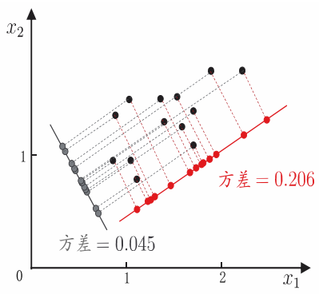
对优化式使用拉格朗日乘子法可得： $\pmb{X} \pmb{X}^T \pmb{W} = \lambda \pmb{W}$ ，只需对协方差矩阵 $\pmb{X} \pmb{X}^T$ 进行特征值分解，并将求得的特征值排序： $\lambda_1 \geq \lambda_2 \geq \ldots \geq \lambda_d$ ，再取前 $d'$ 个特征值对应的特征向量构成 $\pmb{W} = (\pmb{w}_1, \pmb{w}_2, \ldots, \pmb{w}_{d'})$ ，这就是主成分分析的解。
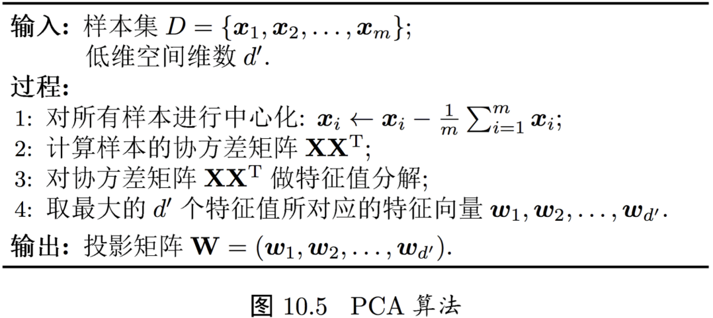
不同的低维空间中对k近邻分类器（或其它开销较小的学习器）进行交叉验证来选取较好的 $d'$ 值。对PCA，还可从重构的角度设置一个重构阈值，例如 $t=95%$ ，然后选取使下式成立的最小 $d'$ 值： $\frac{\sum_{i=1}^{d'} \lambda_i}{\sum_{i=1}^{d} \lambda_i} \geq t$ 。
PCA仅需保留 $\pmb{W}$ 与样本的均值向量即可通过简单的向量减法和矩阵-向量乘法将新样本投影至低维空间中。

降维虽然会导致信息的损失，但一方面舍弃这些信息后能使得样本的采样密度增大，另一方面，当数据受到噪声影响时，最小的特征值所对应的特征向量往往与噪声有关，舍弃可以起到去噪效果。

## 10.4 核化线性降维
线性降维方法假设从高维空间到低维空间的函数映射是线性的，然而，在不少现实任务中，可能需要非线性映射才能找到恰当的低维嵌入：
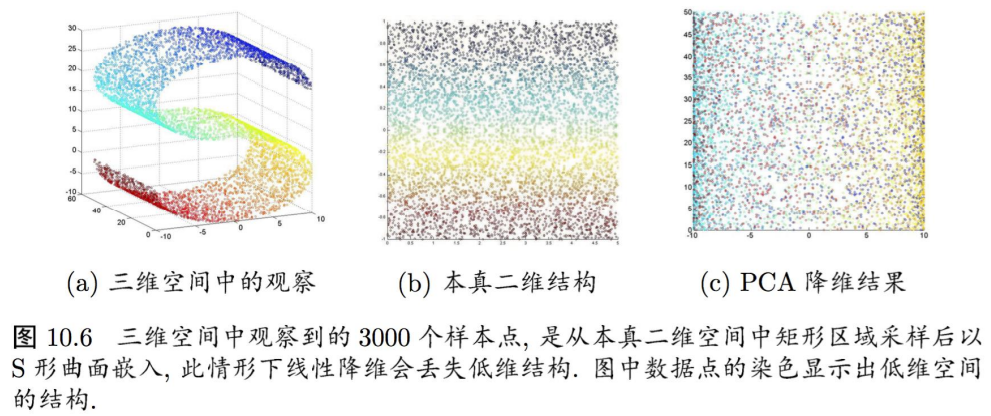

非线性降维的一种常用方法，是基于核技巧对线性降维方法进行“核化”（kernelized）。

以下为核主成分分析（Kernelized PCA，KPCA）的算法描述：
假定我们将在高维特征空间中把数据投影到由 $\pmb{W}$ 确定的超平面上，即PCA欲求解： $(\sum_{i=1}^m \pmb{z}_i \pmb{z}_i^T) \pmb{W} = \lambda \pmb{W}$ ，其中 $\pmb{z}_i$ 是样本点 $\pmb{x}_i$ 在高维特征空间中的像。令 $\pmb{\alpha_i} = \frac{1}{\lambda} \pmb{z}_i^T \pmb{W}$ ， $\pmb{W} = \frac{1}{\lambda} (\sum_{i=1}^m \pmb{z}_i \pmb{z}_i^T) \pmb{W} = \sum_{i=1}^m \pmb{z}_i \frac{\pmb{z}_i^T \pmb{W}}{\lambda} = \sum_{i=1}^m \pmb{z}_i \pmb{\alpha}_i$ ，
假定 $\pmb{z}_i$ 是由原始属性空间中的样本点 $\pmb{x}_i$ 通过映射 $\Phi$ 产生，即 $\pmb{z}_i = \Phi(\pmb{x}_i), \quad i=1,2,\ldots,m$ ，
若 $Phi$ 能被显式表达出来，则通过它将样本映射至高维空间，再在特征空间中实施PCA即可，即有 $(\sum_{i=1}^m \Phi (\pmb{x}_i) \Phi (\pmb{x}_i)^T) \pmb{W} = \lambda \pmb{W}$ ，
并且 $\pmb{W} = \sum_{i=1}^m \Phi (\pmb{x}_i) \pmb{\alpha}_i$ 。

一般情形下，我们不清楚 $\Pgi$ 的具体形式，于是引入核函数 $\kappa(\pmb{x}_i, \pmb{x}_j) = \Phi(\pmb{x}_i)^T \Phi(\pmb{x}_j)$ ，
又由 $\pmb{W} = \sum_{i=1}^m \Phi (\pmb{x}_i) \pmb{\alpha}_i$ ，代入优化式 $(\sum_{i=1}^m \Phi (\pmb{x}_i) \Phi (\pmb{x}_i)^T) \pmb{W} = \lambda \pmb{W}$ ，有 $\pmb{\Kappa} \pmb{A} = \lambda \pmb{A}$ ，其中 $\pmb{\Kappa}$ 为 $\kappa$ 对应的核矩阵， $(\pmb{\Kappa})_{ij} = \kappa(\pmb{x}_i, \pmb{x}_j)$ ， $\pmb{A} = (\pmb{\alpha}_1; \pmb{\alpha}_2; \ldots; \pmb{\alpha}_m)$ 。
上式为特征值分解问题，取 $\pmb{\Kappa}$ 最大的 $d'$ 个特征值对应的特征向量得到解。

对新样本 $\pmb{x}$ ，其投影后的第 $j(j=1,2,\ldots,d')$ 维坐标为： $z_j = \pmb{w}_j^T \Phi(\pmb{x}) = \sum_{i=1}^m \alpha_i^j \Phi(\pmb{x}_i)^T \Phi(\pmb{x})$ ，
其中 $\pmb{\alpha}_i$ 已经过规范化， $\alpha_i^j$ 是 $\pmb{\alpha}_i$ 的第j个分量。由该式可知，为获得投影后的坐标，KPCA需对所有样本求和，因此它的计算开销较大。

## 10.5 流形学习
流形学习（manifold learning）是一类借鉴了拓扑流形概念的降维方法。“流形”是在局部与欧氏空间同胚的空间，换言之，它在局部具有欧氏空间的性质，能用欧氏距离来进行距离计算。
若低维流形嵌入到高维空间中，则数据样本在高维空间的分布虽然看上去非常复杂，但在局部上仍具有欧氏空间的性质，因此，可以容易地在局部建立降维映射关系，然后再设法将局部映射关系推广到全局。
当维数被降至二维或三维时，能对数据进行可视化展示，因此流形学习也可被用于可视化。

### 10.5.1 等度量映射
低维流形嵌入到高维空间之后，直接在高维空间中计算直线距离具有误导性，因为高维空间中的直线距离在低维嵌入流形上不可达。而低维嵌入流形上两点间的本真距离是“测地线”（geodesic）距离。
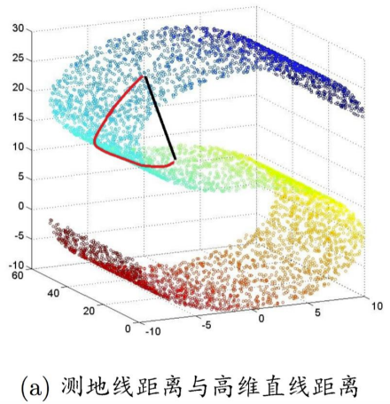

测地线距离的计算：利用流形在局部上与欧氏空间同胚这个性质，对每个点基于欧氏距离找出其近邻点，然后就能建立一个近邻连接图，图种近邻点之间存在连接，而非近邻点之间不存在连接，于是，计算两点之间测地线距离的问题，就转变为计算近邻连接图上两点之间的最短路径问题。
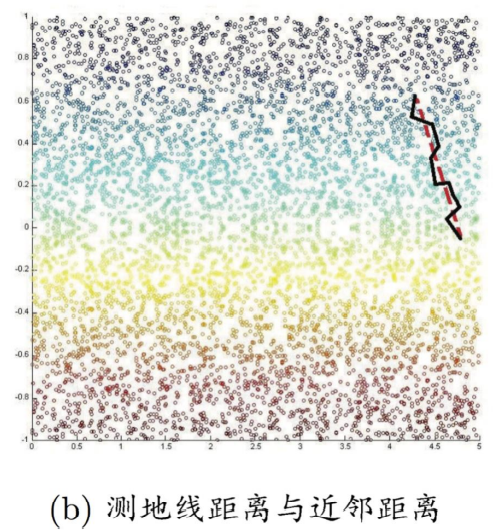

最短路径的计算可通过Dijkstra算法或Floyd算法实现。得到距离后可通过多维缩放方法获得样本点在低维空间中的坐标。

等度量映射（Isometric Mapping，Isomap）
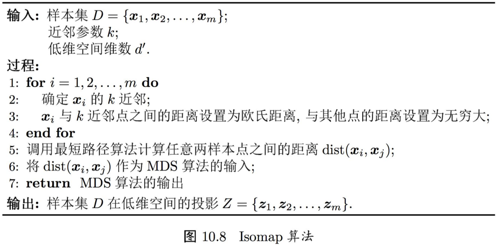

### 10.5.2 局部线性嵌入
局部线性嵌入（Locally Linear Embedding，LLE）
局部线性嵌入试图保持邻域内的线性关系，并使得该线性关系在降维后的空间中继续保持。
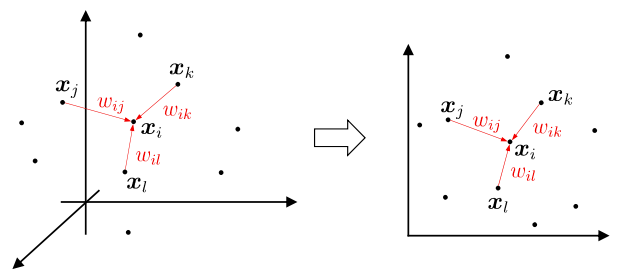
$\pmb{x}_i = w_{ij} \pmb{x}_j + w_{ik} \pmb{x}_k + w_{il} \pmb{x}_l$

LLE先为每个样本 $\pmb{x}_i$ 找到其近邻下标集合 $Q_i$，然后计算出基于 $Q_i$ 中的样本点对 $\pmb{x}_i$ 进行线性重构的系数 $\pmb{w}_i$： $\min_{\pmb{w}_1, \pmb{w}_2, \cdots, \pmb{w}_m} \sum_{i=1}^m \left\| \pmb{x}_i - \sum_{j \in Q_i} w_{ij} \pmb{x}_j \right\|_2^2 \quad \text{s.t.} \quad \sum_{j \in Q_i} w_{ij} = 1$ ，
其中 $\pmb{x}_i$ 和 $\pmb{x}_j$ 均为已知，令 $C_{jk} = (\pmb{x}_i - \pmb{x}_j)^T (\pmb{x}_i - \pmb{x}_k)$ ， $w_{jk}$ 有闭式解： $w_{jk} = \frac{\sum_{k \in Q_i} C_{jk}^{-1}}{\sum_{l,s \in Q_i} C_{ls}^{-1}}$ 。

LLE在低维空间中保持 $\pmb{w}_i$ 不变，于是 $\pmb{x}_i$ 对应的低维空间坐标 $\pmb{z}_i$ 可通过下式求解： $\min_{\pmb{z}_1, \pmb{z}_2, \cdots, \pmb{z}_m} \sum_{i=1}^m \left\| \pmb{z}_i - \sum_{j \in Q_i} w_{ij} \pmb{z}_j \right\|_2^2$ 。
令 $\pmb{Z} = (\pmb{z}_1, \pmb{z}_2, \cdots, \pmb{z}_m) \in \mathbb{R}^{d' \times m} \quad (\pmb{W}_{ij}) = w_{ij}$ ， $\pmb{M} = (\pmb{I}-\pmb{w})^T (\pmb{I}-\pmb{w})$ ，则则优化式可重写为 $\min_{\pmb{Z}} \text{tr} (\pmb{Z} \pmb{M} \pmb{Z}^T) \text{s.t.} \pmb{Z} \pmb{Z}^T = \pmb{I}$ ，并通过特征值分解求解。

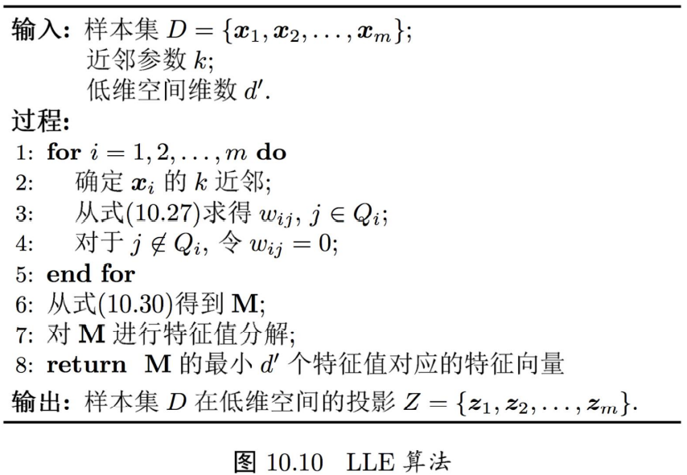

## 10.6 度量学习
度量学习（metric learning）的研究动机：在机器学习中，对高维数据进行降维的主要目的是希望找到一个合适的低维空间，在此空间中进行学习能比原始空间性能更好。事实上，每个空间对应了在样本属性上定义的一个距离度量，而寻找合适的空间，实质上就是在寻找一个合适的距离度量。那么，为何不直接尝试“学习”出一个合适的距离度量呢？

欲对距离度量进行学习，必须有一个便于学习的距离度量表达形式。对两个d维样本 $\pmb{x}_i$ 和 $\pmb{x}_j$ ，它们之间的平方欧氏距离可写为 $\text{dist}_{ed}^2 (\pmb{x}_i, \pmb{x}_j) = \|\pmb{x}_i - \pmb{x}_j\|_2^2 = \text{dist}_{ij,1}^2 + \text{dist}_{ij,2}^2 + \cdots + \text{dist}_{ij,d}^2$ ，
其中 $\text{dist}_{ij,k}$ 表示 $\pmb{x}_i$ 和 $\pmb{x}_j$ 在第k维上的距离。若假定不同属性的重要性不同，则可引入属性权重 $\pmb{w}$ ，得到： $\text{dist}_{wed}^2 (\pmb{x}_i, \pmb{x}_j) = \| \pmb{x}_i - \pmb{x}_j \|_2^2 = w_1 \cdot \text{dist}_{ij,1}^2 + w_2 \cdot \text{dist}_{ij,2}^2 + \cdots + w_d \cdot \text{dist}_{ij,d}^2$ 。
其中， $\pmb{w}_i \geq 0$ ， $\pmb{W} = diag(\pmb{w})$ 是一个对角矩阵， $(\pmb{W})_{ii} = w_i$ ，可通过学习确定。

$\pmb{W}$ 的非对角元素均为零，这意味着坐标轴是正交的，即属性之间无关；但现实问题中往往不是这样，例如考虑西瓜的“重量”和“体积”这两个属性，它们显然是正相关的，其对应的坐标轴不再正交。为此将 $\pmb{W}$ 替换为一个普通的半正定对称矩阵 $\pmb{M}$ ，于是就得到了马氏距离（Mahalanobis distance）： $\text{dist}_{mah}^2 (\pmb{x}_i, \pmb{x}_j) = (\pmb{x}_i - \pmb{x}_j)^T \pmb{W} (\pmb{x}_i - \pmb{x}_j) = \| \pmb{x}_i - \pmb{x}_j \|_M^2$ ，
其中 $\pmb{M}$ 亦称“度量矩阵”，而度量学习则是对 $\pmb{M}$ 进行学习。注意到为了保持距离非负且对称， $\pmb{M}$ 必须是（半）正定对称矩阵，即必有正交基 $\pmb{P}$ 使得 $\pmb{M}$ 能写为 $\pmb{M} = \pmb{P} \pmb{P}^T$ 。
对 $\pmb{M}$ 进行学习当然要设置一个目标。假定我们是希望提高近邻分类器的性能，则可将 $\pmb{M}$ 直接嵌入到近邻分类器的评价指标中去，通过优化该性能指标相应地求得 $\pmb{M}$ 。

近邻成分分析（Neighbourhood Component Analysis，NCA）在进行判别时通常使用多数投票法，邻域中的每个样本投1票，邻域外的样本投0票。不妨将其替换为概率投票法。对于任意样本 $\pmb{x}_j$ ，它对 $\pmb{x}_i$ 分类结果影响的概率为： $p_{ij} = \frac{exp(-\| \pmb{x}_i - \pmb{x}_j \|_M^2)}{\sum_l exp(-\| \pmb{x}_i - \pmb{x}_l \|_M^2)}$ 。
当 $i=j$ 时， $p_{ij}$ 最大。显然， $\pmb{x}_j$ 对 $\pmb{x}_i$ 的影响随着它们之间距离的增大而减小。若以留一法（LOO）正确率的最大化为目标，则可计算 $\pmb{x}_i$ 的留一法正确率，即它被自身之外的所有样本正确分类的概率为 $p_i = \sum_{j \in \Omega_i} p_{ij}$ ，
其中 $\Omega_i$ 表示与 $\pmb{x}_i$ 属于相同类别的样本的下标集合。

整个样本集上的留一法正确率为： $\sum_{i=1}^m p_i = \sum_{i=1}^m \sum_{j \in \Omega_i} p_{ij}$ 。
由 $p_{ij} = \frac{exp(-\| \pmb{x}_i - \pmb{x}_j \|_M^2)}{\sum_l exp(-\| \pmb{x}_i - \pmb{x}_l \|_M^2)}$ 和 $\pmb{M} = \pmb{P} \pmb{P}^T$ ，则NCA的优化目标为： $\min_{\pmb{P}} 1-\sum_{i=1}^m \sum_{j \in \Omega_i} \frac{exp(-\| \pmb{P}^T \pmb{x}_i - \pmb{P}^T \pmb{x}_j \|_2^2)}{\sum_l exp(-\| \pmb{P}^T \pmb{x}_i - \pmb{P}^T \pmb{x}_l \|_2^2)}$ 。
求解即可得到最大化近邻分类器LOO正确率的距离度量矩阵 $\pmb{M}$ 。

实际上，我们不仅能把错误率这样的监督学习目标作为度量学习的优化目标，还能在度量学习中引入领域知识。
若已知某些样本相似、某些样本不相似，则可定义“必连”（must-link）约束集合 $\mathcal{C}$ 与“勿连”（cannot-link）约束集合 $\mathcal{M}$ ： $(\pmb{x}_i, \pmb{x}_j) \in \mathcal{C}$ 表示 $\pmb{x}_i$ 与 $\pmb{x}_j$ 相似， $(\pmb{x}_i, \pmb{x}_j) \in \mathcal{M}$ 表示 $\pmb{x}_i$ 与 $\pmb{x}_j$ 不相似。
显然，我们希望相似的样本之间距离较小，不相似的样本之间距离较大，于是可通过求解下面这个凸优化问题获得适当的度量矩阵 $\pmb{M}$ ： $\min_{\pmb{M}} \sum_{(\pmb{x}_i, \pmb{x}_j) \in \mathcal{M}} \| \pmb{x}_i - \pmb{x}_j \|_M^2 \quad \text{s.t.} \quad \sum_{(\pmb{x}_i, \pmb{x}_j) \in \mathcal{C}} \| \pmb{x}_i - \pmb{x}_j \|_M \geq 1 \quad \pmb{M} \succeq 0$ 。
其中约束 $\pmb{M} \succeq 0$ 表明 $\pmb{M}$ 必须是半正定的。上式要求在不相似样本间的距离不小于1的前提下，使相似样本间的距离尽可能小。

不同的度量学习方法针对不同目标获得“好”的半正定对称距离度量矩阵 $\pmb{M}$ ，若 $\pmb{M}$ 是一个低秩矩阵，则通过对 $\pmb{M}$ 进行特征值分解，总能找到一组正交基，其正交基数目为矩阵 $\pmb{M}$ 的秩 $rank(\pmb{M})$ ，小于原属性数d。于是，度量学习学得的结果可衍生出一个降维矩阵 $\pmb{P} \in \mathbb{R}^{d \times rank(\pmb{M})}$ ，能用于降维之目的。
