## 1.1 引言
1956年夏天约翰·麦卡锡等人在美国达特茅斯学院开会研讨了“如何用机器模拟人的智能”，会上提出“人工智能”这一概念，标志着人工智能学科的诞生。

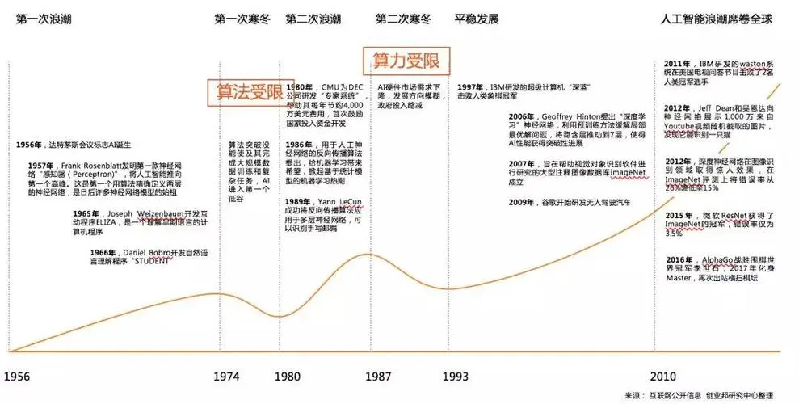

人工智能是研究、开发用于模拟、延伸和扩展人的智能的理论、方法、技术及应用系统的一门新的科学技术。研究的目的是探寻智能本质，研制出具有类人智能的智能机器。

机器学习的核心是“使用算法解析数据，从中学习，然后对世界上的某件事情做出决定或预测”。这意味着，与其显式地编写程序来执行某些任务，不如教计算机如何开发一个算法来完成任务。重在发现数据之间内在关系，并做出预测。
“假设用𝑃来评估计算机程序在某任务类𝑇上的性能，若一个程序通过利用经验𝐸在𝑇中任务上获得了性能改善，则我们就说关于𝑇和𝑃，该程序对𝐸进行了学习”。
机器学习致力于研究如何通过计算的手段，利用经验来改善系统自身的性能，从而在计算机上从数据中产生“模型”，用于对新的情况给出判断。

直观感受：学习机器学习之前凭借“第6感”预测，学习机器学习之前凭借“特征+方法”预测。

机器学习与人工智能的关系（$人工智能 \supseteq 机器学习 \supseteq 深度学习$）
- 机器学习是人工智能的一个分支，使用特定的算法和编程方法来实现人工智能。人工智能致力于创造出比人类更能完成复杂任务的机器。
- 深度学习是机器学习的一个子集，专注于模仿人类大脑的生物学和过程。

机器学习的主要应用领域：机器视觉【人脸检测和识别、语义场景分割、3-D理解、自动驾驶】、语音识别【问答系统】、自然语言处理【机器翻译、语义理解】、决策控制【精准营销、最优路径】、数据挖掘【可视化展示】。

典型应用
- 应用层
  - 场景应用：智能安防、智能金融、智能驾驶、智能医疗、智能制造、智能教育、智能家居、AI+其他
  - 消费级终端硬件：机器人、无人机、智能硬件
- 技术层
  - 应用技术：图像识别、语音识别、文字识别、计算机视觉、自然语言处理、知识图谱
  - 算法：深度学习、强化学习
- 基础层
  - 数据及计算能力：传感器、芯片、数据、云服务、软件框架

机器学习/人工智能的发展方向
- 做人类不愿意做的（提高工作效率，避免单调的重复劳动，如课堂点名）；
- 做人类做不好的（解决精细的量化问题和可重复性，如细胞精细计数问题）；
- 做人类现在还做不了的（利用信息学的特点和优势，创造新的技术和方法扩大人类的认知，如基因预测）

机器学习的一般流程
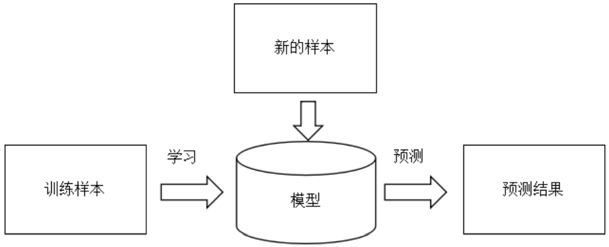

典型的机器学习过程
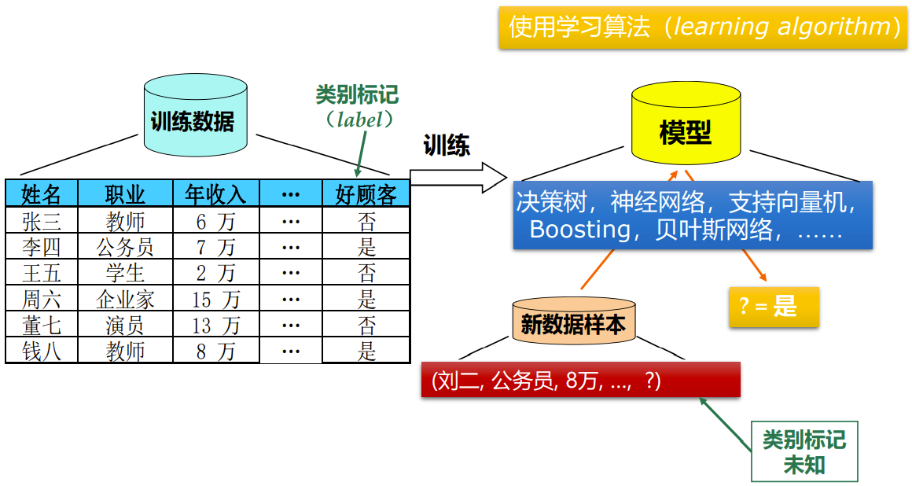

## 1.2 基本术语
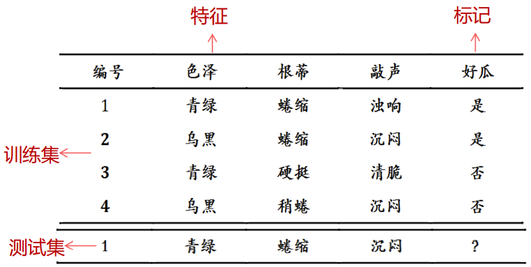

- 数据集（data set）：一组样本的集合，这组记录的集合。
- 示例（instance）/样本（sample）：数据集中每条记录，是关于一个事件或对象（这里是一个西瓜）的描述。
  - 有时整个数据集亦称一个“样本”，因为它可看作对样本空间的一个采样。
- 属性（attribute）/特征（feature）：反映事件或对象在某方面的表现或性质的事项。
- 属性值（attribute value）：属性上的取值。
- 属性空间（attribute space）/样本空间（sample space）/输入空间：属性张成的空间。
- 特征向量（feature vector）：由于空间中的每个点对应一个坐标向量，因此将一个示例称为一个特征向量。

- 维数（dimensionality）：每个示例由d个属性描述，其中d称为样本的“维数”。

- 学习（learning）/训练（training）：从数据中学得模型的过程。
- 训练数据（training data）：训练过程中使用的数据。
- 训练样本（training sample）/训练示例（training instance）/训练例：训练数据中的每个样本。
- 训练集（training set）：训练样本组成的集合。
- 假设（hypothesis）：学得模型对应了关于数据的某种潜在的规律。
- 真相/真实（ground-truth）：这种潜在规律自身，学习过程就是为了找出或逼近真相。
- 学习器（learner）：模型的另外称呼，可看作学习算法在给定数据和参数空间上的实例化。
  - 学习算法通常有参数需设置，使用不同的参数值和（或）训练数据，将产生不同的结果。

- 预测（predication）：...
- 标记（label）：关于示例结果的信息。
- 样例（example）：拥有了标记信息的示例。
  - 若将标记看作对象本身的一部分，则“样例”有时也称为“样本”。
- 标记空间（label space）/输出空间： $(\pmb{x}_i, y_i)$ 表示第i个样例，其中 $y_i \in \mathcal{Y}$ 是示例 $\pmb{x}_i$ 的标记， $\mathcal{Y}$ 是所有标记的集合，亦称标记空间或输出空间。

- 分类（classification）：欲预测的是离散值的学习任务。
  - 二分类（binary classification）：只涉及两个类别的分类。
    - 正类（positive class）：...
    - 反类/负类（negative class）：...
  - 多分类（multi-class classification）：涉及多个类别的分类。
- 回归（regression）：欲预测的是连续值的学习任务。

- 测试（testing）：学得模型后，使用其进行预测的过程。
- 测试样本（testing sample）/测试示例（testing instance）/测试例：被预测的样本。
- 测试集（testing set）：测试样本组成的集合。

- 聚类（clustering）：将训练集中的示例分成若干组，每组称为一个簇（cluster）。学习过程中使用的训练样本通常不拥有标记信息。

根据训练数据是否拥有标记信息，学习任务可大致划分为两大类：“监督学习”（supervised learning）和“无监督学习”（unsupervised learning），分类和回归是前者的代表，而聚类则是后者的代表。

- 泛化（generalization）能力：学得模型适用于新样本的能力。训练好的模型在前所未见的数据上的性能好坏。
  - 训练数据和真实数据间的差异，训练模型的目地是要模型在完全陌生的数据上进行测试的。
  - 通常假设样本空间中的样本服从一个未知分布（distribution） $\mathcal{D}$ ，样本从这个分布中独立获得，即“独立同分布”（independent and identically distribution，i.i.d.）。一般而言，训练样本越多越有可能通过学习获得强泛化能力的模型。

模型定义了特征与标记之间的关系。例如，垃圾邮件检测模型可能会将某些特征与“垃圾邮件”紧密联系起来。

机器学习的两个阶段：
- 训练是指创建或学习模型。也就是说，向模型展示有标记样本，让模型逐渐学习特征与标记之间的关系。
- 测试是指将训练后的模型应用于无标记样本。也就是说，使用经过训练的模型做出有用的预测y'。例如，在测试期间，您可以针对新的无标记样本预测是否好瓜。

## 1.3 假设空间
归纳（induction）与演绎（deduction）
- 归纳：从特殊到一半的“泛化”过程，即从具体的事实归结出一般性规律；
- 演绎：从一般到特殊的“特化”过程，即从基础原理推演出具体状况。

归纳学习（inductive learning）：从样例中学习归纳的过程。
- 广义的归纳学习：从样例中学习。
- 狭义的归纳学习：从训练数据中学得概念，因此也称为概念学习。

假设空间：所有属性的可能取值所组成的集合。

假设空间由3部分组成：
1. 属性（特征）的分别取值；
2. 属性（特征）无论取什么值都合适，我们分别用通配符 `*` 表示；
3. 极端情况，有可能这个概念根本就不成立，世界上压根就没有这种东西，我们用 $\emptyset$ 表示这个假设。

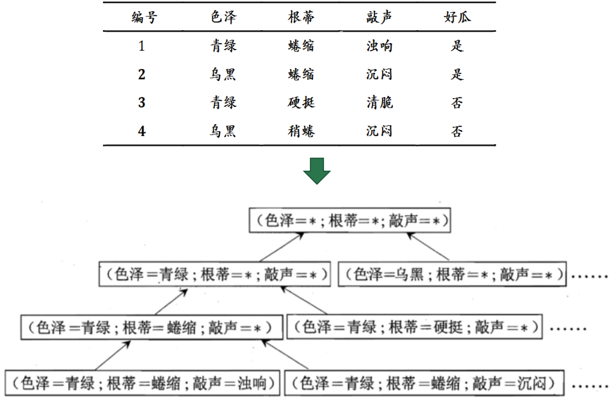

学习过程可以看作一个在所有假设（hypothesis）组成的空间中进行搜索的过程，搜索目标是找到与训练集“匹配”（fit）的假设，获得与训练集一致（即对所有训练样本能够进行正确判断）的假设，这就是我们学得的结果。

版本空间
- 现实问题中我们常面临很大的假设空间，但学习过程是基于有限样本训练集进行的，因此，可能有多个假设与训练集一致，即存在着一个与训练集一致的“假设集合”，我们称之为“版本空间”（version space）。
- 版本空间是机器学习中与已知数据集一致的所有假设（hypothesis）的子集集合。
- 西瓜问题的版本空间
  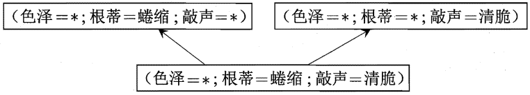

## 1.4 归纳偏好
归纳偏好（inductive bias）/偏好：机器学习算法在学习过程中对某种类型假设的偏好。
- 算法的目的是要根据训练数据，从假设空间中选出最佳的一个假设。
- 接下来还要从版本空间中挑一个假设出来。在假设都满足训练数据的情况下，算法必然要有一些偏好，比如希望模型更普适还是更特异。

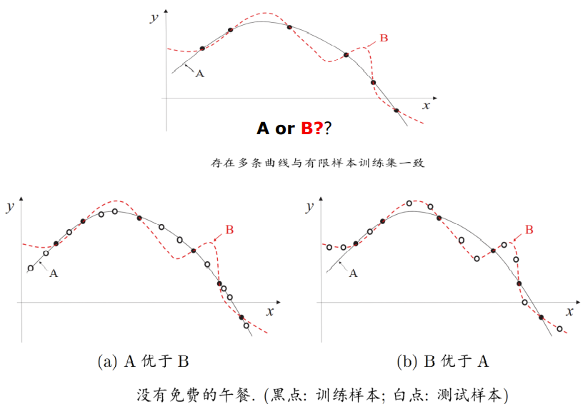

- 归纳偏好可看作学习算法自身在一个可能很庞大的假设空间中对假设进行选择的启发式或“价值观”。
- “奥卡姆剃刀”（Occam's razor）是一种常用的、自然科学研究中最基本的原则，即“若有多个假设与观察一致，选最简单的那个”。
- 具体的现实问题中，学习算法自身的归纳偏好与问题是否相配，大多数时候直接决定了算法能否取得好的性能。

没有免费的午餐（No Free Lunch Theorem，NFL）定理
- 一个算法 $\mathcal{L}_a$ 如果在某些问题上比另一个算法 $\mathcal{L}_b$ 好，必然存在另一些问题， $\mathcal{L}_b$ 比 $\mathcal{L}_a$ 好，也即没有免费的午餐定理。
- NFL定理的寓意是：脱离具体问题，空谈“什么学习算法更好”毫无意义，要谈论算法的相对优劣，必须要针对具体的学习问题。

## 1.5 发展历程
机器学习是人工智能（artificial intelligence）研究发展到一定阶段的必然产物。
- 二十世纪五十年代到七十年代初，人工智能研究处于“推理期”
- 从二十世纪七十年代中期开始，人工智能研究进入了“知识期”

三个主要流派？
- 基于神经网络的“连接主义”（connectionism）
  - 事实上，BP一直是被应用得最广泛的机器学习算法之一。
  - 连接主义学习的最大局限是其“试错性”；简单地说，其学习过程涉及大量参数，而参数的设置缺乏理论指导，主要靠手工“调参”；夸张一点说，参数调节上失之毫厘，学习结果可能谬以千里。
- 基于逻辑表示的“符号主义”（symbolism）
  - 决策树学习技术由于简单易用，到今天仍是最常用的机器学习技术之一。
- “统计学习”（statistical learning）
  - 代表性技术是支持向量机（Support Vector Machine，SVM）以及更一般的“核方法”（kernel methods）。

机器学习如今火起来有两个基本原因：数据大了、计算能力强了。
深度学习模型拥有大量参数，若数据样本少，则很容易“过拟合”；如此复杂的模型、如此大的数据样本，若缺乏强力计算设备，根本无法求解。

## 1.6 应用现状
机器学习近年来发展非常快，在各个领域应用非常广。（略）

> 数据挖掘（data mining）是从海量数据中发掘知识，这就必然涉及对“海量数据”的管理和分析。
> 大体来说，数据库领域的研究为数据挖掘提供数据管理技术，而机器学习和统计学的研究为数据挖掘提供数据分析技术。
> 由于统计学界的研究成果通常需要经由机器学习研究来形成有效的学习算法，之后再进入数据挖掘领域，因此从这个意义上说，统计学主要是通过机器学习对数据挖掘发挥影响，而机器学习领域和数据库领域则是数据挖掘的两大支撑。

## 算法分类
连接主义四大类别
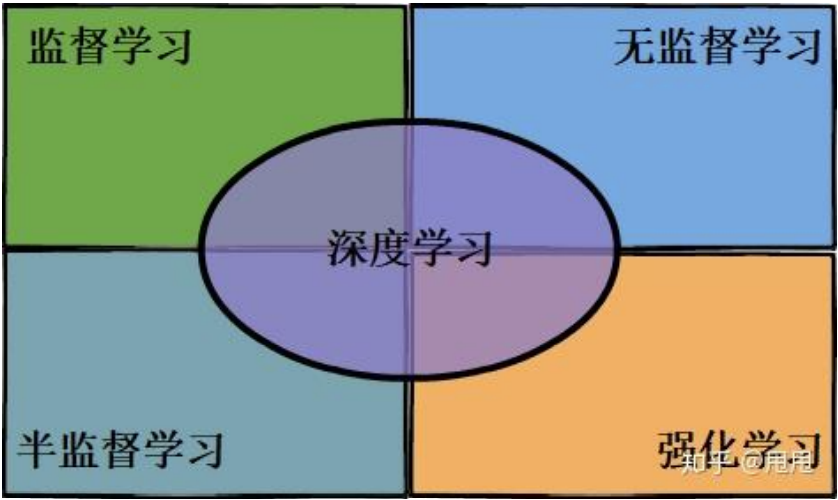

按照输入数据有无标记信息
- 监督学习：分类、回归
  - 样本带有标记值，称为监督信号，有学习过程，根据训练样本学习，得到模型，然后用于预测。按照标记值的类型可以进一步分为两类。
    - 分类问题——标记值为整数编号，离散值
    - 回归问题——标记值为实数
  
  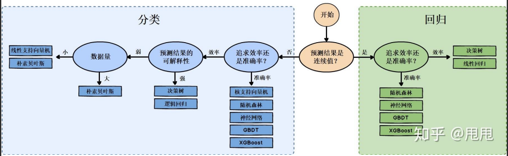
- 无监督学习：聚类，降维
  - 样本没有标记值，没有训练过程，机器学习算法直接对样本进行处理，得到结果。
- 半监督学习：两者结合
  - 有些训练样本有标记值，有些没有标记值，用这些样本进行训练得到模型，然后用于预测，介于有监督学习与无监督学习之间。

- 强化学习
  - 计算机从一开始完全随机的进行操作，通过尝试从错误中学习，找到规律，学会了达到目的的方法。
  - 给予算法一个不断试错，并具有奖励机制的场景，最终是算法找到最佳路径或者策略。
  - 它主要包含四个元素，Agent、环境状态、行动、奖励，强化学习的目标就是获得最多的累计奖励。

  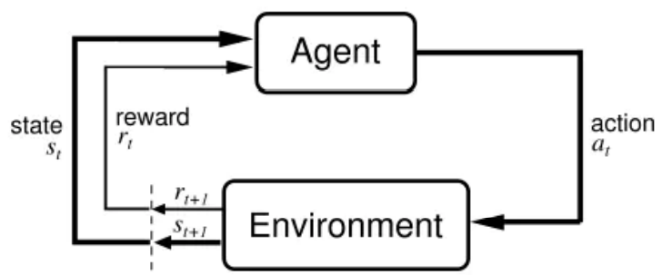

分类问题
- 机器学习模型实现从特征向量到类别编号的映射 $\mathbb{R}^n \rightarrow \mathbb{Z}$
  - 二分类问题，样本标记值通常设置为1和0，分别称为正样本和负样本。
  - 多分类问题，如0-9这10个手写阿拉伯数字的图像识别是典型的多分类问题。

回归问题
- 机器学习模型实现从特征向量到实数值的映射 $\mathbb{R}^n \rightarrow \mathbb{R}$
  - 根据一个人的特征预测其收入，是典型的回归问题

聚类问题
- 也是分类问题，但没有训练过程
- 把一批样本划分成多个类，使得在某种相似度指标下每一类中的样本尽量相似，不同类的样本之间尽量不同
  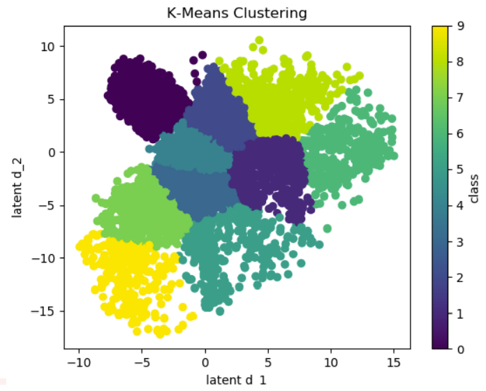

数据降维
- 它将n维空间中的向量X通过某种映射函数映射到更低维的m维空间中 $y = \phi(x) m << n$
- 降维后的数据更易于处理，且可以可视化，下图是将0-9这些手写数字图像投影到2维空间的结果
  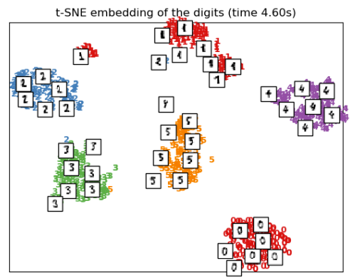
