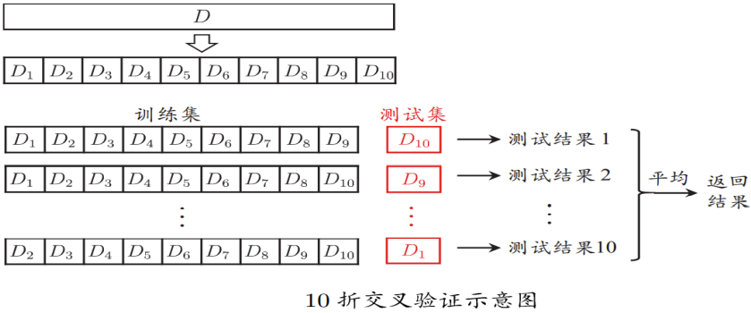
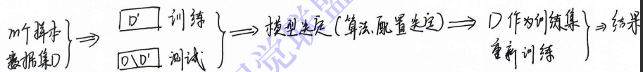
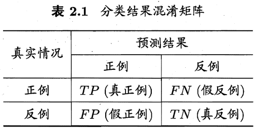
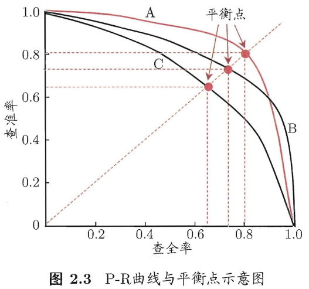
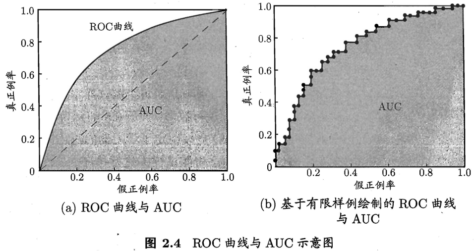
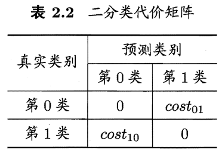
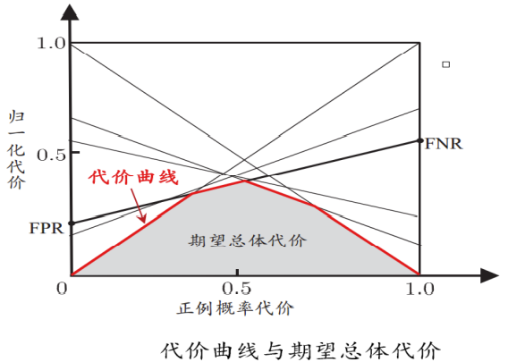
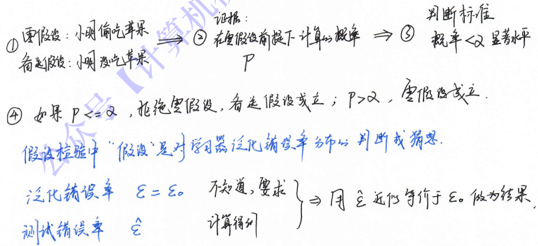
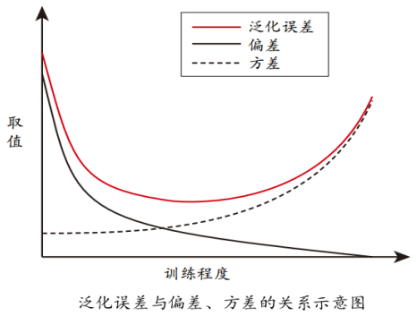

## 2.1 经验误差与过拟合
错误率（errorrate）&精度（accuracy）
- 错误率：分类错误的样本数占样本总数的比例。 $E = a/m$
- 精度： $= 1 - a/m$

误差（error）：学习器的实际预测输出与样本的真实输出之间的差异。
- 训练误差（training error）/经验误差（empirical error）：学习器在训练集上的误差。
- 测试误差：学习器在测试集上的误差。
- 泛化误差（generalization error）：学习器在（除训练集以外所有）新样本上的误差。

期望：得到泛化误差小的学习器。
实际情况：由于事先并不知道新样本的特征，我们只能努力使经验误差最小化。很多时候虽然能在训练集上做到分类错误率为零，但多数情况下这样的学习器并不好。

过拟合（overfitting）&欠拟合（underfitting）
- 过拟合：把训练样本学习得“太好”，将训练样本本身的特点当做所有样本的一般性质，学到了很多没必要的特征，导致泛化性能下降。
  1. 特征选择
  2. 优化目标加正则项
  3. DNN常见方法：early stop/集成学习策略/Dropout策略
  4. 增加训练数据
- 欠拟合：对训练样本的一般性质尚未学好，训练样本被提取的特征比较少，导致训练出来的模型不能很好地匹配。
  1. 增加新特征，可以考虑加入进特征组合、高次特征，来增大假设空间
  2. 尝试非线性模型，比如核SVM 、决策树、DNN等模型
  3. 增加网络的复杂度
  4. 减少使用正则化数量

过拟合、欠拟合的直观类比

过拟合是无法彻底避免的，我们所能做的只是“缓解”，或者说减小其风险。

模型选择（model selection）问题：理想的解决方案是对候选模型的泛化误差进行评估，然后选择泛化误差最小的那个模型。

## 2.2 评估方法
使用一个“测试集”（testing set）来测试学习器对新样本的判别能力，然后以测试集上的“测试误差”（testing error）作为泛化误差的近似。

测试样本
1. 从样本真实分布中独立同分布采样而得；
2. 尽可能与训练集互斥，即测试样本尽量不在训练集中出现、未在训练过程中使用过。

通常将包含 m 个样本的数据集 $D = \{(\pmb{x}_{1}, y_{1}), (\pmb{x}_{2}, y_{2}), \ldots,(\pmb{x}_{m}, y_{m})\}$ 拆分成训练集S和测试集T。

### 2.2.1 留出法
“留出法”（hold-out）直接将数据集D划分为两个互斥的集合，其中一个集合作为训练集S，另一个作为测试集T，即 $D = S \cup T, S \cap T = \emptyset$ 。
在S上训练出模型后，用T来评估其测试误差，作为对泛化误差的估计。

训练/测试集的划分要尽可能保持数据分布的一致性，至少要保持样本的类别比例相似。
如果从采样（sampling）的角度来看待数据集的划分过程，则保留类别比例的采样方式通常称为“分层采样”（stratified sampling）。

一般要采用若干次随机划分、重复进行实验评估后取平均值作为留出法的评估结果。

测试集小时，评估结果的方差较大；训练集小时，评估结果的偏差较大。常见做法是将大约2/3～4/5的样本用于训练，剩余样本用于测试。

### 2.2.2 交叉验证法
“交叉验证法”（cross validation）先将数据集D分层采样划分为k个大小相似的互斥子集，即 $D = D_1 \cup D_2 \cup \ldots \cup D_k, D_1 \cap D_2 \cap \ldots \cap D_k = \emptyset \quad(i \neq j)$ 。每次用k-1个子集的并集作为训练集，余下的那个子集作为测试集，最终返回的是这k个测试结果的均值。
通常把交叉验证法称为“k折交叉验证/k倍交叉验证”（k-fold cross validation），k最常用的取值是10，此时称为l0折交叉验证。

将数据集D划分为k个子集同样存在多种划分方式。为减小因样本划分不同而引入的差别，k折交叉验证通常要随机使用不同的划分重复p次，最终的评估结果是这p次k折交叉验证结果的均值，例如常见的有“10次10折交叉验证”。

> “10次10折交叉验证法”与“100次留出法”都是进行了100次训练/测试。

留一法（Leave-One-Out，LOO）：假定数据集D中包含m个样本，若令k=m，则每次只留1个测试。留一法不受随机样本划分方式影响。
结果准确（也不全是），但数据量较大时，计算量太大。

### 2.2.3 自助法
“自助法”（bootstrapping）以自助采样（bootstrap sampling）/可重复采样/有放回采样为基础，给定包含m个样本的数据集D，对其进行采样产生数据集D'：每次从D中随机选一个样本，放入D'中，然后该样本在D中仍保留，使得该样本下次采样也可能被采到；重复m次，得到包含m个样本的数据集D'（D中有一部分在D'中重复出现，有一部分从未出现）。
样本在m次采样中始终不被采到的概率是 $(1 - \frac{1}{m})^m$ ，取极限得到 $\lim_{m \rightarrowtail \infty} (1 - \frac{1}{m})^m \rightarrowtail \frac{1}{e} \approx 0.368$

初始数据集D中约有36.8%的样本未出现在采样数据集D'中。于是我们可将D'用作训练集，`D\D'`用作测试集；这样，实际评估的模型与期望评估的模型都使用m个训练样本，而我们仍有数据总量约1/3的、没在训练集中出现的样本用于测试。这样的测试结果，亦称“包外估计”（out-of-bag estimate）。

- 自助法在数据集较小、难以有效划分训练/测试集时很有用；
- 自助法能从初始数据集中产生多个不同的训练集，对集成学习等方法有很大的好处。
- 自助法产生的数据集改变了数据集分布，可能引入估计偏差，在数据量足够时，留出法和交叉验证法更常用。

### 2.2.4 调参与最终模型
大多数学习算法都有些参数（parameter）需要设定，参数配置不同，学得模型的性能往往有显著差别。
参数调节（parameter tuning）/调参与算法选择本质上是一致的：不同配置得到不同模型，把对应最好的明星参数作为结果。

实际操作中，参数选定是一个范围加一个变化步长，如 `[0, 0.2]` 以0.05为步长，有0, 0.05, 0.1, 0.15, 0.2这5种参数选择。这已经是计算开销和性能估计的折中。
然而，假定3个参数，每个参数有5种选择，模型有 $5^3 = 125$ 种需要对比。

- 测试数据：学得模型在实际使用中遇到的数据。
- 验证集（validation set）：模型评估与选择中用于评估测试的数据集。

我们用测试集上的判别效果来估计模型在实际使用时的泛化能力，而把训练数据另外划分为训练集和验证集，基于验证集上的性能来进行模型选择和调参。

## 2.3 性能度量
性能度量（performance measure）：衡量模型泛化能力的评价标准。
性能度量反映了任务需求，在对比不同模型的能力时，使用不同的性能度量往往会导致不同的评判结果；这意味着模型的“好坏”是相对的。

在预测任务中，给定样例集 $D = \{(\pmb{x}_1, y_1), (\pmb{x}_2, y_2), \ldots, (\pmb{x}_m, y_m)\}$ 评估学习器f的性能，就要把预测结果f(x)和真实标记比较。

- 回归任务最常用的性能度量是“"均方误差”（mean squared error）： $E(f; D) = \frac{1}{m} \sum_{i=1}^{m} (f(\pmb{x}_i) - y_i)^2$
- 更一般的，对于数据分布 $\mathcal{D}$ 和概率密度函数p(·)，均方误差可描述为： $E(f; D) = \int_{\pmb{x} \sim \mathcal{D}}(f(\pmb{x})-y)^{2} p(\pmb{x}) \mathrm{d} \pmb{x}$

### 2.3.1 错误率与精度
对于分类任务，错误率和精度是最常用的两种性能度量：
- （分类）错误率：分错样本占样本总数的比例。 $E(f; D) = \frac{1}{m} \sum_{i=1}^{m} \mathbb{I} (f(\pmb{x}_{i}) \neq y_{i})$
- 精度：分对样本占样本总数的比率。 $\operatorname{acc}(f; D) = \frac{1}{m} \sum_{i=1}^{m} \mathbb{I} (f(\pmb{x}_{i}) = y_{i}) = 1 - E(f; D)$

更一般的，对于数据分布 $\mathcal{D}$ 和概率密度函数p(·)
- 错误率： $E(f; \mathcal{D}) = \int_{\pmb{x} \sim \mathcal{D}} \mathbb{I}(f(\pmb{x}) \neq y) p(\pmb{x}) \mathrm{d} \pmb{x}$
- 精度： $\operatorname{acc}(f; \mathcal{D}) = \int_{\pmb{x} \sim \mathcal{D}} \mathbb{I}(f(\pmb{x}) = y) p(\pmb{x}) \mathrm{d} \pmb{x} = 1 - E(f; \mathcal{D})$

### 2.3.2 查准率、查全率与F1
错误率和精度虽常用，但并不能满足所有任务需求。若我们关心的是“挑出的西瓜中有多少比例是好瓜”，或者“所有好瓜中有多少比例被挑了出来”，那么错误率显然就不够用了。

对于二分类问题，可将样例根据其真实类别与学习器预测类别的组合划分为真正例（true positive）、假正例（false positive）、真反例（true negative）、假反例（false negative）四种情形，则显然有 $TP+FP+TN+FN=样例总数$ 。

统计真实标记和预测结果的组合可以得到“混淆矩阵”（confusion matrix）：

查准率P与查全率R分别定义为：
- 查准率（precision）/准确率： $P = \frac{TP}{TP + FP}$
- 查全率（recall）/召回率： $R = \frac{TP}{TP + FN}$

查准率和查全率是一对矛盾的度量。一般来说，查准率高时，查全率往往偏低；而查全率高时，查准率往往偏低。通常只有在一些简单任务中，才可能使查全率和查准率都很高。

在很多情形下，我们可根据学习器的预测结果对样例进行排序，排在前面的是学习器认为“最可能”是正例的样本，排在最后的则是学习器认为“最不可能”是正例的样本。
按此顺序逐个把样本作为正例进行预测，则每次可以计算出当前的查全率、查准率。以查准率为纵轴、查全率为横轴作图，就得到了查准率-查全率曲线，简称“P-R曲线”，显示该曲线的图称为“P-R图”。

若一个学习器的P-R曲线被另一个学习器的曲线完全“包住”，则可断言后者的性能优于前者，（如$A>C$）；如果两个学习器的P-R曲线发生了交叉，（如AB），则难以一般性地断言两者孰优孰劣，只能在具体的查准率或查全率条件下进行比较。

比较合理的判据是比较P-R曲线下面积的大小，它在一定程度上表征了学习器在查准率和查全率上取得相对“双高”的比例。但这个值不太容易估算，因此，人们设计了一些综合考虑查准率、查全率的性能度量：

平衡点（Break-Event Point，BEP）是曲线上“查准率=查全率”时的取值。

F1度量： $F1 = \frac{2 \times P \times R}{P + R} = \frac{2 \times TP}{样例总数 + TP - TN}$

在一些应用中，对查准率和查全率的重视程度有所不同。
F1度量的一般形式： $F_{\beta} = \frac{(1 + \beta^2) \times P \times R}{(\beta^2 \times P) + R}$
- 其中 $\beta > 0$ 度量了查全率对查准率的相对重要性。
- $\beta = 1$ 时退化为标准的F1；
- $\beta > 1$ 时查全率有更大影响；
- $\beta < 1$ 时查准率有更大影响。

> F1是基于查准率与查全率的调和平均（harmonic mean）定义的： $\frac{1}{F1} = \frac{1}{2} \cdot (\frac{1}{P} + \frac{1}{R})$
> $F_{\beta}$ 则是加权调和平均： $\frac{1}{F_(\beta)} = \frac{1}{1+\beta^2} \cdot (\frac{1}{P} + \frac{\beta^2}{R})$
> 与算术平均 $(\frac{P + R}{2})$ 和几何平均 $(\sqrt{P \times R})$ 相比，调和平均更重视较小值。

很多时候我们有多个二分类混淆矩阵，希望在n个二分类混淆矩阵上综合考察查准率和查全率。

一种直接的做法是先在各混淆矩阵上分别计算出查准率和查全率，记为 $(P_1, R_1), (P_2, R_2), \ldots, (P_n, R_n)$ ，再计算平均值
- “宏查准率”： $macro-P = \frac{1}{n} \sum_{i=1}^{n} P_i$
- “宏查全率”： $macro-P = \frac{1}{n} \sum_{i=1}^{n} R_i$
- “宏F1”： $macro-F1 = \frac{2 \times macro-P \times macro-R}{macro-P + macro-R}$

还可先将各混淆矩阵的对应元素进行平均，得到TP、FP、TN、FN的平均值，分别记为 $\overline{TP}、\overline{FP}、\overline{TN}、\overline{FN}$ ，再基于这些平均值计算：
- “微查准率”： $micro-P = \frac{\overline{TP}}{\overline{TP} + \overline{FP}}$
- “微查全率”： $micro-P = \frac{\overline{TP}}{\overline{TP} + \overline{FN}}$
- “微F1”： $micro-F1 = \frac{2 \times micro-P \times micro-R}{micro-P + micro-R}$

### 2.3.3 ROC与AUC
很多学习器是为测试样本产生一个实值或概率预测，然后将这个预测值与一个分类阈值（threshold）进行比较，若大于阈值则分为正类，否则为反类。
假如将测试样本进行排序，“最可能”是正例的排在最前面，“最不可能”是正例的排在最后面。分类过程就相当于在这个排序中以某个“截断点”（cut point）将样本分为两部分，前一部分判作正例，后一部分则判作反例。

在不同的应用任务中，我们可根据任务需求来采用不同的截断点，例如若我们更重视“查准率”，则可选择排序中靠前的位置进行截断；若更重视“查全率”，则可选择靠后的位置进行截断。

“受试者工作特征”（Receiver Operating Characteristic，ROC）曲线：
根据学习器的预测结果对样例进行排序，按此顺序逐个把样本作为正例进行预测，每次计算出两个重要量的值，分别以它们为横、纵坐标作图，得到的曲线。
- 纵轴：“真正例率”（True Positive Rate，TPR） $TPR = \frac{TP}{TP+FN}$
- 横轴：“假正例率”（False Positive Rate，FPR） $FPR = \frac{FP}{TN+FP}$

绘图过程：给定 $m^{+}$ 个正例和 $m^{-}$ 个反例，根据学习器预测结果对样例进行排序，然后把分类阈值设为最大，即把所有样例均预测为反例，此时真正例率和假正例率均为0，在坐标 $(0, 0)$ 处标记一个点。然后，将分类阈值依次设为每个样例的预测值，即依次将每个样例划分为正例。设前一个标记点坐标为 $(x, y)$ ，当前若为真正例，则对应标记点的坐标为 $(x, y + \frac{1}{m^{+}})$ 当前若为假正例，则对应标记点的坐标为 $(x + \frac{1}{m^{-}}, y)$ ，然后用线段连接相邻点即得。

进行学习器的比较时，若一个学习器的ROC曲线被另一个学习器的曲线完全“包住”，则可断言后者的性能优于前者；若两个学习器的ROC曲线发生交叉，较为合理的判据是比较ROC曲线下的面积（Area Under ROC Curve，AUC）。

> ROC曲线相对于P-R曲线有个很好的特性：当测试集中的正负样本的分布变化的时候，ROC曲线能够保持不变，即对正负样本不均衡问题不敏感。

假定ROC曲线是由坐标为 $\{(x_1, y_1), (x_2, y_2), \ldots, (x_m, y_m)\}$ 的点按序连接而形成 $(x_1 = 0, x_m = 1)$ ，则AUC可估算为：
- 方式1：计算ROC曲线下面积 $AUC = \frac{1}{2} \sum_{i=1}^{m-1} (x_{i+1} - x_i) \cdot (y_i + y_{i+1})$
- 方式2：AUC统计意义 $AUC = \frac{\sum_{i \in positiveClass} rank_i - \frac{M(1+M)}{2}}{M \times N}$

AUC衡量了样本预测的排序质量。
排序“损失”（loss）： $\mathscr{l}_{rank} = \frac{1}{m^{+} m^{-}} \sum_{\pmb{x}^{+} \in D^{+}} \sum_{\pmb{x}^{-} \in D^{-}} (\mathbb{I}(f(\pmb{x}^{+}) < f(\pmb{x}^{-})) + \frac{1}{2}(f(\pmb{x}^{+}) = f(\pmb{x}^{-})))$
有： $AUC = 1 - \mathscr{l}_{rank}$

### 2.3.4 代价敏感错误率与代价曲线
现实任务中不同类型的错误所造成的后果很可能不同，为了权衡不同类型错误所造成的不同损失，可为错误赋予“非均等代价”（unequal cost）。

以二分类为例，可根据领域知识设定“代价矩阵”（cost matrix），如下表所示，其中 $cost_{ij}$ 表示将第i类样本预测为第j类样本的代价。损失程度越大，$cost_{01}$ 与 $cost_{10}$ 值的差别越大。

前面介绍的性能度量大都隐式地假设了均等代价。在非均等代价下，不再最小化“错误次数”，而是最小化“总体代价”（total cost），则“代价敏感”（cost-sensitive）错误率相应的为：
$E(f; D; cost) = \frac{1}{m} (\sum_{\pmb{x}_i \in D^{+}} \mathbb{I} (f(\pmb{x_i}) \neq y_i) \times cost_{01} + \sum_{\pmb{x}_i \in D^{-}} \mathbb{I} (f(\pmb{x_i}) \neq y_i) \times cost_{10})$

在非均等代价下，ROC曲线不能直接反映出学习器的期望总体代价，而“代价曲线”（cost curve）可以。

代价曲线的横轴是取值为 `[0,1]` 的正例概率代价（其中p是样例为正例的概率） $P(+)cost = \frac{p \times cost_{01}}{p \times cost_{01} + (1-p) \times cost_{10}}$

纵轴是取值为 `[0,1]` 的归一化代价 $cost_{norm} = \frac{FNR \times p \times cost_{01} + FPR \times (1-p) \times cost_{10}}{p \times cost_{01} + (1-p) \times cost_{10}}$

> “规范化”，（normalization）是将不同变化范围的值映射到相同的固定范围中，常见的是 `[0,1]`，此时亦称“归一化”。

代价曲线图的绘制：ROC曲线上每个点对应了代价曲线上的一条线段，设ROC曲线上点的坐标为 $(TPR,FPR)$ ，则可相应计算出FNR，然后在代价平面上绘制一条从 $(0,FPR)$ 到 $(1,FNR)$ 的线段，线段下的面积即表示了该条件下的期望总体代价；如此将ROC曲线上的每个点转化为代价平面上的一条线段，然后取所有线段的下界，围成的面积即为所有条件下学习器的期望总体代价。

## 2.4 比较检验
为什么机器学习中性能比较非常复杂？
- 首先，我们希望比较的是泛化性能，然而通过实验评估方法我们获得的是测试集上的性能，两者的对比结果可能未必相同；
- 第二，测试集上的性能与测试集本身的选择有很大关系，且不论使用不同大小的测试集会得到不同的结果，即便用相同大小的测试集，若包含的测试样例不同，测试结果也会有不同；
- 第三，很多机器学习算法本身有一定的随机性，即便用相同的参数设置在同一个测试集上多次运行，其结果也会有不同。

统计假设检验（hypothesis test）为我们进行学习器性能比较提供了重要依据。

### 2.4.1 假设检验
假设检验逻辑四步：

泛化错误率为 $\epsilon$ 的学习器在一个样本上犯错的概率是 $\epsilon$ ；测试错误率 $\hat{\epsilon}$ 意味着在 $m$ 个测试样本中恰有 $\hat{\epsilon} \times m$ 个被误分类。
假定测试样本是从样本总体分布中独立采样而得，那么泛化错误率为 $\epsilon$ 的学习器将其中 $m'$ 个样本误分类、其余样本全都分类正确的概率是 $\left(\begin{array}{c} m \\ m' \end{array}\right) \epsilon^{m'}(1-\epsilon)^{m-m'}$ ；
由此可估算出其恰将 $\hat{\epsilon} \times m$ 个样本误分类的概率如下式所示，这也表达了在包含 $m$ 个样本的测试集上，泛化错误率为 $\epsilon$ 的学习器被测得测试错误率为 $\hat{\epsilon}$ 的概率：
$P(\hat{\epsilon}; \epsilon) = \left(\begin{array}{c} m \\ \hat{\epsilon} \times m \end{array}\right) \epsilon^{\hat{\epsilon} \times m}(1-\epsilon)^{m-\hat{\epsilon} \times m}$

...

### 2.4.2 交叉验证t检验
### 2.4.3 McNemar检验
### 2.4.4 Friedman检验与Nemenyi后续检验

## 2.5 偏差与方差
通过实验可以估计学习算法的泛化性能，而“偏差-方差分解”（bias-variance decomposition）可以用来帮助解释泛化性能。“偏差-方差分解”试图对学习算法期望的泛化错误率进行拆解。

对测试样本 $\pmb{x}$ ，令 $y_D$ 为 $\pmb{x}$ 在数据集中的标记，y为 $\pmb{x}$ 的真实标记， $f(\pmb{x}; D)$ 为训练集D上学得模型f在 $\pmb{x}$ 上的预测输出。
以回归任务为例，学习算法的期望预测为： $\bar{f} (\pmb{x}) = \mathbb{E}_D [f(\pmb{x}; D)]$
使用样本数相同的不同训练集产生的方差为 $var(\pmb{x}) = \mathbb{E}_D [(f(\pmb{x}; D) - \bar{f} (\pmb{x}))^2]$
噪声为 $\epsilon^2 = \mathbb{E}_D [(y_D - y)^2]$
期望输出与真实标记的差别称为偏差（bias），即 $bias^2 (\pmb{x}) = (\bar{f}(\pmb{x}) - y)^2$

算法的期望泛化误差 $E(f; D) = bias^2 (\pmb{x}) + var(\pmb{x}) + \epsilon^2$
即，泛化误差等于偏差、方差与噪声之和。

> - 偏差度量了学习算法期望预测与真实结果的偏离程度；即刻画了学习算法本身的拟合能力；
> - 方差度量了同样大小训练集的变动所导致的学习性能的变化；即刻画了数据扰动所造成的影响；
> - 噪声表达了在当前任务上任何学习算法所能达到的期望泛化误差的下界；即刻画了学习问题本身的难度。

泛化性能是由学习算法的能力、数据的充分性以及学习任务本身的难度所共同决定的。给定学习任务为了取得好的泛化性能，需要使偏差小（充分拟合数据）而且方差较小（减少数据扰动产生的影响）。

一般来说，偏差与方差是有冲突的，称为偏差-方差窘境（bias-variance dilemma）。
- 在训练不足时，学习器拟合能力不强，训练数据的扰动不足以使学习器的拟合能力产生显著变化，此时偏差主导泛化错误率；
- 随着训练程度加深，学习器拟合能力逐渐增强，方差逐渐主导泛化错误率；
- 训练充足后，学习器的拟合能力非常强，训练数据的轻微扰动都会导致学习器的显著变化，若训练数据自身非全局特性被学到则会发生过拟合。

> Bias VS Variance
> 每种评估器都有是有利有弊。
> Error = Bias + Variance
> Error反映的是整个模型的准确度，Bias反映的是模型在样本上的输出与真实值之间的误差，即模型本身的精准度，Variance反映的是模型每一次输出结果与模型输出期望之间的误差，即模型的稳定性。
