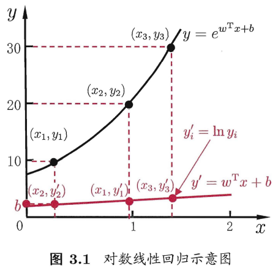
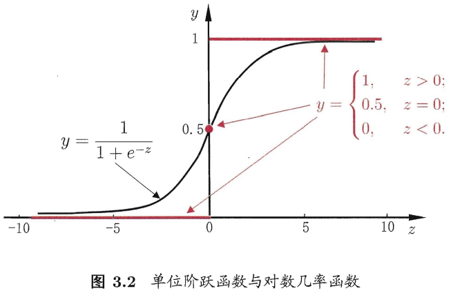
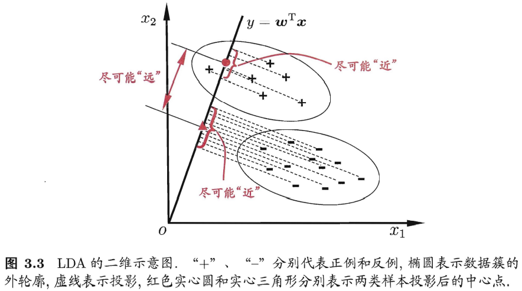
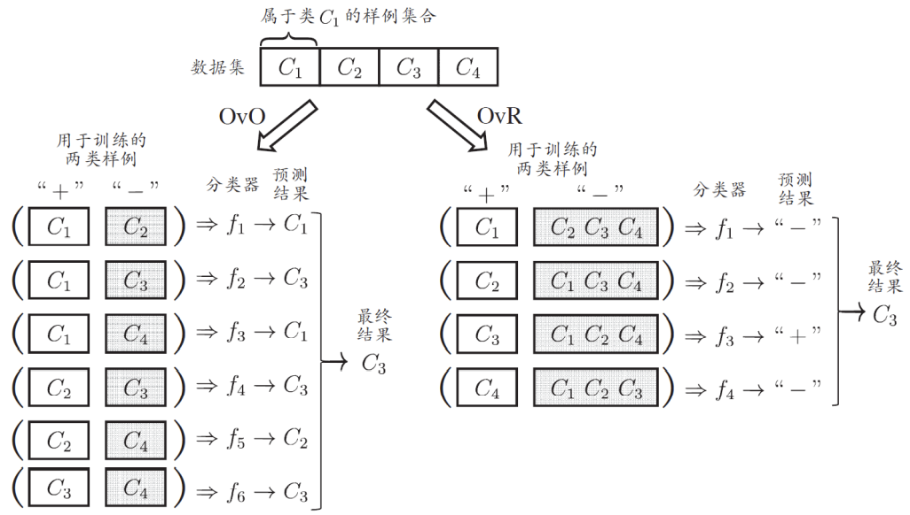
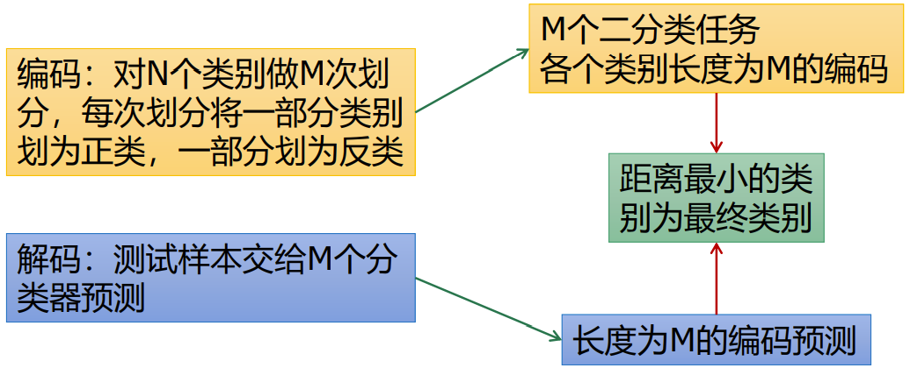
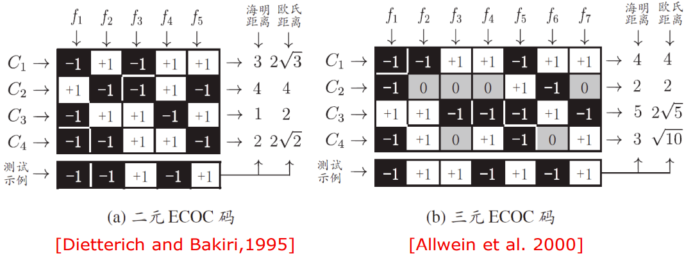
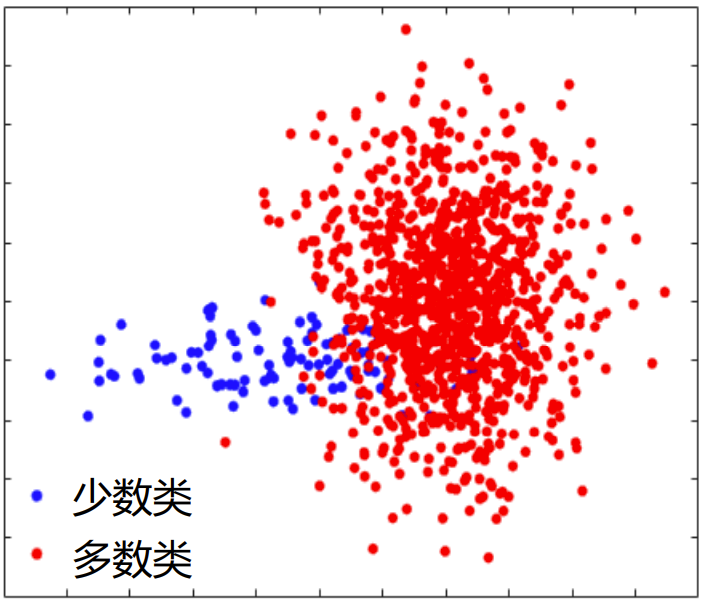

## 3.1 基本形式
给定由d个属性描述的示例 $\pmb{x} = (x_1; x_2; \ldots; x_d)$ ，其中 $x_i$ 是 $\pmb{x}$ 在第i个属性上的取值，线性模型（linear model）试图学得一个通过属性的线性组合来进行预测的函数，即 $f(\pmb{x}) = w_1 x_1 + w_2 x_2 + \ldots + w_d x_d + b$
向量形式 $f(\pmb{x}) = \pmb{w}^{T} \pmb{x} + b$
其中 $\pmb{w} = (w_1; w_2; \ldots; w_d)$ 。 $\pmb{w}$ 和b学得之后，模型就得以确定。

线性模型的优点：
- 形式简单、易于建模；
- 是非线性模型（nonlinear model）的基础：许多非线性模型可在线性模型的基础上通过引入层级结构或高维映射而得；
- 有很好的可解释性（comprehensibility）/可理解性（understandability）： $\pmb{w}$ 直观表达了各属性在预测中的重要性。

## 3.2 线性回归
给定数据集 $D = \{(\pmb{x}_1, y_1), (\pmb{x}_2, y_2), \ldots, (\pmb{x}_m, y_m)\}$ ，其中 $\pmb{x}_i = (x_{i1}; x_{i2}; \ldots; x_{id}), y_i \in \mathbb{R}$ 。
“线性回归”（linear regression）试图学得一个线性模型以尽可能准确地预测实值输出标记。

**单元线性回归**
$D = \{(x_i, y_i)\}_{i=1}^{m}, x_i \in \mathbb{R}$ 。
- 对离散属性，若属性值间存在“序”(order)关系，可通过连续化将其转化为连续值，如 $\{高, 矮\} \to \{1.0, 0.0\}$ 、 $\{高, 中, 低\} \to \{1.0, 0.5, 0.0\}$ 。
- 若属性值间不存在序关系，假定有k个属性值，则通常转化为k维向量，如 $\{西瓜, 南瓜, 黄瓜\} \to {(0,0,1), (0,1,0), (1,0,0)}$ 。

> 若将无序属性连续化，则会不恰当地引入序关系，对后续处理如距离计算等造成误导。

线性回归试图学得 $f(x_i) = w x_i + b$ ，使得 $f(x_i) \simeq y_i$
令均方误差最小化，有 $(w^{*}, b^{*}) = \argmin_{(w,b)} \sum_{i=1}^{m} (f(x_i) - y_i)^2 = \argmin_{(w,b)} \sum_{i=1}^{m} (y_i - w x_i - b)^2$

“最小二乘法”（least square method）：基于均方误差最小化来进行模型求解的方法。

线性回归模型的最小二乘“参数估计”（parameter estimation）：求解w和b使 $E_{(w, b)} = \sum_{i=1}^{m} (y_i - w x_i -b)^2$ 最小化的过程。
将 $E_{(w, b)}$ 分别对w和b求导，
$$
\begin{array}{l}
\frac{\partial E_{(w, b)}}{\partial w}=2\left(w \sum_{i=1}^{m} x_{i}^{2}-\sum_{i=1}^{m}\left(y_{i}-b\right) x_{i}\right) \\
\frac{\partial E_{(w, b)}}{\partial b}=2\left(m b-\sum_{i=1}^{m}\left(y_{i}-w x_{i}\right)\right)
\end{array}
$$
令其为0，可得到w和b最优解的闭式（closed-form）解：
$$
\begin{array}{l}
w = \frac{\sum_{i=1}^{m} y_i (x_i - \bar{x})}{\sum_{i=1}^{m} x_i^2 - \frac{1}{m} (\sum_{i=1}^{m} x_i)^2} \\
b = \frac{1}{m} \sum_{i=1}^{m} (y_i - w x_i)
\end{array}
$$
其中 $\bar{x} = \frac{1}{m} \sum_{i=1}^{m} x_i$ 为x的均值。

**多元线性回归（multiple linear regression）**/多变量线性回归
更一般的数据集D，样本由d个属性描述。
试图学得 $f(\pmb{x}_i) = \pmb{w}^T \pmb{x}_i + b$ ，使得 $f(\pmb{x}_i) \simeq y_i$ 。
为了方便矩阵运算，把 $\pmb{w}$ 和b吸收入向量形式 $\hat{\pmb{w}} = (\pmb{w}; b)$ ，则数据集D可表示为一个 $m \times (d+1)$ 的矩阵 $\pmb{X}$，即
$$
\pmb{X} = \begin{pmatrix} x_{11} & x_{12} & \cdots & x_{1d} & 1 \\ x_{21} & x_{22} & \cdots & x_{2d} & 1 \\ \vdots & \vdots & \ddots & \vdots & \vdots \\ x_{m1} & x_{m2} & \cdots & x_{md} & 1 \end{pmatrix} = \begin{pmatrix} \pmb{x}_1^T & 1\\ \pmb{x}_2^T & 1\\ \vdots & \vdots \\ \pmb{x}_m^T & 1 \end{pmatrix} \qquad y = \begin{pmatrix} y_1 \\ y_2 \\ \vdots \\ y_m \end{pmatrix}
$$

同样采用最小二乘法求解，有 $\hat{\pmb{w}}^{*} = \argmin_{\hat{\pmb{w}}} (\pmb{y - \pmb{X} \hat{\pmb{w}}})^T (\pmb{y} - \pmb{X}\hat{\pmb{w}})$ 。
令 $E_{\hat{\pmb{w}}} = (\pmb{y - \pmb{X} \hat{\pmb{w}}})^T (\pmb{y} - \pmb{X}\hat{\pmb{w}})$ ，对 $\hat{\pmb{w}}$ 求导，得到 $\frac{\partial E_{\hat{\pmb{w}}}}{\partial \hat{\pmb{w}}} = 2 \pmb{X}^T (\pmb{X} \hat{\pmb{w}}) - \pmb{y}$ 。
令其为0，可得 $\hat{\pmb{w}}$ 最优解的闭式解。

- 当 $\pmb{X}^T \pmb{X}$ 为满秩矩阵（full-rank matrix）或正定矩阵（positive definite matrix）时，令上式为0可得 $\hat{\pmb{w}}^{*} = (\pmb{X}^T \pmb{X})^{-1} \pmb{X}^T \pmb{y}$ 。
- 当 $\pmb{X}^T \pmb{X}$ 不满秩时，则可解出多个 $\hat{\pmb{w}}$ ，此时需求助于归纳偏好，或引入正则化（regularization）项。

**对数线性回归（log-linear regression）**
- 线性回归模型： $f(\pmb{x}_i) = \pmb{w}^T \pmb{x} + b$ 。
- 对数线性回归模型： $\ln y = \pmb{w}^T \pmb{x} + b$ ，试图让 $e^{\pmb{w}^T \pmb{x} + b}$ 逼近y。

**广义线性模型（generalized linear model，GLM）**
$y = g^{-1}(\pmb{w}^T \pmb{x} + b)$
- 联系函数（link function）： $g(\cdot)$ 单调可微，连续且充分光滑。
- 对数线性回归是广义线性回归模型在 $g(\cdot) = \ln (\cdot)$ 时的特例。

## 3.3 对数几率回归
考虑二分类任务，其输出标记 $y \in {0, 1}$ ，而线性回归模型产生的预测值 $z = \pmb{w}^T \pmb{x} + b$ 是实值，需转换为0/1值。
最理想的是“单位阶跃函数”（unit-step function）/Heaviside 函数，即若预测值之大于零就判为正例，小于零则判为反例，预测值为临界值零则可任意判别。

如图红线，单位阶跃函数不连续，希望找到单调可微的近似单位阶跃函数的“替代函数”（surrogate function）。对数几率函数（logistic function）/对率函数正是这样一个常用的替代函数： $y = \frac{1}{1 + e^{-z}}$ 。

如图黑线，对数几率函数是一种“Sigmoid”函数，它将z值转化为一个接近0或1的y值，并且其输出值在z=0附近变化很陡。
> Sigmoid函数即形似S的函数。对率函数是Sigmoid函数最重要的代表。

将对数几率函数作为 $g^{-1}(\cdot)$ ，得到： $y = \frac{1}{1 + e^{-(\pmb{w}^T \pmb{x} + b)}}$ 。可变化为 $\ln \frac{y}{1-y} = \pmb{w}^T \pmb{x} + b$ 。

- 几率（odds）：若将y视为样本x作为正例的可能性，则1-y是其反例可能性，两者的比值 $\frac{y}{1-y}$。其反应了 $\pmb{x}$ 作为正例的相对可能性。
- 对数几率（log odds/logit）： 对对率取对数 $\ln \frac{y}{1-y}$ 。

对数几率回归（logistic regression/logit regression）/逻辑回归： 在用线性回归模型的预测结果去逼近真实标记的对数几率。
- 直接对分类可能性进行建模，无需事先假设数据分布。
- 不仅预测出“类别”，还可得到近似概率预测。
- 可直接应用现有数值优化算法求取最优解。

若将y视为类后验概率估计 $p(y=1|\pmb{x})$ ，则： $\ln \frac{p(y=1|\pmb{x})}{p(y=0|\pmb{x})} = \pmb{w}^T \pmb{x} + b$ 。
显然（ $p(y=0|\pmb{x}) = 1 - p(y=1|\pmb{x})$ ）：
$$
\begin{matrix}
 p(y=1|\pmb{x}) = \frac{e^{\pmb{w}^T \pmb{x} + b}}{1 + e^{-(\pmb{w}^T \pmb{x} + b)}} \\
 p(y=0|\pmb{x}) = \frac{1}{1 + e^{-(\pmb{w}^T \pmb{x} + b)}} \\
\end{matrix}
$$

于是，可通过“极大似然法”（maximum likelihood method）来估计 $\pmb{w}$ 和 $b$ 。给定数据集 $\{(\pmb{x}_i, y_i)\}_{i=1}^{m}$ ，对数回归模型最大化 “对数似然”（log-likelihood）： $\mathcal{l} (\pmb{w}, b) = \sum_{i=1}^{m} \ln p(y_i|\pmb{x}_i; \pmb{w}, b)$ 。

令 $\beta = (\pmb{w}; b), \hat{\pmb{x}} = (\pmb{x}; 1)$ ，则 $\pmb{w}^T \pmb{x} + b$ 可简写为 $\beta^T \hat{\pmb{x}}$ 。
再令 $p_1(\hat{\pmb{x}_i}; \beta) = p(y=1|\hat{\pmb{x}_i}; \beta) = \frac{e^{\pmb{w}^T \pmb{x} + b}}{1 + e^{\pmb{w}^T \pmb{x} + b}}, \qquad p_0(\hat{\pmb{x}_i}; \beta) = p(y=0|\hat{\pmb{x}_i}; \beta) = 1 - p_1(\hat{\pmb{x}_i}; \beta) = \frac{1}{1 + e^{\pmb{w}^T \pmb{x} + b}}$，则似然项可重写为 $p(y_i|\pmb{x}_i; \pmb{w}, b) = y_i p_1(\hat{\pmb{x}_i}; \beta) + (1-y_i) p_0(\hat{\pmb{x}_i}; \beta)$ 【据说这个公式有问题】。
于是，最大化似然函数 $\mathcal{l} (\pmb{w}, b) = \sum_{i=1}^{m} \ln p(y_i|\pmb{x}_i; \pmb{w}, b)$ 等价于最小化 $\mathcal{l} (\beta) = \sum_{i=1}^{m} (-y_i \beta^T \hat{\pmb{x}_i} + \ln(1 + e^{\beta^T \hat{\pmb{x}_i}}))$ 。

> 高阶可导连续凸函数，根据凸优化理论，经典的数值优化算法如梯度下降法（gradient descent method）、牛顿法（Newton method）等都可求得其最优解： $\beta^{*} = \argmin_{\beta} \mathcal{l} (\beta)$ 。

以牛顿法为例，其第t+1轮迭代解的更新公式为： $\beta^{t+1} = \beta^{t} - (\frac{\partial^2 \mathcal{l} (\beta)}{\partial \beta \partial \beta^T})^{-1} \frac{\partial \mathcal{l} (\beta)}{\partial \beta}$ 。

其中关于 $\beta$ 的一、二阶导数分别为：
$$
\begin{aligned}
\frac{\partial \ell(\boldsymbol{\beta})}{\partial \boldsymbol{\beta}} & =-\sum_{i=1}^{m} \hat{\boldsymbol{x}}_{i}\left(y_{i}-p_{1}\left(\hat{\boldsymbol{x}}_{i} ; \boldsymbol{\beta}\right)\right) \\
\frac{\partial^{2} \ell(\boldsymbol{\beta})}{\partial \boldsymbol{\beta} \partial \boldsymbol{\beta}^{\mathrm{T}}} & =\sum_{i=1}^{m} \hat{\boldsymbol{x}}_{i} \hat{\boldsymbol{x}}_{i}^{\mathrm{T}} p_{1}\left(\hat{\boldsymbol{x}}_{i} ; \boldsymbol{\beta}\right)\left(1-p_{1}\left(\hat{\boldsymbol{x}}_{i} ; \boldsymbol{\beta}\right)\right)
\end{aligned}
$$

## 3.4 线性判别分析
线性判别分析（Linear Discriminant Analysis，LDA）/“Fisher判别分析”是一种经典的线性学习方法。
LDA的思想：给定训练样例集，设法将样例投影到一条直线上，使得同类样例的投影点尽可能接近、异类样例的投影点尽可能远离；在对新样本进行分类时，将其投影到同样的这条直线上，再根据投影点的位置来确定新样本的类别。

给定数据集 $D = \{(\pmb{x}_i, y_i)\}_{i=1}^{m}, y_i \in \{0, 1\}$
- $\pmb{X}_i$ ：第 $i \in \{0, 1\}$ 类示例的集合
- $\pmb{\mu}_i$ ：第 $i$ 类示例的均值向量
- $\pmb{\Sigma}_i$ ：第 $i$ 类示例的协方差矩阵
- 两类样本的中心在直线上的投影： $\pmb{w}^T \pmb{\mu}_0$ 和 $\pmb{w}^T \pmb{\mu}_1$
- 两类样本的协方差： $\pmb{w}^T \pmb{\Sigma}_0 \pmb{w}$ 和 $\pmb{w}^T \pmb{\Sigma}_1 \pmb{w}$

使同类样例的投影点尽可能接近，让同类样例投影点的协方差 $\pmb{w}^T \pmb{\Sigma}_0 \pmb{w} + \pmb{w}^T \pmb{\Sigma}_1 \pmb{w}$ 尽可能小；
使异类样例的投影点尽可能远离，让类中心之间的距离 $||\pmb{w}^T \pmb{\mu}_0 - \pmb{w}^T \pmb{\mu}_1||_2^2$ 尽可能大。
同时考虑二者，可得： $J = \frac{||\pmb{w}^T \pmb{\mu}_0 - \pmb{w}^T \pmb{\mu}_1||_2^2}{\pmb{w}^T \pmb{\Sigma}_0 \pmb{w} + \pmb{w}^T \pmb{\Sigma}_1 \pmb{w}} = \frac{\pmb{w}^T (\pmb{\mu}_0 - \pmb{\mu}_1)(\pmb{\mu}_0 - \pmb{\mu}_1)^T \pmb{w}}{\pmb{w}^T (\pmb{\Sigma}_0 + \pmb{\Sigma}_1) \pmb{w}}$ 。

- 类内散度矩阵（within-class scatter matrix）： $\pmb{S}_w = \pmb{\Sigma}_0 + \pmb{\Sigma}_1 = \sum_{\pmb{x} \in \pmb{X}_0}(\pmb{x} - \pmb{\mu}_0)(\pmb{x} - \pmb{\mu}_0)^T + \sum_{\pmb{x} \in \pmb{X}_1}(\pmb{x} - \pmb{\mu}_1)(\pmb{x} - \pmb{\mu}_1)^T$
- 类间散度矩阵（between-class scatter matrix）： $\pmb{S}_b = (\pmb{\mu}_0 - \pmb{\mu}_1)(\pmb{\mu}_0 - \pmb{\mu}_1)^T$

LDA欲最大化的目标： $J = \frac{\pmb{w}^T \pmb{S}_b \pmb{w}}{\pmb{w}^T \pmb{S}_w \pmb{w}}$ ，即 $\pmb{S}_b$ 与 $\pmb{S}_w$ 的“广义瑞利商”（generalized Rayleigh quotient）。

令 $\pmb{w}^T \pmb{S}_w \pmb{w} = 1$ ，最大化广义瑞利商等价形式为 $\min_w -\pmb{w}^T \pmb{S}_b \pmb{w} s.t. \pmb{w}^T \pmb{S}_w \pmb{w} = 1$ 。
运用拉格朗日乘子法，有 $\pmb{S}_b \pmb{w} = \lambda \pmb{S}_w \pmb{w}$ ，其中 $\lambda$ 为拉格朗日乘子。
$\pmb{S}_b \pmb{w}$ 的方向恒为 $\pmb{\mu}_0 - \pmb{\mu}_1$ ，不妨令 $\pmb{S}_b \pmb{w} = \lambda (\pmb{\mu}_0 - \pmb{\mu}_1)$ ，于是 $\pmb{w} = \pmb{S}_w^{-1}(\pmb{\mu}_0 - \pmb{\mu}_1)$ 。

在实践中通常是对 $\pmb{S}_w$ 进行奇异值分解，即 $\pmb{S}_w = \pmb{U} \pmb{\Sigma} \pmb{V}^T$ ，然后令 $\pmb{S}_w^{-1} = \pmb{V} \pmb{\Sigma}^{-1} \pmb{U}^T$ 。

将LDA推广到多分类任务中。假定存在N个类，且第i类示例数为 $m_i$ 。
- “全局散度矩阵”： $\pmb{S}_t = \pmb{S}_b + \pmb{S}_w = \sum_{i=1}^m (\pmb{x}_i - \pmb{\mu})(\pmb{x}_i - \pmb{\mu})^T$
- “类内散度矩阵”： $\pmb{S}_w = \sum_{i=1}^N \pmb{S}_{w_i}, \quad \pmb{S}_{w_i} = \sum_{\pmb{x} \in \pmb{X}_i}(\pmb{x} - \pmb{\mu}_i)(\pmb{x} - \pmb{\mu}_i)^T$
- $\pmb{S}_b = \pmb{S}_t - \pmb{S}_w = \sum_{i=1}^N m_i(\pmb{\mu}_i - \pmb{\mu})(\pmb{\mu}_i - \pmb{\mu})^T$

常见优化实现目标： $\max_W \frac{tr(\pmb{W}^T \pmb{S}_b \pmb{W})}{tr(\pmb{W}^T \pmb{S}_w \pmb{W})}$ ，其中 $\pmb{W} \in \mathbb{R}^{d \times (N-1)}$ ， $tr(\cdot)$ 表示矩阵的迹（trace）。

通过广义特征值问题求解： $\pmb{S}_b \pmb{W} = \lambda \pmb{S}_w \pmb{W}$ ， $\pmb{W}$ 的闭式解 $A = \pmb{S}_w^{-1} \pmb{S}_b$ 的 $d'$ 个最大非零广义特征值对应的特征向量组成的矩阵， $d' \le N-1$ 。

> LDA常被视为一种经典的监督降维技术。

## 3.5 多分类学习
多分类学习方法
- 二分类学习方法推广到多类
- 利用二分类学习器解决多分类问题（常用）
- 对问题进行拆分，为拆出的每个二分类任务训练一个分类器
- 对每个分类器的预测结果进行集成以获得最终的多分类结果

拆分策略
- 一对一（One vs. One，OvO）
  - 拆分阶段
    - N 个类别两两配对：N(N-1)/2 个二分类任务
    - 各个二分类任务学习分类器：N(N-1)/2 个二类分类器
  - 测试阶段
    - 新样本提交给所有分类器预测：N(N-1)/2 个分类结果
    - 投票产生最终分类结果，被预测最多的类别为最终类别
- 一对其余（One vs. Rest，OvR）
  - 任务拆分
    - 某一类作为正例，其他反例：N 个二分类任务
    - 各个二类任务学习分类器：N 个二分类分类器
  - 测试阶段
    - 新样本提交给所有分类器预测：N 个分类结果
    - 比较各分类器预测置信度，置信度最大类别作为最终类别
- 多对多（Many vs. Many，MvM）

两种策略比较 OvO vs. OvR

| 一对一                                     | 一对其余                            |
| ------------------------------------------ | ----------------------------------- |
| 训练N(N-1)/2个分类器，存储开销和测试时间大 | 训练N个分类器，存储开销和测试时间小 |
| 训练只用两个类的样例，训练时间短           | 训练用到全部训练样例，训练时间长    |

> 预测性能取决于具体数据分布，多数情况下两者差不多

MvM是每次将若干个类作为正类，若干个其他类作为反类。显然，OvO和OvR是MvM的特例。
MvM的正、反类构造必须有特殊的设计，不能随意选取。最常用的MvM技术：“纠错输出码”（Error Correcting Output Codes，ECOC）。
- 编码：对N个类别做M次划分，每次划分将一部分类别划为正类，一部分划为反类，从而形成一个二分类训练集；这样一共产生M个训练集，可训练出M个分类器。
- 解码：M个分类器分别对测试样本进行预测，这些预测标记组成一个编码。将这个预测编码与每个类别各自的编码进行比较，返回其中距离最小的类别作为最终预测结果。

ECOC编码对分类器的错误有一定的容忍和修正能力。
- 一般来说，对同一个学习任务，ECOC编码越长，纠错能力越强。所需训练的分类器越多，计算、存储开销都会增大；另外，对有限类别数，可能的组合数目是有限的，码长超过一定范围后就失去了意义。
- 对同等长度的编码，理论上来说，任意两个类别之间的编码距离越远，则纠错能力越强。

## 3.6 类别不平衡问题
类别不平衡（class-imbalance）就是指分类任务中不同类别的训练样例数目差别很大的情况。
- 多数类：拥有较多样本数量的类别
- 少数类：样本数量少的类别

线性分类器 $y = \pmb{w}^T \pmb{x} + b$ 对 $\pmb{x}$ 预测时 $y>0.5$ 为正例子，否则为反例。几率 $\frac{y}{1-y}$ 反应了正反例的比值，
而0.5恰表明分类器认为正反例数目相同，即 $\frac{y}{1-y} > 1$ 预测为正例。
实例中，正例为 $m^+$ ，反例为 $m^-$ ，则 $\frac{y}{1-y} > \frac{m^+}{m^-}$ 预测为正例。

类别不平衡学习的一个基本策略——“再缩放”（rescaling）/“再平衡”（rebalance）。
- 欠采样（undersampling）/下采样（downsampling）：去除一些反例使正反例数目接近；
  - 随机欠采样：随机地删除一切多数类样本。
  - 改进的欠采样：有选择地去除一些对最终分类结果影响不大的多数类样本。（即删除远离分类边界或引起数据重叠的多数类样本）
- 过采样（oversampling）/上采样（upsampling）：增加一些正例使正反例数目接近；
  - 随机过采样：随机地复制一些少数类样本。
  - 启发式过采样：生成一些新的少数类样本。
- 阈值移动（threshold-moving）：是直接基于原始训练集进行学习，但在用训练好的分类器进行预测时，嵌入“再缩放”。

> “再缩放”也是“代价敏感学习”（cost-sensitive learning）的基础。
> 在代价敏感学习中将“再缩放”中的 $m^- / m^+$ 用 $cost^+ / cost^-$ 代替即可，其中 $cost^+$ 是将正例误分为反例的代价， $cost^-$ 是将反例误分为正例的代价。
