## 4.1 基本流程
决策树（decision tree）/判定树是一种描述对样本实例进行分类的树形结构。

- 决策过程的最终结论对应了我们所希望的判定结果；
- 决策过程中提出的每个判定问题都是对某个属性的“测试”；
- 每个测试的结果或是导出最终结论，或者导出进一步的判定问题，其考虑范围是在上次决策结果的限定范围之内。

一棵决策树包含
- 一个根结点：包含样本全集；
- 若干个内部结点：叶结点对应于决策结果，其他每个结点则对应于一个属性测试：每个结点包含的样本集合根据属性测试的结果被划分到子结点中；
- 若干个叶结点：对应决策结果。

从根结点到每个叶结点的路径对应了一个判定测试序列。

决策树学习的目的是为了产生一棵泛化能力强，即处理未见示例能力强的决策树，其基本流程遵循简单且直观的“分而治之”（divide and conquer）策略：
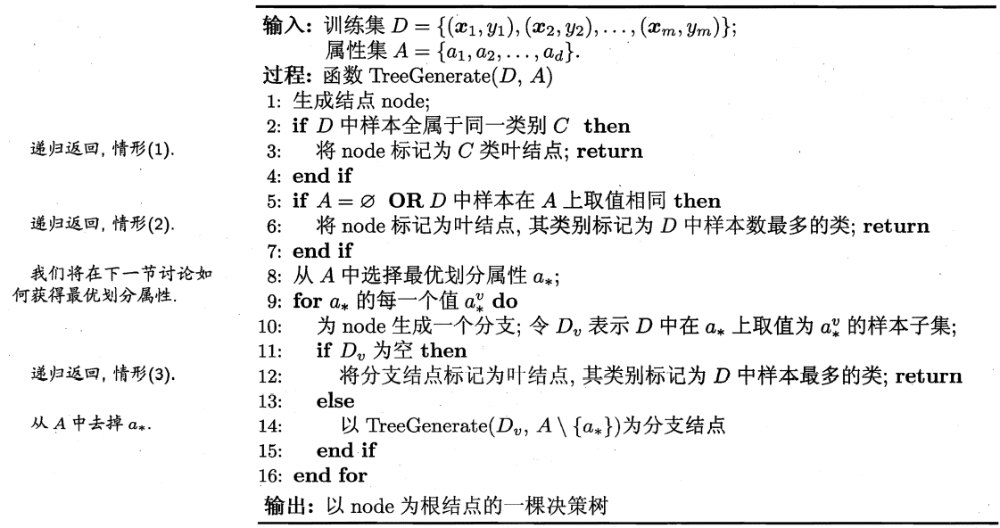

决策树的生成是一个递归过程，有三种情形会导致递归返回：
1. 当前结点包含的样本全属于同一类别，无需划分；
2. 当前属性集为空，或是所有样本在所有属性上取值相同，无法划分；：把当前结点标记为叶结点，并将其类别设定为该结点所含样本最多的类别；
3. 当前结点包含的样本集合为空，不能划分。：把当前结点标记为叶结点，将其类别设定为其父结点所含样本最多的类别，即把父结点的样本分布作为当前结点的先验分布。

决策树算法步骤包括3部分：
1. 特征选择：目的在于选取能够对训练数据分类的特征。
2. 树的生成：往往通过计算信息增益或其他指标，从根结点开始，递归地产生决策树。
3. 树的剪枝：往往从已生成的树上剪掉一些叶结点或叶结点以上的子树，并将其父结点或根结点作为新的叶结点，从而简化生成的决策树。

## 4.2 划分选择
决策树学习的关键在于如何选择最优划分属性。一般而言，随着划分过程不断进行，我们希望决策树的分支结点所包含的样本尽可能属于同一类别，即结点的“纯度”（purity）越来越高。

### 4.2.1 信息增益（ID3）
> 信息熵
> - 信息熵 $H(X)$ 表示不确定性的度量，熵越大，信息的不确定性越大。
> - 设X是一个取有限个值的随机变量，其概率分布为： $P(X=x_i) = p_i, \quad i=1,2,\ldots,n$
> - 随机变量X的信息熵定义为： $H(X) = -\sum_{i=1}^{n} p_i \log_2 p_i$ 其中，对数一般以2为底，也可取其它对数底，它们间用换底公式换算。

“信息熵”（information entropy）是度量样本集合纯度最常用的一种指标，假定当前样本集合D中第k类样本所占的比例为 $p_k (k=1,2,\ldots,|\mathcal{Y}|)$ ，则D的信息熵定义为： $Ent(D) = -\sum_{k=1}^{|\mathcal{Y}|} p_k \log_2 p_k$ 。
- 计算信息熵时约定：若 $p=0$ ，则 $p \log_2 p = 0$ ；
- Ent(D)的最小值为0，最大值为 $\log_2 |\mathcal{Y}|$ 。

假定离散属性a有V个可能的取值 $\{a^1, a^2, \ldots, a^V\}$ ，用a来对样本集D进行划分，产生V个分支结点，第v个分支结点包含了D中所有在属性a上取值为 $a^v$ 的样本，记为 $D^v$ 。考虑到不同的分支结点所包含的样本数不同，给分支结点赋予权重 $|D^v|/|D|$ ，样本数越多的分支结点的影响越大，则可计算出用属性a对样本集D进行划分所获得的“信息增益”（information gain）：$Gain(D, a) = Ent(D) - \sum_{v=1}^{V} \frac{|D^v|}{|D|} Ent(D^v)$ 。
- 一般而言，信息增益越大，则意味着使用属性a来进行划分所获得的“纯度提升”越大 $a_* = \argmax_{a \in A} Gain(D, a)$ ；
- ID3（Iterative Dichotomiser，迭代二分器）决策树学习算法就是以信息增益为准则来选择划分属性。

实例及结果（计算过程略）：
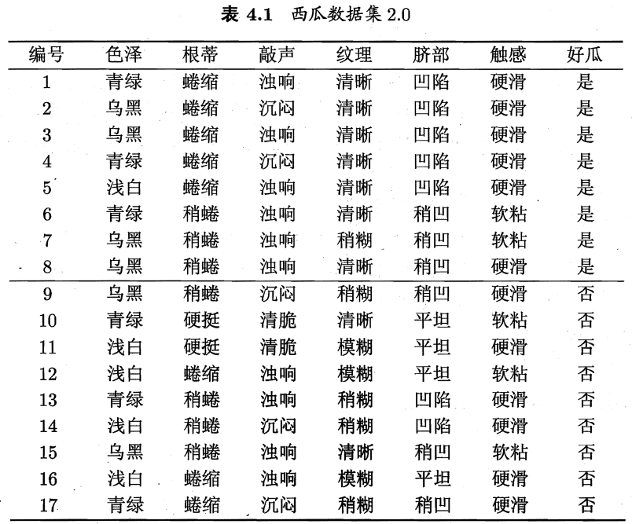
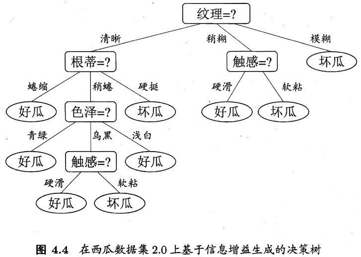

> ID3算法局限性：
> - 只能处理分类属性（离散属性），不能处理连续属性（数值属性）；
> - 信息增益准则对可取值数目较多的属性有所偏好。
> 原因：当特征的取值较多时，根据此特征划分更容易得到纯度更高的子集，因此划分之后的熵更低，由于划分前的熵是一定的，因此信息增益更大，因此信息增益比较偏向取值较多的特征。

### 4.2.2 增益率（C4.5）
若把“编号”也作为一个候选划分属性，则其信息增益一般远大于其他属性。显然，这样的决策树不具有泛化能力，无法对新样本进行有效预测。

> 信息增益对可取值数目较多的属性有所偏好。

C4.5决策树算法不直接使用信息增益，而是使用“增益率”（gain ratio）来选择划分属性。
增益率定义为：$Gain\_ratio(D, a) = \frac{Gain(D, a)}{IV(a)}$ ，其中 $IV(a) = - \sum_{v=1}^{V} \frac{|D^v|}{|D|} \log_2 \frac{|D^v|}{|D|}$ 称为属性a的“固有值”（intrinsic value）。
属性a的可能取值数目越多（即V越大），则 $IV(a)$ 的值通常会越大。

> 增益率准则对可取值数目较少的属性有所偏好。

C4.5使用了一个启发式：先从候选划分属性中找出信息增益高于平均水平的属性，再从中选取增益率最高的。

### 4.2.3 基尼指数（CART）
CART（Classification And Regression Tree）决策树使用“基尼指数”（Gini index）来选择划分属性，数据集D的纯度可用基尼值来度量： $Gini(D) = \sum_{k=1}^{|\mathcal{Y}|} \sum_{k' \neq k} p_k p_{k'} = 1 - \sum_{k=1}^{|\mathcal{Y}|} p_k^2$ 。

直观来说，Gini(D)反映了从数据集D中随机抽取两个样本，其类别标记不一致的概率。Gini(D)越小，数据集D的纯度越高。属性a的基尼指数定义为 $Gini\_index(D, a) = \sum_{v=1}^{V} \frac{|D^v|}{|D|} Gini(D^v)$ 。
在候选属性集合A中，选择使得划分后基尼指数最小的属性作为最优划分属性，即 $a_* = \argmin_{a \in A} Gini\_index(D, a)$ 。

## 4.3 剪枝处理
为什么剪枝
- “剪枝”（pruning）是决策树学习算法对付“过拟合”的主要手段；
- 可通过“剪枝”来一定程度避免因决策分支过多，以致于把训练集自身的一些特点当做所有数据都具有的一般性质而导致的过拟合。

剪枝的基本策略：
- 预剪枝（prepruning）：在构造的过程中先评估，再考虑是否分支。
  - 决策树生成过程中，对每个结点在划分前先进行估计，若当前结点的划分不能带来决策树泛化性能提升，则停止划分并将当前结点记为叶结点，其类别标记为训练样例数最多的类别。
- 后剪枝（post-pruning）：在构造好一颗完整的决策树后，自底向上，评估分支的必要性。
  - 先从训练集生成一棵完整的决策树，然后自底向上地对非叶结点进行考察，若将该结点对应的子树替换为叶结点能带来决策树泛化性能提升，则将该子树替换为叶结点。

判断决策树泛化性能是否提升的方法
- 本节采用“留出法”：预留一部分数据用作“验证集”以进行性能评估。

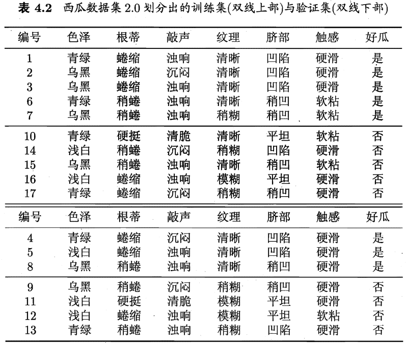

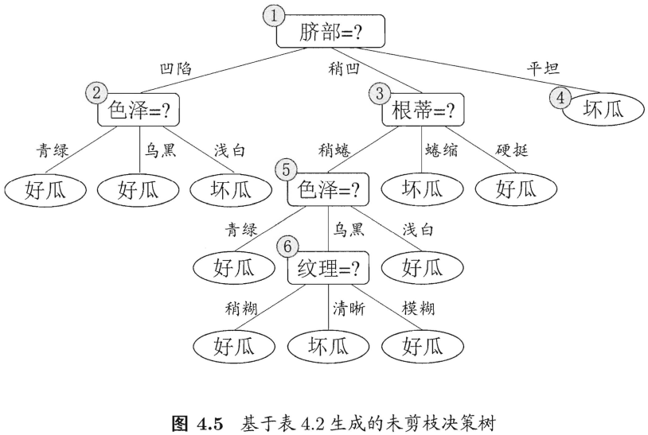

### 4.3.1 预剪枝
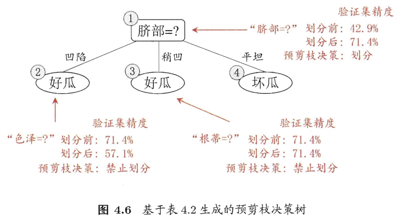

“决策树桩”（decision stump）：一棵仅有一层划分的决策树。

预剪枝的优缺点
- 优点
  - 降低过拟合风险；
  - 显著减少训练时间和测试时间开销。
- 缺点
  - 欠拟合风险：有些分支的当前划分虽然不能提升泛化性能，但在其基础上进行的后续划分却有可能导致性能显著提高。预剪枝基于“贪心”本质禁止这些分支展开，带来了欠拟合风险。

### 4.3.2 后剪枝
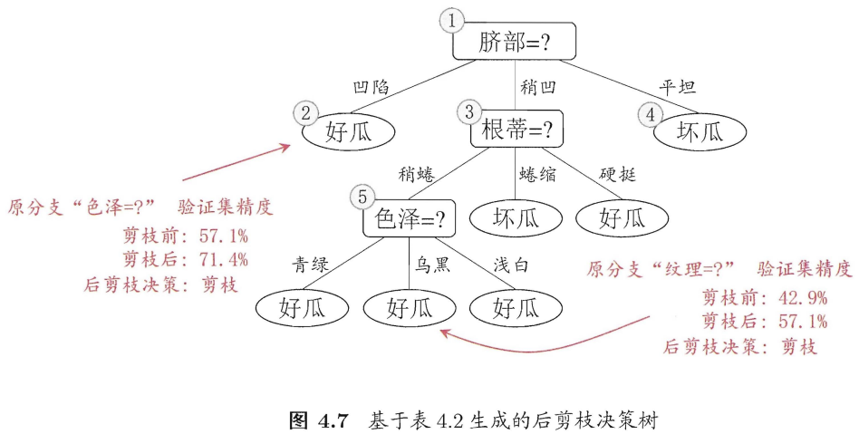

后剪枝的优缺点
- 优点
  - 后剪枝比预剪枝保留了更多的分支，欠拟合风险小，泛化性能往往优于预剪枝决策树。
- 缺点
  - 训练时间开销大：后剪枝过程是在生成完全决策树之后进行的，需要自底向上对所有非叶结点逐一考察，因此训练时间开销比未剪枝和预剪枝决策树都要大的多。

## 4.4 连续与缺失值

### 4.4.1 连续值处理
由于连续属性的可取值数目不再有限，连续属性离散化技术可派上用场。C4.5决策树算法中采用二分法（bi-partition）对连续属性进行处理。

第一步：假定连续属性a在样本集D上出现n个不同的取值，从小到大排列，记为 $\{a_1, a_2, \ldots, a_n\}$ 。
基于划分点t可将D分为子集 $d_t^-$ 和 $d_t^+$ ，其中
- $d_t^-$ 包含那些在属性a上取值不大于t的样本；
- $d_t^+$ 包含那些在属性a上取值大于t的样本。

考察包含n-1个元素的候选划分点集合 $T_a = \{ \frac{a_i+a_{i+1}}{2} | i \le i \le n-1 \}$ ，即把区间 $[a^i, a_{i+1})$ 的中位点 $\frac{a_i+a_{i+1}}{2}$ 作为候选划分点。

> 可将划分点设为该属性在训练集中出现的不大于中位点的最大值，从而使得最终决策树使用的划分点都在训练集中出现过。

第二步：采用离散属性值方法考察这些划分点，选取最优的划分点进行样本集合的划分。
$Gain(D, a) = \max_{t \in T_a} Gain(D, a, t) = \max_{t \in T_a} Ent(D) - \sum_{\lambda \in \{-, +\}} \frac{|d_t^\lambda|}{|D|} Ent(D_t^\lambda)$
其中Gain(D, a, t)是样本集D基于划分点t二分后的信息增益，于是，就可选择使Gain(D, a, t)最大化的划分点。

> 与离散属性不同，若当前结点划分属性为连续属性，该属性还可作为其后代结点的划分属性。

### 4.4.2 缺失值处理
现实任务中常会遇到不完整样本，即样本的某些属性值缺失。如果仅使用无缺失值的样本来进行学习，显然是对数据信息极大的浪费。
利用有缺失属性值的训练样例进行学习，需要解决两个问题：
- 如何在属性缺失的情况下进行划分属性选择？
- 给定划分属性，若样本在该属性上的值缺失，如何对样本进行划分？

$\tilde{D}$ 表示D中在属性a上没有缺失值的样本子集， $\tilde{D}^v$ 表示 $\tilde{D}$ 中在属性a上取值为 $a^v$ 的样本子集， $\tilde{D}_k$ 表示 $\tilde{D}$ 中属于第k类的样本子集。为每个样本 $\pmb{x}$ 赋予一个权重 $w_{\pmb{x}}$ （在决策树学习开始阶段，根结点中各样本的权重初始化为1），并定义：
- 无缺失值样本所占的比例： $\rho = \frac{\sum_{\pmb{x} \in \tilde{D}} w_{\pmb{x}}}{\sum_{\pmb{x} \in D} w_{\pmb{x}}}$ ；
- 无缺失值样本中第k类所占比例： $\tilde{p}_k = \frac{\sum_{\pmb{x} \in \tilde{D}_k} w_{\pmb{x}}}{\sum_{\pmb{x} \in \tilde{D}} w_{\pmb{x}}} \quad (1 \le k \le |\mathcal{Y}|)$ ；
- 无缺失值样本中在属性a上取值 $a^v$ 的样本所占比例： $\tilde{r}_v = \frac{\sum_{\pmb{x} \in \tilde{D}^v} w_{\pmb{x}}}{\sum_{\pmb{x} \in \tilde{D}} w_{\pmb{x}}} \quad (1 \le v \le V)$ 。

显然， $\sum_{k=1}^{|\mathcal{Y}|} \tilde{p}_k = 1 \quad, \quad \sum_{v=1}^V \tilde{r}_v = 1$ 。

基于上述定义，可得 $Gain(D, a) = \rho Gain(\tilde{D}, a) = \rho \times (Ent(\tilde{D}) - \sum_{v=1}^V \tilde{r}_v Ent(\tilde{D}^v))$ ，其中 $Ent(\tilde{D}) = - \sum_{k=1}^{|\mathcal{Y}|} \tilde{p}_k \log_2 \tilde{p}_k$ 。

若样本 $\pmb{x}$ 在划分属性a上的取值已知，则将 $\pmb{x}$ 划入与其取值对应的子结点，且样本权值在子结点中保持为 $w_{\pmb{x}}$ ；
若样本 $\pmb{x}$ 在划分属性a上的取值未知，则将 $\pmb{x}$ 同时划入所有子结点，且样本权值在与属性值 $a^v$ 对应的子结点中调整为 $\tilde{r}_v \cdot w_{\pmb{x}}$ （直观来看，相当于让同一个样本以不同概率划入不同的子结点中去）。

<!-- 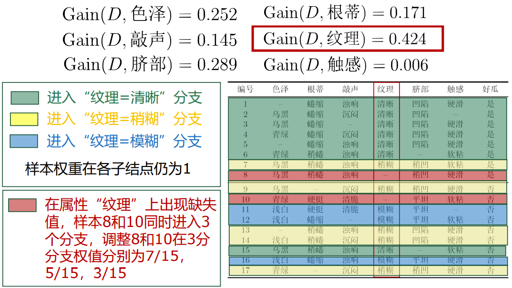 -->

## 4.5 多变量决策树
单变量决策树
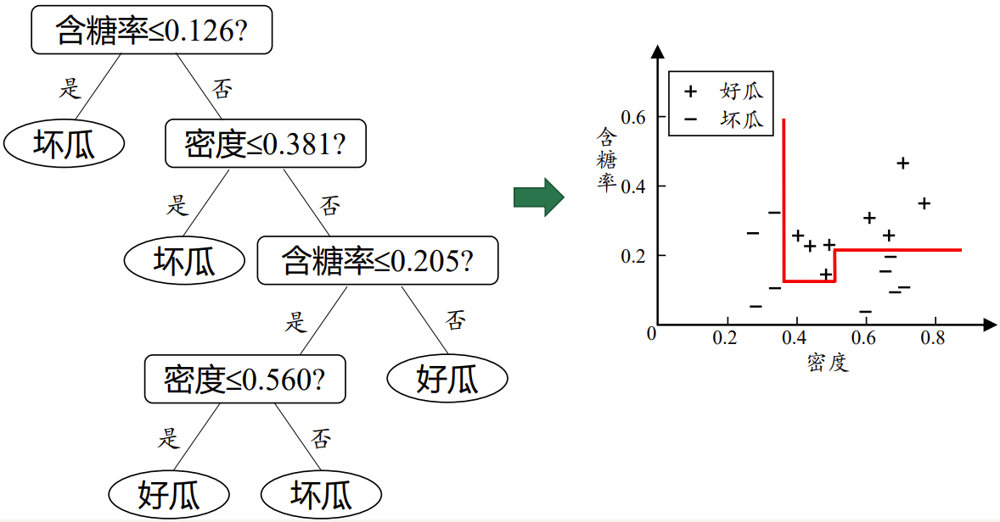
- 若我们把每个属性视为坐标空间中的一个坐标轴，则d个属性描述的样本就对应了d维空间中的一个数据点，对样本分类则意味着在这个坐标空间中寻找不同类样本之间的分类边界；
- 决策树所形成的分类边界有一个明显的特点：轴平行（axis-parallel），即它的分类边界由若干个与坐标轴平行的分段组成。

若能使用斜的划分边界，则决策树模型将大为简化。
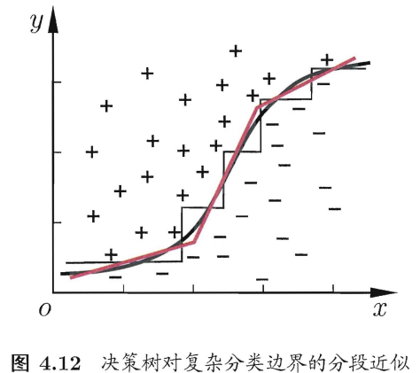

“多变量决策树”（multivariate decision tree）/“斜决策树”（oblivious decision tree）：使用斜的划分边界的决策树。
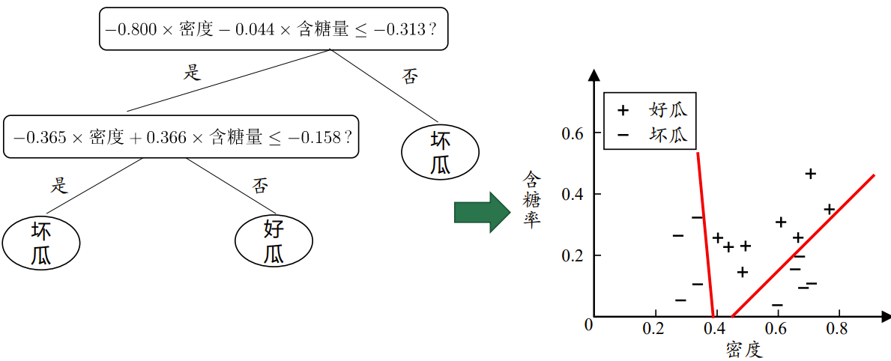
- 非叶节点不再是仅对某个属性，而是对属性的线性组合；
-  每个非叶结点是一个形如 $\sum_{i=1}^d w_i a_i = t$ 的线性分类器，其中 $w_i$ 是属性 $a_i$ 的权值， $w_i$ 和t可在该结点所含的样本集和属性集上学得。
