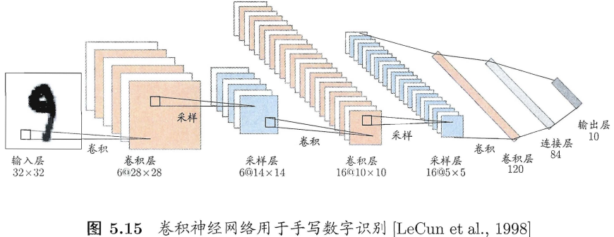

## 5.1 神经元模型
神经网络发展史

第一阶段
- 1943年，心理学家Warren.S. McCulloch和数理逻辑学家Walter Pitts建立了人工神经元的简易数学模型，称为MP模型，并从原理上证明了人工神经网络能够计算任何算数和逻辑函数。
- 1949年，Hebb发表《The Organization of Behavior》一书，提出生物神经元学习的机理，即Hebb学习规则。
- 1958年，计算科学家Frank Rosenblatt 提出了感知机网络（Perceptron）模型和其学习规则。
- 1960年，Widrow和Hoff提出自适应线性神经元（Adaline）模型和最小均方学习算法。
- 1969年，Minsky和Papert发表《Perceptrons》一书，指出单层神经网路不能解决非线性问题，多层网络的训练算法尚无希望。这个论断导致神经网络进入低谷。

第二阶段
- 1982年，物理学家J.Hopfield提出了一种具有联想记忆、优化计算能力的递归网络模型，即Hopfield网络。
- 1985年，Hinton、Sejnowsky、Runelhart等人提出了著名的Boltzmann机。
- 1986年，Hinton、Rumelhart 等编辑的著作《Parallel Distributed Proceesing: Explorations in the Microstructures of Cognition》报告了反向传播算法。
- 1987年，IEEE 在美国加州圣地亚哥召开第一届神经网络国际会议（ICNN）。
- 90年代初，伴随统计学习理论和SVM的兴起，神经网络由于理论不够清楚，难以训练，再次进入低谷。

第三阶段
- 2006年，Hinton提出了深度信念网络(DBN)，通过“预训练+微调”使得深度模型的最优化变得相对容易。
- 2012年，Hinton组参加ImageNet竞赛，使用CNN模型以超过第二名10个百分点的成绩夺得当年竞赛的冠军。
- 伴随云计算、大数据时代的到来，计算能力的大幅提升，使得深度学习模型在计算机视觉、自然语言处理、语音识别等众多领域都取得了较大的成功。

神经元是大脑处理信息的基本单元，它是以细胞体为主体，由许多向周围延伸的不规则树枝状纤维构成的神经细胞，其形状很像一棵枯树的枝干。它主要由细胞体、树突、轴突和突触组成。
- 当其处于兴奋状态时，输出侧的轴突就会发出脉冲信号，每个神经元的树突从来自其它神经元的轴突末梢接收由轴突传来的信号。
- 如果神经元所接收到的信号的总和超过了它本身的“阈值”（threshold/bias），则该神经元就会处于兴奋状态，并向它后续连接的神经元发出脉冲信号。

> 
> 为了更形象理解神经元传递信号过程，把一个神经元比作一个水桶。水桶下侧连着多根水管（树突），水管既可以把桶里的水排出去（抑制性），又可以将其他水桶的水输进来（兴奋性），水管的粗细不同，对桶中水的影响程度不同（权重），水管对水桶水位（膜电位）的改变就是水桶内水位的改变，当桶中水达到一定高度时，就能通过另一条管道（轴突）排出去。

神经网络（neural networks）是由具有适应性的简单单元组成的广泛并行互连的网络，它的组织能够模拟生物神经系统对真实世界物体所作出的交互反应”。
- 机器学习中谈论神经网络时指的是“神经网络学习”，是机器学习与神经网络这两个学科领域的交叉部分。
- 神经网络中最基本的成分是神经元（neuron）模型，即上述定义中的“简单单元”（unit）.

M-P神经元模型【McCulloch and Pitts】
- 输入：来自其他 个神经元传递过来的输入信号。
- 处理：输入信号通过带权重的连接（connection）进行传递，神经元接收到总输入值将与神经元的阈值进行比较。
- 输出：通过“激活函数”（activation function）/响应函数的处理以得到输出。

激活函数

- 理想激活函数是阶跃函数，0表示抑制神经元而1表示激活神经元。
- 阶跃函数具有不连续、不光滑等不好的性质，常用的是Sigmoid函数（对数几率函数是其典型代表）。

把许多个这样的神经元按一定的层次结构连接起来，就得到了神经网络。

## 5.2 感知机与多层网络
感知机（Perceptron）由两层神经元组成，输入层接收外界输入信号后传递给输出层，输出层是M-P神经元，亦称“阈值逻辑单元”（threshold logic unit）。

感知机能容易地实现逻辑与、或、非运算。 $y = f(\Sigma_i w_i x_i - \theta)$ ，假定f是阶跃函数，有
- “与” $(x_1 \wedge x_2)$ ：令 $w_1 = w_2 = 1, \theta = 2$ ，则 $y = f(1 \cdot x_i + 1 \cdot x_2 - 2)$ ，仅在 $x_1 = x_2 = 1$ 时，$y = 1$ ；
- “或” $(x_1 \vee x_2)$ ：令 $w_1 = w_2 = 1, \theta = 0.5$ ，则 $y = f(1 \cdot x_i + 1 \cdot x_2 - 0.5)$ ，仅在 $x_1 = 1$ 或 $x_2 = 1$ 时，$y = 1$ ；
- “非” $(\neg x_1)$ ：令 $w_1 = -0.6, w_2 = 0, \theta = -0.5$ ，则 $y = f(-0.6 \cdot x_i + 0 \cdot x_2 + 0.5)$ ，当 $x_1 = 1$ 时，$y = 0$ ；当 $x_1 = 0$ 时，$y = 1$ 。

更一般地，给定训练数据集，权重 $w_i \quad (i=1,2,..,n)$ 和阈值 $\theta$ 可以通过学习得到。阈值 $\theta$ 可看作一个固定输入为-1.0的“哑结点”（dummy node）所对应的连接权重 $w_{n+1}$ 。

感知机学习规则：对训练样例 $(\pmb{x}, y)$ ，若当前感知机的输出为 $\hat{y}$ ，则感知机权重调整规则为：
$w_i \leftarrow w_i + \Delta w_i$ ， $\Delta w_i = \eta (y - \hat{y}) x_i$ ，其中 $\eta \in (0, 1)$ 为学习率（learning rate）。
若感知机对训练样例 $(\pmb{x}, y)$ 预测正确，即 $\hat{y} = y$ ，则感知机不发生变化，否则将根据错误的程度进行权重调整。

感知机学习能力
- 若两类模式线性可分（linearly separable），则感知机的学习过程一定会收敛（converge）；否感知机的学习过程将会发生震荡。
- 单层感知机的学习能力非常有限，只能解决线性可分问题
  - 事实上，与、或、非问题是线性可分的，因此感知机学习过程能够求得适当的权值向量；
  - 而异或问题不是线性可分的，感知机学习不能求得合适解。

多层感知机：解决异或问题的两层感知机

- 输出层与输入层之间的一层神经元，被称之为隐层或隐含层（hidden layer），隐含层和输出层神经元都是具有激活函数的功能神经元。

多层前馈神经网络（multi-layer feedforward neural networks）
- 定义：每层神经元与下一层神经元全互联，神经元之间不存在同层连接也不存在跨层连接。
- 前馈：输入层接受外界输入，隐含层与输出层神经元对信号进行加工，最终结果由输出层神经元输出。
- 学习：根据训练数据来调整神经元之间的“连接权”（connection weight）以及每个功能神经元的“阈值”。
- 多层网络：包含隐层的网络。

[“Hebb规则”，这个思想是神经网络的学习算法的最本质，也是最原始的思想。](https://zhuanlan.zhihu.com/p/26745851)

广义Hebb规则有一些缺点：
1. 只是一个启发式的想法，在数学上非最优；
2. 只能更新输出层的权重，无法更新隐藏层的权重。

因此，不含隐层的感知机只能解决线性分类问题，含隐层的感知机又没有有效的学习规则。【十分悲凉】

> 由于Minsky的巨大影响力以及书中呈现的悲观态度，让很多学者和实验室纷纷放弃了神经网络的研究。神经网络的研究陷入了冰河期。这个时期又被称为“AI winter”。
> 接近10年以后，直到出现误差反向传播算法（BP：ErrorBack Propagation），解决了多层感知机的学习问题。神经网络的研究才得以复苏。
> 这时候的Hinton还很年轻，30年以后，正是他重新定义了神经网络，带来了神经网络复苏的又一春。

## 5.3 误差逆传播算法
基本原理：利用输出后的误差来估计输出层的前一层的误差，再用这个误差估计更前一层的误差，如此一层一层地反向传播下去，从而获得所有其它各层的误差估计。

误差逆传播（Error Back Propagation，BP）算法/反向传播算法是最成功的训练多层前馈神经网络的学习算法。
通常说“BP网络”一般是指用BP算法训练的多层前馈神经网络。
- 给定训练集 $D = \{(\pmb{x}_1, \pmb{y}_1), (\pmb{x}_2, \pmb{y}_2), \ldots, (\pmb{x}_m, \pmb{y}_m)\}, \qquad \pmb{x}_i \in \mathbb{R}^d, \pmb{y}_i \in \mathbb{R}^l$ ，即输入示例由d个属性描述，输出l维实值向量。
- 为方便讨论，给定一个拥有d个输入神经元，l个输出神经元，q个隐层神经元的多层前向前馈网络结构。

记号：
- $\theta_j$：输出层第 个神经元阈值；
- $\gamma_h$：隐含层第 个神经元阈值；
- $\nu_{ih}$：输入层与隐层神经元之间的连接权重；
- $\omega_{hj}$：隐层与输出层神经元之间的连接权重；

对于样例 $(\pmb{x}_k, \pmb{y}_k)$ ，假设网络的实际输出为 $\hat{\pmb{y}}_k$
- 前向计算
  - $b_{h}=f\left(\beta_{h}-\gamma_{h}\right), \beta_{h}=\sum_{i=1}^{d} v_{i h} x_{i}$
  - $\hat{y}_{j}^{k}=f\left(\alpha_{j}-\theta_{j}\right), \alpha_{h}=\sum_{i=1}^{q} w_{h j} b_{h}$
  - $E_{k}=\frac{1}{2} \sum_{j=1}^{l}\left(\hat{y}_{j}^{k}-y_{j}^{k}\right)^{2}$
- 参数数目
  - 权重： $v_{i h}, w_{h j}$ ，阈值： $\theta_{j}, \gamma_{h} \quad (i = 1, \ldots, d; h = 1, \ldots, q; j = 1, \ldots, l)$
  - 因此网络中有 $(d + l + 1)q + l$ 个参数需确定。
- 参数优化
  - BP是一个迭代学习算法，在迭代的每一轮中采用广义的感知机学习规则对参数进行更新估计，任意的参数v的更新估计式为：$v \leftarrow v + \eta \Delta v$ 。

BP算法基于梯度下降（gradient descent）策略，以目标的负梯度方向对参数进行调整。对误差 $E_k$ ，给定学习率 $\eta$ ，有：
- $\Delta w_{h j}=-\eta \frac{\partial E_{k}}{\partial w_{h j}}$
- $\frac{\partial E_{k}}{\partial w_{h j}} = \frac{\partial E_{k}}{\partial \hat{y}_{j}^{k}} \cdot \frac{\partial \hat{y}_{j}^{k}}{\partial \beta{j}} \cdot \frac{\partial \beta{j}}{\partial w_{h j}}$
- $g_j = -\frac{\partial E_{k}}{\partial \hat{y}_{j}^{k}} \cdot \frac{\partial \hat{y}_{j}^{k}}{\partial \beta{j}} = -(\hat{y}_{j}^{k} - y_{j}^{k}) f'(\beta_j - \theta_j) = \hat{y}_{j}^{k} (1 - \hat{y}_{j}^{k}) (y_{j}^{k} - \hat{y}_{j}^{k})$
- $\Delta w_{h j} = \eta g_j b_h$

类似可得：
- $\Delta \theta_j = -\eta g_j$
- $\Delta v_{i h} = \eta e_h x_i$
- $\Delta \gamma_h = -\eta e_h$

其中：
$$
\begin{aligned}
e_{h} &=-\frac{\partial E_{k}}{\partial b_{h}} \cdot \frac{\partial b_{h}}{\partial \alpha_{h}} \\
&=-\sum_{j=1}^{l} \frac{\partial E_{k}}{\partial \beta_{j}} \partial b_{h} f^{\prime}\left(\alpha_{h}-\gamma_{h}\right) \\
&=\sum_{j=1}^{h} w_{h j} g_{j} f^{\prime}\left(\alpha_{h}-\gamma_{h}\right) \\
&=b_{h}\left(1-b_{h}\right) \sum_{j=1}^{h} w_{h j} g_{j}
\end{aligned}
$$

学习率 $\eta \in (0,1)$ 控制着算法每一轮迭代中的更新步长，若太长则让容易震荡，太小则收敛速度又会过慢。

标准BP算法
- 每次针对单个训练样例更新权值与阈值。
- 参数更新频繁，不同样例可能抵消，需要多次迭代。

累计误差逆传播（accumulated error backpropagation）算法
- 其优化的目标是最小化整个训练集上的累计误差 $E = \frac{1}{m} \sum_{k=1}^m E_k$ 。
- 读取整个训练集一遍才对参数进行更新，参数更新频率较低。

实际应用
- 但在很多任务中，累计误差下降到一定程度后，进一步下降会非常缓慢，这时标准BP算法往往会获得较好的解，尤其当训练集非常大时效果更明显。

多层前馈网络表示能力
- 只需要一个包含足够多神经元的隐层，多层前馈神经网络就能以任意精度逼近任意复杂度的连续函数。

多层前馈网络局限
- 神经网络由于强大的表示能力，经常遭遇过拟合。
  - 表现为：训练误差持续降低，但测试误差却可能上升。
- 如何设置隐层神经元的个数仍然是个未决问题。实际应用中通常使用“试错法”（trial-by-error）调整。

缓解过拟合的策略
- 早停（early stopping）：在训练过程中，若训练误差降低，但验证误差升高，则停止训练；
- 正则化（regularization）：在误差目标函数中增加一项描述网络复杂程度的部分，例如连接权值与阈值的平方和 $E = \lambda \frac{1}{m} \sum_{k=1}^m E_k + (1-\lambda) \sum_i w_i^2$ 。
  - 其中 $\lambda \in (0,1)$ 用于对经验误差与网络复杂度这两项进行折中，常通过交叉验证法来估计。

## 5.4 全局最小与局部极小
对 $\boldsymbol{w}^{*}$ 和 $\theta^{*}$ ，若存在 $\epsilon>0$ 使得 $\forall(\boldsymbol{w} ; \theta) \in\left\{\left\|(\boldsymbol{w} ; \theta)-\left(\boldsymbol{w}^{*} ; \theta^{*}\right)\right\| \leq \epsilon\right\}$ ，都有 $E(\boldsymbol{w} ; \theta) \geq E\left(\boldsymbol{w}^{*} ; \theta^{*}\right)$ 成立，则 $\left(\boldsymbol{w}^{*} ; \theta^{*}\right)$ 为局部极小解；若在参数空间中任意的 $(\boldsymbol{w} ; \theta)$ ，都有 $E(\boldsymbol{w} ; \theta) \geq E\left(\boldsymbol{w}^{*} ; \theta^{*}\right)$ ，则 $\left(\boldsymbol{w}^{*} ; \theta^{*}\right)$ 为全局最小解. 两者对应的 $E\left(\boldsymbol{w}^{*} ; \theta^{*}\right)$ 分别称为误差函数的局部最小解和全局最小值。

- 显然参数空间梯度为零的点，只要其误差函数值小于邻点的误差函数值，就是局部极小点；
- 可能存在多个局部极小值，但却只会有一个全局极最小值。

“跳出”局部最小的策略
基于梯度的搜索是使用最为广泛的参数寻优方法。如果误差函数仅有一个局部极小，那么此时找到的局部极小就是全局最小；然而，如果误差函数具有多个局部极小，则不能保证找到的解是全局最小。
在现实任务中，通常采用以下策略“跳出”局部极小，从而进一步达到全局最小。
- 多组不同的初始参数优化神经网络，选取误差最小的解作为最终参数。
- “模拟退火”（simulated）技术：每一步都以一定的概率接受比当前解更差的结果，从而有助于跳出局部极小。
- 随机梯度下降：与标准梯度下降法精确计算梯度不同，随机梯度下降法在计算梯度时加入了随机因素。
- 遗传算法（genetic algorithm）：遗传算法也常用来训练神经网络以更好地逼近全局极小。

## 5.5 其他常见神经网络

### 5.5.1 RBF网络
RBF（Radial Basis Function，径向基函数）网络是一种单隐层前馈神经网络，它使用径向基函数作为隐层神经元激活函数，而输出层则是隐层神经元输出的线性组合。
RBF网络模型：假定输入为d维的向量x，输出为实值，则RBF网络可以表示为： $\phi(\pmb{x}) = \sum_{i=1}^q w_i \rho (\pmb{x}, \pmb{c}_i)$ 。
其中q为隐层神经元的个数， $\pmb{c}_i$ 和 $w_i$ 分别是第i神经元对应的中心和权重， $\rho(\pmb{x}, \pmb{c}_i)$ 是径向基函数。
常用的高斯径向基函数形如： $\rho (\pmb{x}, \pmb{c}_i) = e^{-\beta_i ||\pmb{x}-\pmb{c}_i||^2}$
RBF网络性质：具有足够多隐层神经元RBF神经网络能以任意精度逼近任意连续函数。
RBF网络训练
- S1：确定神经元中心 $\pmb{c}_i$ ，常用的方式包括随机采样、聚类等；
- S2：利用BP算法等确定参数 $w_i$ 和 $\beta_i$ 。

### 5.5.2 ART网络
竞争型学习（competitive learning）是神经网络中一种常用的无监督学习策略，在使用该策略时，网络的输出神经元相互竞争，每一时刻仅有一个神经元被激活，其他神经元的状态被抑制，这种机制亦称“胜者通吃”（winner-take-all）。

ART网络
- ART（Adaptive Resonance Theory，自适应谐振理论）网络是竞争学习的重要代表；
- ART网络由比较层、识别层、识别阈值和重置模块构成；
- 比较层负责接收输入样本，并将其传送给识别层神经元；
- 识别层每个神经元对应一个模式类，神经元的数目可在训练过程中动态增长以增加新的模式类。

ART网络性能依赖于识别阈值
- 识别阈值高时，输入样本将会分成比较多、得到较精细分类
- 识别阈值低时，输入样本将会分成比较少、产生较粗略分类

ART网络的优势
- ART较好的缓解了竞争学习中的“可塑性-稳定性窘境”（stability-plasticity dilemma）。
  - 可塑性是指神经网络要有学习新知识的能力；
  - 稳定性是指神经网络在学习新知识时要保持对旧知识的记忆。
- ART网络可以增量学习（incremental learning）或在线学习（online learning）。

ART网络的发展：ART2网络、FuzzyART网络、ARTMAP网络。

### 5.5.3 SOM网络
SOM（Self-Organizing Map，自组织映射）网络是一种竞争型的无监督神经网络，它能将高维数据映射到低维空间（通常为2维），同时保持输入数据在高维空间的拓扑结构，即将高维空间中相似的样本点映射到网络输出层中邻近神经元。

如图，SOM网络中的输出层神经元以矩阵方式排列在二维空间中，每个神经元都拥有一个权值向量，网络在接收输入向量后，将会确定输出层获胜神经元，它决定了该输入向量在低维空间中的位置。

SOM 网络训练
- S1：接受到一个训练样本后，每个输出层神经元计算该样本与自身携带的权向量之间的距离，距离最近的神经元成为竞争获胜者；
- S2：最佳匹配单元（best matching unit）及其近邻神经元的权值将被调整，使得这些权向量与当前输入样本的距离缩小。

### 5.5.4 级联相关网络
级联相关（Cascade-Correlation）网络不仅利用训练样本优化连接权值，阈值参数，将网络的结构也当做学习的目标之一，希望在训练过程中找到适合数据的网络结构。
- 级联：建立层次连接的层级结构。
- 相关：最大化神经元的输出与网络误差之间的相关性来训练相关参数。

### 5.5.5 Elman网络
递归神经网络（recurrent neural networks）/循环神经网络
- 允许网络中出现环形结构，使得神经元的输出反馈回来作为输入信号。
- t时刻网络的输出状态：由t时刻的输入状态和t-1时刻的网络状态决定，从而能处理与时间有关的动态变化。

Elman网络是最常用的递归神经网络之一，结构如图所示，这种结构与前馈神经网络很相似，但是隐层神经元的输出被反馈回来，与下一时刻输入层神经元提供的信号一起，作为隐层神经元在下一时刻的输入。

训练算法：推广的BP算法

### 5.5.6 Boltzmann机
能量模型：神经网络中有一类模型为网络状态定义一个“能量”（energy），能量最小化时网络达到理想状态，而网络的训练就是在最小化这个能量函数。

Boltzmann机
- Boltzmann机就是一种基于能量的模型
- 结构：显层与隐层
  - 显层：数据的输入输出
  - 隐层：数据的内在表达
- 神经元
  - 布尔型：即只能取0和1两种状态，其中1表示激活，0表示抑制。

Boltzmann机能量：令状态向量 $\pmb(s) \in \{0,1\}^n$，则其对应的Boltzmann机能量定义为： $E(\pmb{s}) = -\sum_{i=1}^{n-1} \sum_{j=i+1}^n w_{i j} s_i s_j - \sum_{i=1}^n \theta_i s_i$，其中 $w_{i j}$ 表示两个神经元之间的连接权值，$\theta_i$ 表示神经元的阈值。

Boltzmann分布：网络中的神经元以任意不依赖与输入值的顺序进行更新，则网络最终将达到 Boltzmann分布，此时状态向量 $\pmb{s}$ 出现的概率将仅由其能量与所有可能状态向量的能量确定： $P(\pmb{s}) = \frac{e^{-E(\pmb{s})}}{\sum_{\pmb{t}} e^{-E(\pmb{t})}}$ 。

Boltzmann机训练
- 将每个训练样本视为一个状态向量，使其出现的概率尽可能大
- 标准的Boltzmann机是一个全连接图，训练网络的复杂度很高，这使其难以用于解决现实任务
- 现实中常用受限Boltzmann机（Restricted Boltzmann Machine，RBM），RBM仅保留显层与隐层之间的连接，从而将Boltzmann机结构有完全图简化为二部图。

受限Boltzmann机常用“对比散度”（Contrastive Divergence，CD）来进行训练。
- 假定网络中有d个显层神经元q个隐层神经元，令v和h分别是显层与隐层的状态向量，由于同一层内不存在连接，有：
  - $P(v|h) = -\prod_{i=1}^d P(v_i|h)$
  - $P(h|v) = -\prod_{i=1}^q P(h_i|v)$
- CD算法对每个训练样本v，先计算出隐层神经元状态的概率分布，然后根据这个概率分布采样得到h；类似的方法从h中产生v'，再从v'中产生h'；连接权重的更新公式为： $\Delta w = \pmb{v} \pmb{h}^T - \pmb{v'} \pmb{h'}^T$ 。

## 5.6 深度学习
> 深度学习=大量训练数据+并行计算+可扩展的智能算法

典型的深度学习（deep learning）模型就是很深层的神经网络。

模型复杂度
- 增加隐层神经元的数目（模型宽度）
- 增加隐层数目（模型深度）
- 从增加模型复杂度的角度看，增加隐层的数目比增加隐层神经元的数目更有效。这是因为增加隐层数不仅增加了拥有激活函数的神经元数目，还增加了激活函数嵌套的层数。

复杂模型难点：多隐层网络难以直接用经典算法（例如标准BP算法）进行训练，因为误差在多隐层内逆传播时，往往会“发散”（diverge）而不能收敛到稳定状态。

复杂模型训练方法
- 预训练（pre-training）+微调（fine-tuning）
  - 预训练：监督逐层训练是多隐层网络训练的有效手段，每次训练一层隐层结点，训练时将上一层隐层结点的输出作为输入，而本层隐结点的输出作为下一层隐结点的输入，这称为“预训练”。
  - 微调：在预训练全部完成后，再对整个网络进行微调训练。微调一般使用BP算法。
- 例子：深度信念网络（deep belief network，DBN）
  - 结构：每一层都是一个受限Boltzmann机
  - 训练方法：无监督预训练+BP微调
- 分析：预训练+微调的做法可以视为将大量参数分组，对每组先找到局部看起来比较好的设置，然后再基于这些局部较优的结果联合起来进行全局寻优。

卷积神经网络（Convolutional Neural Network，CNN）
- 卷积层：每个卷积层包含多个特征映射（feature map），每个特征映射是一个由多个神经元构成的“平面”，通过一种卷积滤波器提取的一种特征。
- 采样层：亦称“汇合层”（pooling）/池化层，其作用是基于局部相关性原理进行亚采样，从而在减少数据量的同时保留有用信息。
- 连接层：每个神经元被全连接到上一层每个神经元，本质就是传统的神经网络，其目的是通过连接层和输出层的连接完成识别任务。

卷积神经网络激活函数：在CNN中通常将Sigmoid激活函数替换为修正的线性函数 $f(x)=max(0,x)$ 。

卷积神经网络训练：CNN可以用BP进行训练，但在训练中，无论是卷积层还是采样层，每一组神经元都是用相同的连接权，从而大幅减少了需要训练的参数数目。

复杂模型训练方法：权共享（weight sharing）
- 一组神经元使用相同的连接权值。
- 权共享策略在卷积神经网络中发挥了重要作用。

卷积神经网络的结构：CNN复合多个卷积层和采样层对输入信号进行加工，然后在连接层实现与输出目标之间的映射。

“特征工程”（feature engineering）VS“特征学习”（feature learning）或者“表示学习”（representation learning）
- 特征工程由人类专家根据现实任务来设计，特征提取与识别是单独的两个阶段；
  
- 特征学习通过深度学习技术自动产生有益于分类的特征，是一个端到端的学习框架。
  
