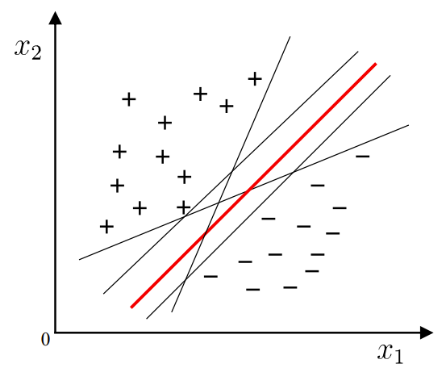
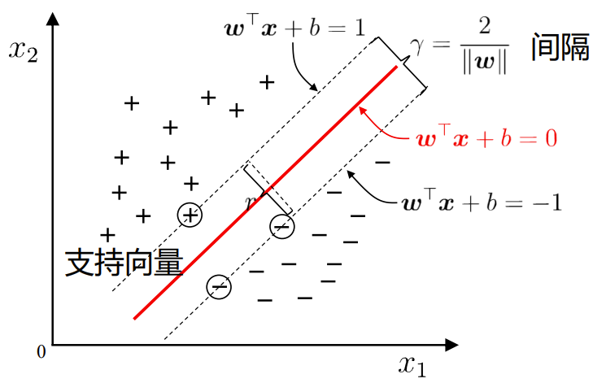
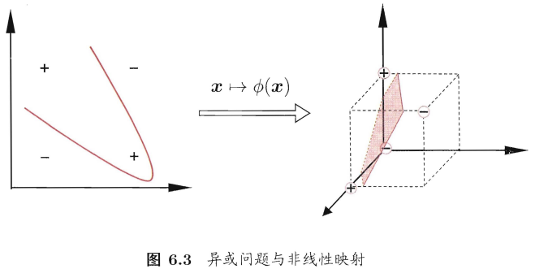
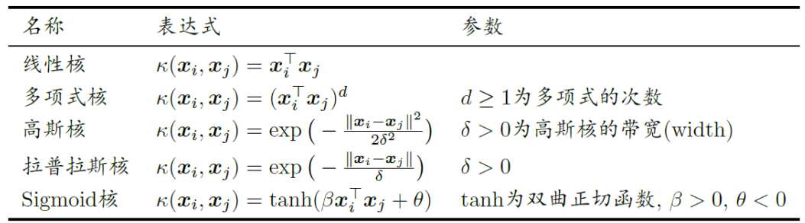
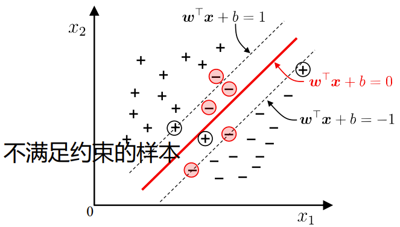
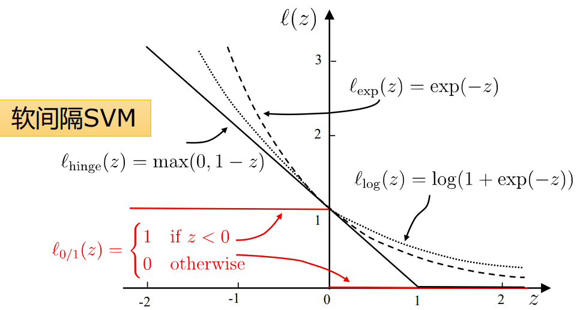
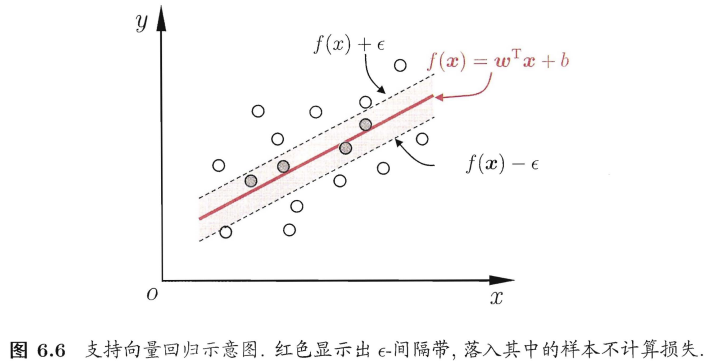
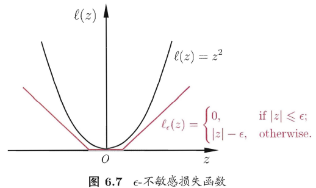

## 6.1 间隔与支持向量
10给定训练样本集 $D = \{(\pmb{x}_1, y_1), (\pmb{x}_2, y_2), \ldots, (\pmb{x}_m, y_m)\}$ ，分类学习最基本的想法就是基于训练集D在样本空间中找到一个划分超平面，将不同类别的样本分开。

- Q：将训练样本分开的超平面可能有很多，哪一个好呢？
- A：位于两类训练样本“正中间”的划分超平面，对训练样本局部扰动的“容忍”性最好。换言之，这个划分超平面所产生的分类结果是最鲁棒的，对未见示例的泛化能力最强。

在样本空间中，划分超平面可通过如下线性方程来描述： $\pmb{w}^T\pmb{x} + b = 0$
- $\pmb{w}=(w_1; w_2; \ldots; w_d)$ 为法向量，决定了超平面的方向；
- b 为位移项，决定了超平面与原点之间的距离。

划分超平面可被法向量 $\pmb{w}$ 和位移b确定，记做 $(\pmb{w}, b)$ 。样本空间中任意点 $\pmb{x}$ 到超平面 $(\pmb{w}, b)$ 的距离为： $r = \frac{|\pmb{w}^T\pmb{x} + b|}{||\pmb{w}||}$ 。
假设超平面 $(\pmb{w}, b)$ 可将训练样本正确分类，即 $(\pmb{x}_i, y_i) \in D$ ，若 $y_i = +1$ ，则有 $\pmb{w}^T\pmb{x}_i + b > 0$ ，若 $y_i = -1$ ，则有 $\pmb{w}^T\pmb{x}_i + b < 0$ ，令：
$$
\left\{\begin{matrix}
 \pmb{w}^T \pmb{x}_i + b \ge +1 &, y_i = +1 \\
 \pmb{w}^T \pmb{x}_i + b \le -1 &, y_i = -1
\end{matrix}\right.
$$

支持向量与间隔：
- 支持向量（support vector）：距离超平面最近的几个训练样本点（每个样本点对应一个特征向量），它们使得上式的等号成立。
- 间隔（margin）：两个异类支持向量到超平面的距离之和 $\gamma = \frac{2}{||\pmb{w}||}$ 。

欲找到具有“最大间隔”（maximum margin）的划分超平面，也就是要找到能满足约束的参数 $\pmb{w}$ 和b，使得 $\gamma$ 最大，即：
$$
\begin{aligned}
\underset{\boldsymbol{w}, b}{\arg \max } & \frac{2}{\|\boldsymbol{w}\|} \\
\text { s.t. } & y_{i}\left(\boldsymbol{w}^{\top} \boldsymbol{x}_{i}+b\right) \geq 1, i=1,2, \ldots, m .
\end{aligned}
$$
可重写为：
$$
\begin{aligned}
\underset{\boldsymbol{w}, b}{\arg \min } & \frac{1}{2}\|\boldsymbol{w}\|^{2} \\
\text { s.t. } & y_{i}\left(\boldsymbol{w}^{\top} \boldsymbol{x}_{i}+b\right) \geq 1, i=1,2, \ldots, m .
\end{aligned}
$$

以上就是支持向量机（Support Vector Machine，SVM）的基本型。

## 6.2 对偶问题
- 无约束优化问题，可写为： $\min f(x)$ → 费马引理，导数为0。
- 有等式约束的优化问题，可写为： $\min f(x) \quad \text { s.t. } h_{i(x)}=0, i=1,2,\ldots,n \quad F(x, \lambda) = f(x) + \sum_{k=1}^l \lambda_k h_k (x)$ → 拉格朗日乘子法。

希望求解SVM基本型得到大间隔划分超平面所对应的模型： $f(\pmb{x}) = \pmb{w}^T\pmb{x} + b$ ，其中 $\pmb{w}$ 和b是模型参数。这是一个凸二次规划（convex quadratic programming）问题。

使用拉格朗日乘子法可得到其“对偶问题”（dual problem）：
- 第一步：引入拉格朗日乘子 $\alpha_i \ge 0$ 得到拉格朗日函数： $L(\pmb{w}, b, \pmb{\alpha}) = \frac{1}{2}\|\pmb{w}\|^2 - \sum_{i=1}^m \alpha_i (y_i(\pmb{w}^T\pmb{x}_i + b) - 1)$ 。
- 第二步：令 $L(\pmb{w}, b, \pmb{\alpha})$ 对 $\pmb{w}$ 和b的偏导数为0，得到 $\pmb{w} = \sum_{i=1}^m \alpha_i y_i \pmb{x}_i, \qquad \sum_{i=1}^m \alpha_i y_i = 0$ 。
- 第三步：回代： $\min_{\alpha_i} \frac{1}{2}\sum_{i=1}^m \sum_{j=1}^m \alpha_i \alpha_j y_i y_j \pmb{x}_i^T \pmb{x}_j - \sum_{i=1}^m \alpha_i$ 。

最终模型： $f(\pmb{x}) = \pmb{w}^T\pmb{x} + b = \sum_{i=1}^m \alpha_i y_i \pmb{x}_i^T \pmb{x} + b$ 。
KKT（Karush-Kuhn-Tucker）条件： $\alpha_i \ge 0, \quad y_i f(\pmb{x}_i) - 1 \ge 0, \quad \alpha_i (y_i f(\pmb{x}_i) - 1) = 0$ 。

支持向量机解的稀疏性：训练完成后，大部分的训练样本都不需保留，最终模型仅与支持向量有关。

二次规划问题的规模正比于训练样本数，在实际任务中造成很大的开销。

SMO（Sequential Minimal Optimization）是一个著名的高效算法，基本思路：不断执行如下两个步骤直至收敛：
- 第一步：选取一对需要更新的变量 $\alpha_i, \alpha_j$ 。
- 第二步：固定 $\alpha_i, \alpha_j$ 以外的参数，求解对偶问题更新 $\alpha_i, \alpha_j$ 。

仅考虑 $\alpha_i, \alpha_j$ 时，对偶问题的约束变为： $\alpha_i y_i + \alpha_j y_j = -\sum_{k \ne i, j} \alpha_k y_k, \quad \alpha_i \ge 0, \alpha_j \ge 0$ 。
- 用一个变量表示另一个变量，回代入对偶问题可得一个单变量的二次规划，该问题具有闭式解。

偏移项b：通过支持向量来确定， $b = \frac{1}{|S|} \sum_{\pmb{s} \in S} (1/y_s - \sum_{i \in S} \alpha_i y_i \pmb{x}_i^T \pmb{x}_s)$ 。

## 6.3 核函数
若不存在一个能正确划分两类样本的超平面，可将样本从原始空间映射到一个更高维的特征空间，使得样本在这个特征空间内线性可分。

如果原始空间是有限维，即属性数有限，那么一定存在一个高维特征空间使样本可分。

令 $\phi (\pmb{x})$ 表示将 $\pmb{x}$ 映射后的特征向量，于是，在特征空间中划分超平面所对应的模型可表示为： $f(\pmb{x}) = \pmb{w}^T \phi (\pmb{x}) + b$ 。

原始问题： $\min_{\pmb{w}, b} \frac{1}{2} ||\pmb{w}||^2 \quad \text{s.t.} y_i (\pmb{w}^T \phi (\pmb{x}_i) + b) \ge 1, \quad i = 1, 2, \ldots, m$ 。

对偶问题： $\max_{\alpha} \sum_{i=1}^m \alpha_i - \frac{1}{2} \sum_{i=1}^m \sum_{j=1}^m \alpha_i \alpha_j y_i y_j \phi (\pmb{x}_i)^T \phi (\pmb{x}_j) \quad \text{s.t.} \sum_{i=1}^m \alpha_i y_i = 0, \quad \alpha_i \ge 0, \quad i = 1, 2, \ldots, m$ 。

求解上式涉及到计算 $\phi (\pmb{x}_i)^T \phi (\pmb{x}_j)$ ，这是样本 $\pmb{x}_i$ 与 $\pmb{x}_j$ 映射到特征空间后的内积。由于特征空间维数可能很高，计算困难。

设想一个函数： $\kappa (\pmb{x}_i, \pmb{x}_j) = <\phi (\pmb{x}_i), \phi (\pmb{x}_j)> = \phi (\pmb{x}_i)^T \phi (\pmb{x}_j)$ ，即 $\pmb{x}_i$ 与 $\pmb{x}_j$ 在特征空间中的内积等于它们在原始样本空间中通过函数 $\kappa (\cdot, \cdot)$ 计算的结果。（这称为“核技巧”（kernel trick）：不显式地设计核映射，而是设计核函数。）

于是对偶问题可重写为： $\max_{\alpha} \sum_{i=1}^m \alpha_i - \frac{1}{2} \sum_{i=1}^m \sum_{j=1}^m \alpha_i \alpha_j y_i y_j \kappa (\pmb{x}_i, \pmb{x}_j) \quad \text{s.t.} \sum_{i=1}^m \alpha_i y_i = 0, \quad \alpha_i \ge 0, \quad i = 1, 2, \ldots, m$ 。

求解后即可得到： $f(\pmb{x}) = \pmb{w}^T \phi (\pmb{x}) + b = \sum_{i=1}^m \alpha_i y_i \phi (\pmb{x}_i)^T \phi (\pmb{x}) + b = \sum_{i=1}^m \alpha_i y_i \kappa (\pmb{x}, \pmb{x}_i) + b$ 。

这里的函数 $\kappa (\cdot, \cdot)$ 就是“核函数”（kernel function）。
式子显示出模型最优解可通过训练样本的核函数展开，这一展式亦称“支持向量展式”（support vector expansion）。
若已知合适映射 $\phi (\cdot)$ 的具体形式，则可写出核函数 $\kappa (\cdot, \cdot)$ 。

核函数：令 $\mathcal{X}$ 为输入空间，$\kappa (\cdot, \cdot)$ 是定义在 $\mathcal{X} \times \mathcal{X}$ 上的对称函数，则 $\kappa$ 是核函数当且仅当对任意数据 $D = \{(\pmb{x}_1, \pmb{x}_2, \ldots, \pmb{x}_m)\}$ ，“核矩阵”（kernel matrix） $\mathbf{K}$ 总是半正定的：
$$
\mathbf{K}=\left[\begin{array}{ccccc}
\kappa\left(\boldsymbol{x}_{1}, \boldsymbol{x}_{1}\right) & \cdots & \kappa\left(\boldsymbol{x}_{1}, \boldsymbol{x}_{j}\right) & \cdots & \kappa\left(\boldsymbol{x}_{1}, \boldsymbol{x}_{m}\right) \\
\vdots & \ddots & \vdots & \ddots & \vdots \\
\kappa\left(\boldsymbol{x}_{i}, \boldsymbol{x}_{1}\right) & \cdots & \kappa\left(\boldsymbol{x}_{i}, \boldsymbol{x}_{j}\right) & \cdots & \kappa\left(\boldsymbol{x}_{i}, \boldsymbol{x}_{m}\right) \\
\vdots & \ddots & \vdots & \ddots & \vdots \\
\kappa\left(\boldsymbol{x}_{m}, \boldsymbol{x}_{1}\right) & \cdots & \kappa\left(\boldsymbol{x}_{m}, \boldsymbol{x}_{j}\right) & \cdots & \kappa\left(\boldsymbol{x}_{m}, \boldsymbol{x}_{m}\right)
\end{array}\right]
$$

Mercer定理（充分非必要）：只要一个对称函数所对应的核矩阵半正定，则它就能作为核函数来使用。

常用核函数：
- 若 $\kappa_1$ 和 $\kappa_2$ 是核函数，则对于任意正数 $\gamma_1, $\gamma_2$ ，其线性组合 $\gamma_1 \kappa_1 + \gamma_2 \kappa_2$ 也是核函数。
- 若 $\kappa_1$ 和 $\kappa_2$ 是核函数，则核函数的直积 $\kappa_1 \otimes \kappa_2 (\pmb{x}, \pmb{z}) = \kappa_1 (\pmb{x}, \pmb{z}) \kappa_2 (\pmb{x}, \pmb{z})$ 也是核函数。
- 若 $\kappa_1$ 是核函数，则对于任意函数 $g(\pmb{x})$ ， $\kappa (\pmb{x}, \pmb{z}) = g(\pmb{x}) \kappa_1 (\pmb{x}, \pmb{z}) g(\pmb{z})$ 也是核函数。

## 6.4 软间隔与正则化
现实中，很难确定合适的核函数使得训练样本在特征空间中线性可分；同时一个线性可分的结果也很难断定是否是有过拟合造成的。
为缓解此类问题，引入”软间隔”（soft margin）的概念，允许支持向量机在一些样本上不满足约束。

- “硬间隔”（hard margin）：所有样本都满足约束条件。
- “软间隔”（soft margin）：允许一些样本不满足约束条件。 $y_i(\pmb{w}^T \pmb{x}_i + b) \ge 1$ 。

最大化间隔的同时，不满足约束的样本应尽可能少，优化目标可写为： $\min_{\pmb{w}, b} \frac{1}{2} \|\pmb{w}\|^2 + C \sum_{i=1}^m \mathcal{l}_{0/1} (y_i(\pmb{w}^T \pmb{x}_i + b) - 1)$ 。
- $C > 0$ 是一个常数，当C为无穷大时，上式迫使所有样本都满足约束条件，即硬间隔；当C取有限值时，上式允许一些样本不满足约束条件，即软间隔。
- $\mathcal{l}_{0/1}$ 是 “0/1损失函数”（0/1 loss function）： $\mathcal{l}_{0/1} (z) = \begin{cases} 1 &, if z < 0 \\ 0 &, otherwise \end{cases}$ 。

存在的问题： $\mathcal{l}_{0/1}$ 是非凸、非连续，数学性质不太好，常用其他一些函数来替代 $\mathcal{l}_{0/1}$ ，称为“替代损失函数”（hinge loss function）。替代损失函数数学性质较好，一般是0/1损失函数的上界。
常用的替代损失函数：
- hinge损失： $\mathcal{l}_{hinge} (z) = \max (0, 1 - z)$ ；
- 指数损失（exponential loss）： $\mathcal{l}_{exp} (z) = \exp (-z)$ ；
- 对率损失（logistic loss）： $\mathcal{l}_{log} (z) = \log (1 + \exp (-z))$ 。

若采用hinge损失，优化目标可写为： $\min_{\pmb{w}, b} \frac{1}{2} \|\pmb{w}\|^2 + C \sum_{i=1}^m \max (0, 1 - y_i(\pmb{w}^T \pmb{x}_i + b))$ 。
引入“松弛变量”（slack variable）$\xi_i \ge 0$ ，得到常用的“软间隔支持向量机”： $\min_{\pmb{w}, b, \xi_i} \frac{1}{2} \|\pmb{w}\|^2 + C \sum_{i=1}^m \xi_i \quad s.t. \quad y_i(\pmb{w}^T \pmb{x}_i + b) \ge 1 - \xi_i, \quad \xi_i \ge 0 \quad i = 1, 2, \cdots, m$ 。
...

> 根据KKT条件可推得最终模型仅与支持向量有关，也即hinge损失函数依然保持了支持向量机解的稀疏性。

能否用对率损失函数 $\mathcal{l}_{log}$ 来替代损失函数？
1. 支持向量机与对率回归优化目标相近，通常性能相当；
2. 优势在于输出具有自然的概率意义；
3. 对率回归可直接用于多分类任务；
4. 对率回归的解依赖于更多的训练样本，预测开销更大。

支持向量机学习模型的更一般形式： $\min_f \Omega (f) + C \sum_{i=1}^m \mathcal{l} (f(\pmb{x}_i), y_i)$ 。
- $\Omega (f)$ ：结构风险（structural risk），用于描述模型f的复杂度；
- $\mathcal{l} (f(\pmb{x}_i), y_i)$ ：经验风险（empirical risk），用于描述描述模型与训练数据的契合程度。

上式被称为“正则化”（regularization）问题，$\Omega (f)$ 称为正则化项，C称为正则化常数。

通过替换上面两个部分, 可以得到许多其他学习模型
- 对数几率回归（Logistic Regression）
- 最小绝对收缩选择算子（LASSO）
- ...

## 6.5 支持向量回归
给定训练样本 $D = \{(\pmb{x}_1, y_1), (\pmb{x}_2, y_2), \ldots, (\pmb{x}_m, y_m)\} ,y_i \in \mathbb{R}$ ，希望学得一个函数 $f(\pmb{x}) = \pmb{w}^T \pmb{x} + b$ ，使得 $f(\pmb{x}_i)$ 与y尽可能接近， $\pmb{w}$ 和b是待确定的模型参数。

支持向量回归（Support Vector Regression，SVR）假设我们能容忍 $f(\pmb{x})$ 与y之间最多有 $\epsilon$ 的偏差 ，即仅当 $|f(\pmb{x}_i) - y_i| \ge \epsilon$ 时，才计算损失。
相当于以 $f(\pmb{x})$ 为中心，构建了一个宽度为 $2\epsilon$ 的间隔带，若训练样本落入此间隔带，则认为是被预测正确的。

SVR问题可形式化为： $\min_{\pmb{w}, b} \frac{1}{2} \|\pmb{w}\|^2 + C \sum_{i=1}^m \mathcal{l}_{\epsilon} (f(\pmb{x}_i), y_i)$ 。
- C：正则化参数；
- $\mathcal{l}_{\epsilon}$ ：$\epsilon-$ 不敏感损失（$\epsilon-$ insensitive loss）函数，定义为 $\mathcal{l}_{\epsilon} (z) = \left\{\begin{array}{ll} 0 &, if |z| \le \epsilon; \\ |z| - \epsilon &, otherwise. \end{array}\right.$ 。

引入松弛变量 $\xi_i$ 和 $\hat{\xi}_i$ ，重写为： $\min_{\pmb{w}, b, \xi, \hat{\xi}} \frac{1}{2} \|\pmb{w}\|^2 + C \sum_{i=1}^m (\xi_i + \hat{\xi}_i) \quad \text{s.t.} f(\pmb{x}_i) - y_i \le \epsilon + \xi_i, \quad y_i - f(\pmb{x}_i) \le \epsilon + \hat{\xi}_i, \quad \xi_i, \hat{\xi}_i \ge 0, \quad i = 1, 2, \ldots, m$ 。

引入拉格朗日乘子，由拉格朗日乘子法得拉格朗日函数。令各偏导为零，代入得到SVR的对偶问题。
上述过程中需满足KKT条件，最终得到SVR的解形如 $f(\pmb{x}) = \sum_{i=1}^m (\hat{\alpha}_i - \alpha_i) \pmb(x_i)^T \pmb{x} + b$ 。

考虑特征映射形式 $\pmb{w} = \sum_{i=1}^m (\hat{\alpha}_i - \alpha_i) \phi(\pmb{x}_i)$ ，代入，则SVR可表示为： $f(\pmb{x}) = \sum_{i=1}^m (\hat{\alpha}_i - \alpha_i) \kappa(\pmb{x}, \pmb{x}_i) + b$ ，其中 $\kappa(\pmb{x}_i, \pmb{x}_j) = \phi(\pmb{x}_i)^T \phi(\pmb{x}_j)$ 为核函数。

## 6.6 核方法
“表示定理”（representation theorem）：令 $\mathbb{H}$ 为核函数 $\kappa$ 对应的再生核希尔伯特空间， $||h||_{\mathbb{H}}$ 表示 $\mathbb{H}$ 空间中关于h的范数（原点矩），对于任意单调递增函数 $\Omega: [0, \infty] \rightarrow \mathbb{R}$ 和任意非负损失函数 $\mathcal{l}: \mathbb{R}^m \rightarrow [0, \infty]$ ，优化问题： $\min_{h \in \mathbb{H}} F(h) = \Omega(||h||_{\mathbb{H}}) + \mathcal{l}(h(\pmb{x}_1), h(\pmb{x}_2), \ldots, h(\pmb{x}_m))$ 的解总可写为： $h^{*}(x) = \sum_{i=1}^m \alpha_i \kappa(\pmb{x}, \pmb{x}_i)$ 。

“核方法”（kernel method）：基于核的学习方法。最常见的，是通过“核化”（即引入核函数）来将线性学习器拓展为非线性学习器。

“核线性判别分析”（Kernel Linear Discriminant Analysis, KLDA）：
...
