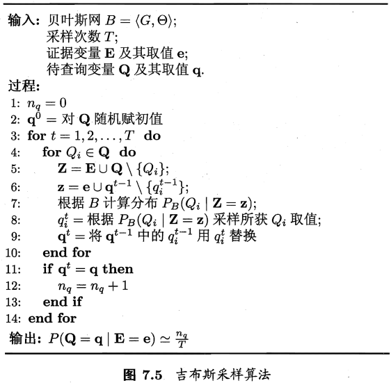

## 7.1 贝叶斯决策论
- 条件概率： $P(A|B) = \frac{P(A\cap B)}{P(B)}$
- 全概率公式： $P(A) = \sum_{i=1}^n P(A|B_i)P(B_i)$
- 贝叶斯公式： $P(B_i|A) = \frac{P(A|B_i)P(B_i)}{P(A)}$

贝叶斯决策论（Bayesian decision theory）是在概率框架下实施决策的基本方法。
在分类问题情况下，在所有相关概率都已知的理想情形下，贝叶斯决策考虑如何基于这些概率和误判损失来选择最优的类别标记。

假设有N种可能的类别标记，即 $y = \{c_1, c_2, \ldots, c_N\}$， $\lambda_{ij}$ 是将一个真实标记为 $c_j$ 的样本误分类为 $c_i$ 所产生的损失。基于后验概率 $P(c_i|\pmb{x})$ 可获得将样本 $\pmb{x}$ 分类为 $c_i$ 所产生的期望损失（expected loss），即在样本上的“条件风险”（conditional risk）： $R(c_i|\pmb{x}) = \sum_{j=1}^N \lambda_{ij}P(c_j|\pmb{x})$。
我们的任务是寻找一个判定准则 $h: \mathcal{X} \rightarrow \mathcal{Y}$ ，以最小化总体风险 $R(h) = \mathbb{E} [R(h(\pmb{x}), \pmb{x})]$ 。
显然，对于每个样本 $\pmb{x}$ 若h能最小化条件风险 $R(h(\pmb{x})|\pmb{x})$，则总体风险 $R(h)$ 也将被最小化。

贝叶斯判定准则（Bayesian decision rule）：为最小化总体风险，只需在每个样本上选择那个能使条件风险 $R(c|\pmb{x})$ 最小的类别标记，即 $h^{*} (\pmb{x}) = \argmin_{c \in \mathcal{Y}} R(c|\pmb{x})$。
- 此时， $h^{*}$ 称为贝叶斯最优分类器（Bayes optimal classifier），与之对应的总体风险 $R(h^{*})$ 称为贝叶斯风险（Bayes risk）。
- $1-R(h^{*})$ 反应了分类器所能达到的最好性能，即通过机器学习所能产生的模型精度的理论上限。

具体来说，若目标是最小化分类错误率，则误判损失 $\lambda_{ij}$ 可以写为 $\lambda_{ij} = \left\{ \begin{array}{ll} 0 &, fi i=j \\ 1 &, otherwise \end{array} \right.$ ，
此时，条件风险 $R(c|\pmb{x}) = 1-P(c|\pmb{x})$ ，
于是，最小化分类错误率的贝叶斯最优分类器为： $h^{*} (\pmb{x}) = \argmax_{c \in \mathcal{Y}} P(c|\pmb{x})$ ，即对于每个样本 $\pmb{x}$ ，选择能使后验概率 $P(c|\pmb{x})$ 最大的类别标记。

不难看出，使用贝叶斯判定准则来最小化决策风险，首先要获得后验概率 $P(c|\pmb{x})$ 。
然而，在现实中通常难以直接获得。机器学习所要实现的是基于有限的训练样本尽可能准确地估计出后验概率 $P(c|\pmb{x})$ 。

主要有两种策略：
- 判别式模型（discriminative model）：
  - 给定 $\pmb{x}$ ，通过直接建模 $P(c|\pmb{x})$ 来预测c。
  - 例：决策树、BP神经网络、支持向量机。
- 生成式模型（generative model）：
  - 先对联合概率分布 $P(\pmb{x}, c)$ 建模，然后再由此获得 $P(c|\pmb{x})$ 。
  - 生成式模型考虑 $P(c|\pmb{x}) = \frac{P(\pmb{x}, c)}{P(\pmb{x})}$ 。

基于贝叶斯定理，生成式模型可以写为 $P(c|\pmb{x}) = \frac{P(\pmb{x}|c)P(c)}{P(\pmb{x})}$ 。
- $P(c)$ ：类“先验”（prior）概率，样本空间中各类样本所占的比例，可通过各类样本出现的频率估计（大数定理）。
- $P(\pmb{x}|c)$ ：样本 $\pmb{x}$ 相对于类标记c的类条件概率（conditional probability），或称为“似然”（likelihood）。
- $P(\pmb{x})$ ：用于归一化的“证据”（evidence）因子。

## 7.2 极大似然估计
估计类条件概率的常用策略：先假定其具有某种确定的概率分布形式，再基于训练样本对概率分布参数估计。
记关于类别c的类条件概率为 $P(\pmb{x}|c)$ ，假设 $P(\pmb{x}|c)$ 具有确定的形式被参数 $\theta_c$ 唯一确定，我们的任务就是利用训练集D估计参数 $\theta_c$ 。

概率模型的训练过程就是参数估计过程，统计学界的两个学派提供了不同的方案：
- 频率主义学派（Frequentist）认为参数虽然未知，但却存在客观值，因此可通过优化似然函数等准则来确定参数值。
- 贝叶斯学派（Bayesian）认为参数是未观察到的随机变量、其本身也可有分布，因此可假定参数服从一个先验分布，然后基于观测到的数据计算参数的后验分布。

极大似然估计——频率主义学派
令 $D_c$ 表示训练集D中第c类样本组成的集合，假设这些样本是独立的，则参数 $\theta_c$ 对于数据集 $D_c$ 的似然是： $P(D_c|\theta_c) = \prod_{\pmb{x} \in D_c} P(\pmb{x}|\theta_c)$ 。
对 $\theta_c$ 进行极大似然估计，寻找能最大化似然 $P(D_c|\theta_c)$ 的参数值 $\hat{\theta}_c$ 。直观上看，极大似然估计是试图在 $\theta_c$ 所有可能的取值中，找到一个使数据出现的“可能性”最大值。
上式的连乘操作易造成下溢，通常使用对数似然（log-likelihood）： $LL(\theta_c) = \log P(D_c|\theta_c) = \sum_{\pmb{x} \in D_c} \log P(\pmb{x}|\theta_c)$ 。
此时，参数 $\theta_c$ 的极大似然估计 $\hat{\theta}_c$ 为： $\hat{\theta}_c = \argmax_{\theta_c} LL(\theta_c)$ 。

> 极大似然估计，是参数估计的方法之一。说的是已知某个随机样本满足某种概率分布，但是其中具体的参数不清楚，参数估计就是通过若干次试验，观察其结果，利用结果推出参数的大概值。极大似然估计是建立在这样的思想上：已知某个参数能使这个样本出现的概率最大，我们当然不会再去选择其他小概率的样本，所以干脆就把这个参数作为估计的真实值。
> 求极大似然函数估计值的一般步骤：
> 1. 写出似然函数；
> 2. 对似然函数取对数，并整理；
> 3. 求导数；
> 4. 解似然方程。（注：有可能解不出方程组，得不到解析解）

例如，在连续属性情形下，假设概率密度函数 $p(\pmb{x}|c) ~ \mathcal{N}(\mu_c, \sigma_c^2)$ ，则参数 $\mu_c$ 和 $\sigma_c^2$ 的极大似然估计分别为：
- $\hat{\mu}_c = \frac{1}{|D_c|} \sum_{\pmb{x} \in D_c} \pmb{x}$
- $\hat{\sigma}_c^2 = \frac{1}{|D_c|} \sum_{\pmb{x} \in D_c} (\pmb{x} - \hat{\mu}_c)(\pmb{x} - \hat{\mu}_c)^T$

也就是说，通过极大似然法得到的正态分布均值就是样本均值，方差就是 $(\pmb{x} - \hat{\mu}_c)(\pmb{x} - \hat{\mu}_c)^T$ 的均值，这显然是一个符合直觉的结果。
需注意的是，这种参数化的方法虽能使类条件概率估计变得相对简单，但估计结果的准确性严重依赖于所假设的概率分布形式是否符合潜在的真实数据分布。

## 7.3 朴素贝叶斯分类器
估计后验概率 $P(c|\pmb{x})$ 主要困难：类条件概率 $P(\pmb{x}|c)$ 是所有属性上的联合概率，难以从有限的训练样本估计获得。
朴素贝叶斯分类器（naïve Bayes classifier）采用了“属性条件独立性假设”（attribute conditional independence assumption）：每个属性独立地对分类结果发生影响。

基于属性条件独立性假设，重写后验概率 $P(c|\pmb{x})$ 为： $P(c|\pmb{x}) = \frac{P(c)P(\pmb{x}|c)}{P(\pmb{x})} = \frac{P(c)}{P(\pmb{x})} \prod_{i=1}^d P(x_i|c)$ ：
- d：属性数目；
- $x_i$： $\pmb{x}$ 在第i个属性上的取值。

由于于对所有类别来说 $P(\pmb{x})$ 相同，因此基于贝叶斯判定准则有： $h_{nb}(\pmb{x}) = \argmax_{c \in \mathcal{Y}} P(c) \prod_{i=1}^d P(x_i|c)$ ，这就是朴素贝叶斯分类器的表达式。

朴素贝叶斯分类器的训练器的训练过程就是基于训练集D来估计类先验概率 $P(c)$ 并为每个属性估计条件概率 $P(x_i|c)$ 。
- 令 $D_c$ 表示训练集D中第c类样本组合的集合，若有充足的独立同分布样本，则可容易地估计出类先验概率。 $P(c) = \frac{|D_c|}{|D|}$ 。
- 对离散属性而言，令 $D_{c, x_i}$ 表示 $D_c$ 中第i个属性上取值为 $x_i$ 的样本组成的集合，则条件概率 $P(x_i|c)$ 可估计为： $P(x_i|c) = \frac{|D_{c, x_i}|}{|D_c|}$ 。
- 对连续属性而言可考虑概率密度函数，假定 $p(x_i|c) ~ \mathcal{N}(\mu_{c, i}, \sigma_{c, i}^2)$ ，其中 $\mu_{c, i}$ 和 $\sigma_{c, i}^2$ 分别是第c类样本在第i个属性上的均值和方差，则有： $P(x_i|c) = \frac{1}{\sqrt{2\pi}\sigma_{c, i}} \exp (-\frac{(x_i - \mu_{c, i})^2}{2\sigma_{c, i}^2})$ 。

若某个属性值在训练集中没有与某个类同时出现过，则直接计算会出现问题，比如“敲声=清脆”测试例，训练集中没有该样例，因此连乘式计算的概率值为0，无论其他属性上明显像好瓜，分类结果都是“好瓜=否”，这显然并不合理。

为了避免其他属性携带的信息被训练集中未出现的属性值“抹去”，在估计概率值时通常要进行“拉普拉斯修正”（Laplace correction）：令N表示训练集D中可能的类别数，$N_i$ 表示第i个属性可能的取值数，则之前的公式分别修正为：
- $\hat{P}(c) = \frac{|D_c| + 1}{|D| + N}$ ；
- $\hat{P}(x_i|c) = \frac{|D_{c, x_i}| + 1}{|D| + N_i}$ 。

现实任务中，朴素贝叶斯分类器的使用：速度要求高，“查表”；任务数据更替频繁，“懒惰学习” （lazy learning）；数据不断增加，增量学习等等。

## 7.4 半朴素贝叶斯分类器
为了降低贝叶斯公式中估计后验概率 $P(c|\pmb{x})$ 的困难，朴素贝叶斯分类器采用的属性条件独立性假设；对属性条件独立假设进行一定程度的放松，由此产生了一类称为“半朴素贝叶斯分类器” （semi-naïve Bayes classifiers）。

半朴素贝叶斯分类器最常用的一种策略：“独依赖估计”（One-Dependence Estimation，ODE），假设每个属性在类别之外最多仅依赖一个其他属性，即： $P(c|\pmb{x}) \propto P(c) \prod_{i=1}^d P(x_i|c, p a_i)$ ，其中 $p a_i$ 为属性 $x_i$ 所依赖的属性，称为 $x_i$ 的父属性（parent attribute）。

对每个属性 $x_i$ ，若其父属性 $p a_i$ 已知，则可估计概率值 $P(x_i|c, p a_i)$ ，于是问题的关键转化为如何确定每个属性的父属性。

最直接的做法是假设所有属性都依赖于同一属性，称为“超父”（super-parent），然后通过交叉验证等模型选择方法来确定超父属性，由此形成了SPODE（Super-Parent ODE）方法。

TAN（Tree Augmented naïve Bayes）则是在最大带权生成树（maximum weighted spanning tree）算法的基础上，通过以下步骤将属性间依赖关系简约为上图所示的树形结构：
1. 计算任意两个属性之间的条件互信息（conditional mutual information）： $I(x_i, x_j|y) = \sum_{x_i, x_j; c \in \mathcal{Y}} P(x_i, x_j, c) \log \frac{P(x_i, x_j|c)}{P(x_i|c)P(x_j|c)}$ ；
2. 以属性为结点构建完全图，任意两个结点之间边的权重设为 $I(x_i, x_j|y)$ ；
3. 构建此完全图的最大带权生成树，挑选根变量，将边设为有向；
4. 加入类别节点y，增加从y到每个属性的有向边。

AODE（Average One-Dependence Estimation）是一种基于集成学习机制、更为强大的分类器。
- 尝试将每个属性作为超父构建 SPODE；
- 将具有足够训练数据支撑的SPODE集群起来作为最终结果。

$P(c|\pmb{x}) \propto \sum_{i=1; |D_{x_i}| \ge m'}^d P(c, x_i) \prod_{j=1}^d P(x_j|c, x_i)$ ：
- $D_{x_i}$ ：在第i个属性上取值为$x_i$ 的样本的集合；
- $m'$ ：阈值常数。

$$
\hat{P} (c, x_i) = \frac{|D_{c, x_i}| + 1}{|D| + N \times N_i}, \\
\hat{P} (x_j|c, x_i) = \frac{|D_{c, x_i, x_j}| + 1}{|D_{c, x_i}| + N_j}
$$
- N：D中可能的类别数；
- $N_i$ ：第i个属性可能的取值数；
- $D_{c, x_i}$ ：类别为c且在第i个属性上取值为 $x_i$ 的样本集合；
- $D_{c, x_i, x_j}$ ：类别为c且在第i和第j个属性上取值分别为 $x_i$ 和 $x_j$ 的样本集合。

## 7.5 贝叶斯网
贝叶斯网（Bayesian network）/“信念网”（belief network）借助有向无环图（Directed Acyclic Graph，DAG）来刻画属性间的依赖关系，并使用条件概率表（Conditional Probability Table，CPT）来描述属性的联合概率分布。

具体来说，一个贝叶斯网B由结构G和参数 $\theta$ 两部分构成，即 $B = (G, \theta)$ 。

...

### 7.5.1 结构
### 7.5.2 学习
### 7.5.3 推断

## 7.6 EM算法
- EM算法是一种迭代算法，用于含有隐变量的概率模型参数的极大似然估计，或极大后验概率估计。
- EM算法的每次迭代由两步组成：E步，求期望（expectation）；M步，求极大（maximization）。

未观测的变量称为“隐变量”（hidden variable）。令 $\pmb{X}$ 表示已观测变量集， $\pmb{Z}$ 表示隐变量集， 若预对模型参数 $\theta$ 做极大似然估计，则应最大化对数似然函数： $LL(\theta|\pmb{X}, \pmb{Z}) = \ln P(\pmb{X}, \pmb{Z}|\theta)$ 。
由于 $\pmb{Z}$ 是隐变量，上式无法直接求解。此时我们可以通过对 $\pmb{Z}$ 计算期望，来最大化已观测数据的对数“边际似然”（marginal likelihood）： $LL(\theta|\pmb{X}) = \ln P(\pmb{X}|\theta) = \ln \sum_{\pmb{Z}} P(\pmb{X}, \pmb{Z}|\theta)$ 。

EM（Expectation-Maximization）算法/期望最大化算法是常用的估计参数隐变量的利器，其基本想法是：
- 若参数 $\theta$ 已知，则可根据训练数据推断出最优隐变量 $\pmb{Z}$ 的值（E步）；
- 若隐变量 $\pmb{Z}$ 的值已知，则可方便地对参数 $\theta$ 做极大似然估计（M步）。

于是，以初始值 $\theta^0$ 为起点，对上述边际似然，可迭代执行以下步骤直至收敛：
- 基于 $\theta^t$ ，推断隐变量 $\pmb{Z}$ 的期望，记为 $\pmb{Z}^t$ ；
- 基于已观测变量 $\pmb{X}$ 和 $\pmb{Z}^t$ ，对参数 $\theta$ 做极大似然估计，记为 $\theta^{t+1}$ 。

这就是EM算法的原型。

进一步，若我们不是取 $\pmb{Z}$ 的期望，而是基于 $\theta^t$ 计算隐变量 $\pmb{Z}$ 的概率分布 $P(\pmb{Z}|\pmb{X}, \theta^t)$ ，EM算法的两个步骤是：
- E步（Expectation）：以当前参数 $\theta^t$ 推断隐变量分布 $P(\pmb{Z}|\pmb{X}, \theta^t)$ ，并计算对数似然 $LL(\theta|\pmb{X}, \pmb{Z})$ 关于 $\pmb{Z}$ 的期望： $Q(\theta|\theta^t) = \mathbb{E}_{\pmb{Z} | \pmb{X}, \theta^t} LL(\theta|\pmb{X}, \pmb{Z})$ ；
- M步（Maximization）：寻找参数最大化期望似然，即： $\theta^{t+1} = \argmax_\theta Q(\theta|\theta^t)$ 。

EM算法使用两个步骤交替计算：第一步计算期望（E步），利用当前估计的参数值计算对数似然的参数值；第二步最大化（M步），寻找能使E步产生的似然期望最大化的参数值……直至收敛到全局最优解。
