## 8.1 个体与集成
集成学习（ensemble learning）通过构建并结合多个学习器来提升性能，也称为多分类器系统（multiple classifier system）、基于委员会的学习（committee-based learning）等。
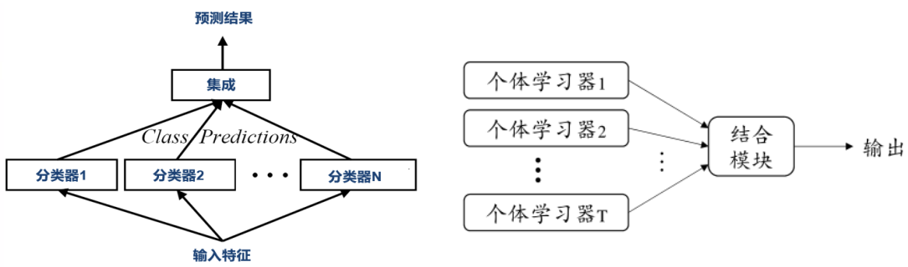

集成学习的目标
- 提升单个模型的性能；
- 在模型选择中，降低选择性能不佳模型的风险；
- 提高鲁棒性和泛化性。

集成学习的一般结构：先产生一组“个体学习器”（individual learner），再用某种策略将它们结合起来。
- “同质”（homogeneous）集成：集成中只包含同种类型的个体学习器，同质集成中的个体学习器亦称“基学习器”（base learner），相应的学习算法称为“基学习算法”（base learning algorithm）。
- “异质”（heterogenous）集成：集成中包含不同类型的个体学习器，异质集成中的个体学习器由不同的学习算法生成，不再有基学习算法；个体学习器常称为“组件学习器”（component learner）或直接称为个体学习器。

集成学习通过将多个学习器进行结合，常可获得比单一学习器显著优越的泛化性能，这对“弱学习器”（weak learner）尤为明显。

例子：在二分类任务中，假定三个分类器在三个测试样本上的表现如图所示，其中√表示分类正确，×表示分类错误，集成学习的结果通过投票法（voting）产生，即“少数服从多数”。
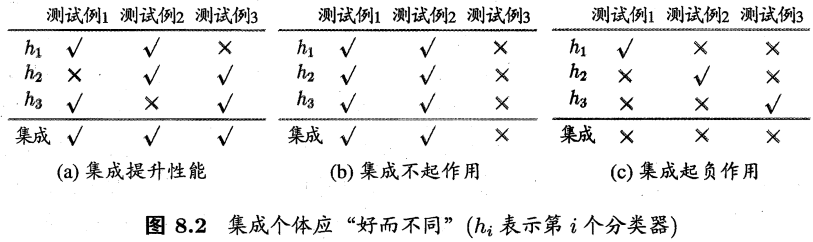

结论：要获得好的集成，个体学习器应“好而不同”，即个体学习器要有一定的“准确性”，即学习器不能太坏，并且要有“多样性”（diversity），即学习器间具有差异。

考虑二分类问题 $y \in \{-1,1\}$ 和真实函数f，假定分类器的错误率为 $\epsilon$ ，即对每个基分类器 $h_i$ ，有 $P(h_i(\pmb{x}) \neq f(\pmb{x})) = \epsilon$ ，
假设集成通过简单投票法结合T个分类器（假设T为奇数），若有超过半数的基分类器正确则分类就正确： $H(\pmb{x}) = \text{sign}(\sum_{i=1}^T h_i(\pmb{x}))$ ，
假设基分类器的错误率相互独立，则由Hoeffding不等式可得集成的错误率为： $P(H(\pmb{x}) \neq f(\pmb{x})) = \sum_{k=0}^{\lfloor T/2 \rfloor} \binom{T}{k} (1-\epsilon)^k \epsilon^{T-k} \leq 2 \exp(-\frac{1}{2} T(1-2\epsilon)^2)$ 。
上式显示，在一定条件下，随着集成中个体分类器数目T的增大、集成的错误率将指数级下降，最终趋向于零。

> 在概率论中，霍夫丁不等式给出了随机变量的和与其期望值偏差的概率上限，该不等式被Wassily Hoeffding于1963年提出并证明。
> 霍夫丁不等式是Azuma-Hoeffding不等式的特例，它比Sergei Bernstein于1923年证明的Bernstein不等式更具一般性。
> 这几个不等式都是McDiarmid不等式的特例。

上面的分析有一个关键假设：基学习器的误差相互独立
- 现实任务中，个体学习器是为解决同一个问题训练出来的，显然不可能互相独立；
- 事实上，个体学习器的“准确性”和“多样性”本身就存在冲突。

如何产生“好而不同”的个体学习器是集成学习研究的核心。

集成学习大致可分为两大类：
- 个体学习器间存在强依赖关系、必须串行生成的序列化方法。代表：Boosting。
- 个体学习器间不存在强依赖关系、可同时生成的并行化方法。代表：Bagging和“随机森林”（Random Forest）。

## 8.2 Boosting
【提升法】
- 个体学习器存在强依赖关系
- 串行生成
- 每次调整训练数据的样本分布

Boosting算法
- 分类器按顺序逐一生成
- 关注最具有“信息量”的数据点
- 训练样本被加权
- 根据加权投票完成模型输出
- 可以建立足够强大的分类器
- 基本学习器可以非常弱小 （优于随机猜测即可）

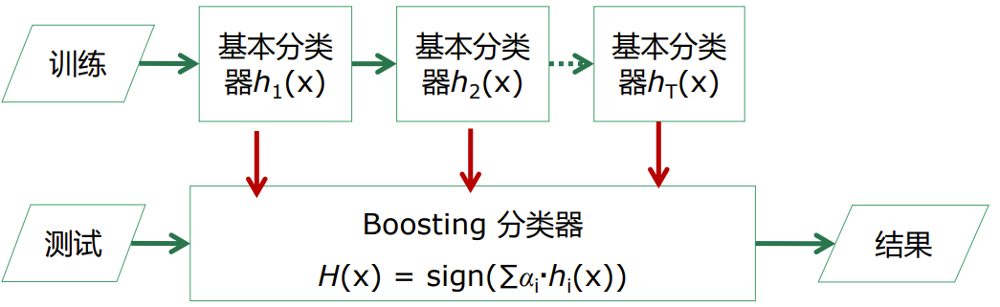

Boosting族算法最著名的代表是AdaBoost：
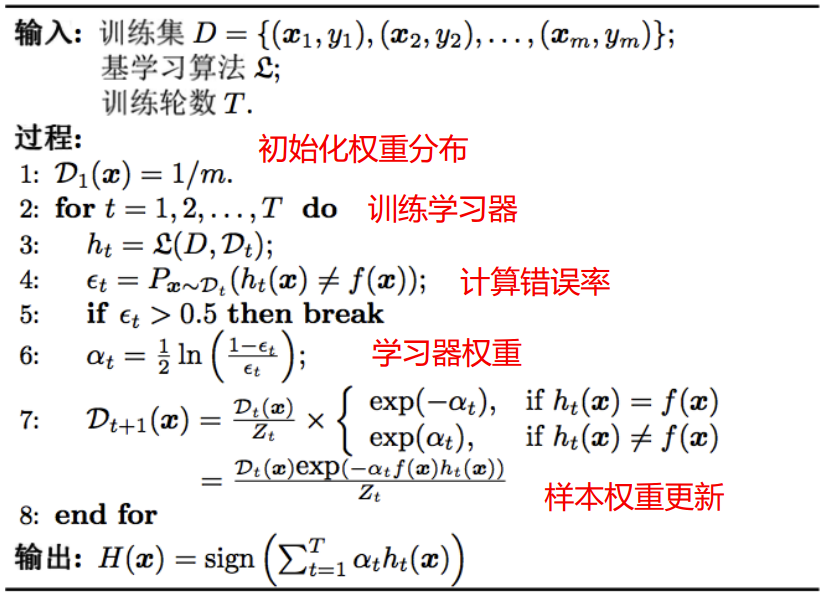

AdaBoost算法有多种推导方式，比较容易理解的是基于“加性模型”（additive model），即基学习器的线性组合： $H(\pmb{x})=\sum_{t=1}^T\alpha_t h_t(\pmb{x})$ 来最小化指数损失函数（exponential loss function）： $\mathcal{l}_{exp}(H|\mathcal{D})=\mathbb{E}_{\pmb{x} \sim \mathcal{D}}[\exp^{-f(\pmb{x})H(\pmb{x})}]$ 。
若 $H(\pmb{x})$ 能令指数损失函数最小化，则上式对 $H(\pmb{x})$ 的骗到为0，即： $\frac{\partial\mathcal{l}_{exp}(H|\mathcal{D})}{\partial H(\pmb{x})} = -e^{-H(\pmb{x})} P(f(\pmb{x})=1|\pmb{x}) + e^{H(\pmb{x})} P(f(\pmb{x})=-1|\pmb{x})$ = 0，
解得： $H(\pmb{x}) = \frac{1}{2}\ln\frac{P(f(\pmb{x})=1|\pmb{x})}{P(f(\pmb{x})=-1|\pmb{x})}$ 。
因此，有：
$$
\begin{aligned}{l}
\operatorname{sign}(H(\boldsymbol{x})) &=\operatorname{sign}\left(\frac{1}{2} \ln \frac{P(f(x)=1 \mid \boldsymbol{x})}{P(f(x)=-1 \mid \boldsymbol{x})}\right) \\
&=\left\{\begin{aligned}{ll}
1 &, P(f(x)=1 \mid \boldsymbol{x})>P(f(x)=-1 \mid \boldsymbol{x}) \\
-1 &, P(f(x)=1 \mid \boldsymbol{x})<P(f(x)=-1 \mid \boldsymbol{x})
\end{aligned}\right. \\
&=\underset{y \in\{-1,1\}}{\arg \max } P(f(x)=y \mid \boldsymbol{x}), \\
\end{aligned}
$$

$\text{sign}(H(\pmb{x}))$ 达到了贝叶斯最优错误率，说明指数损失函数是分类任务原来0/1损失函数的一致（consisten）的替代函数。
当基分类器 $h_t$ 基于分布 $\mathcal{D}_t$ 产生后，该基分类器的权重 $\alpha_t$ 应使得 $\alpha_t h_t$ 最小化指数损失函数：
$$
\begin{aligned}
\ell_{\exp }\left(\alpha_{t} h_{t} \mid \mathcal{D}_{t}\right) & =\mathbb{E}_{\boldsymbol{x} \sim \mathcal{D}_{t}}\left[e^{-f(\boldsymbol{x}) \alpha_{t} h_{t}(\boldsymbol{x})}\right] \\
& =\mathbb{E}_{\boldsymbol{x} \sim \mathcal{D}_{t}}\left[e^{-\alpha_{t}} \mathbb{I}\left(f(\boldsymbol{x})=h_{t}(\boldsymbol{x})\right)+e^{\alpha_{t}} \mathbb{I}\left(f(\boldsymbol{x}) \neq h_{t}(\boldsymbol{x})\right)\right] \\
& =e^{-\alpha_{t}} P_{\boldsymbol{x} \sim \mathcal{D}_{t}}\left(f(\boldsymbol{x})=h_{t}(\boldsymbol{x})\right)+e^{\alpha_{t}} P_{\boldsymbol{x} \sim \mathcal{D}_{t}}\left(f(\boldsymbol{x}) \neq h_{t}(\boldsymbol{x})\right) \\
& =e^{-\alpha_{t}}\left(1-\epsilon_{t}\right)+e^{\alpha_{t}} \epsilon_{t} \quad \quad \epsilon_{t}=P_{\boldsymbol{x} \sim \mathcal{D}_{t}}\left(h_{t}(\boldsymbol{x}) \neq f(\boldsymbol{x})\right)
\end{aligned}
$$

令指数损失函数的导数为0，即： $\frac{\partial \mathcal{l}_{exp}(\alpha_t h_t|\mathcal{D}_t)}{\partial \alpha_t} = -e^{-\alpha_t} (1-\epsilon_t) + e^{\alpha_t} \epsilon_t = 0$ ，解得： $\alpha_t = \frac{1}{2} \ln (\frac{1-\epsilon_t}{\epsilon_t})$ 。
在获得 $H_{t-1}$ 之后的样本分布进行调整，使得下一轮的基学习器 $h_t$ 能纠正 $H_{t-1}$ 的一些错误，理想的 $h_t$ 能纠正全部错误： $\mathcal{l}_{exp}(H_{t-1} + h_t|\mathcal{D}) = \mathbb{E}_{\pmb{x} \sim \mathcal{D}}[e^{-f(\pmb{x}) (H_{t-1} + h_t)(\pmb{x})}] = \mathbb{E}_{\pmb{x} \sim \mathcal{D}}[e^{-f(\pmb{x}) H_{t-1}(\pmb{x})}e^{-f(\pmb{x}) h_t(\pmb{x})}]$ ，
泰勒展开近似为： $\mathcal{l}_{exp}(H_{t-1} + h_t|\mathcal{D}) \approx \mathbb{E}_{\pmb{x} \sim \mathcal{D}}[e^{-f(\pmb{x}) H_{t-1}(\pmb{x})} (1-f(\pmb{x}) h_t(\pmb{x})) + \frac{f^2(\pmb{x}) h_t^2(\pmb{x})}{2}] = \mathbb{E}_{\pmb{x} \sim \mathcal{D}}[e^{-f(\pmb{x}) H_{t-1}(\pmb{x})} (1-f(\pmb{x}) h_t(\pmb{x})+ \frac{1}{2})]$ 。

于是，理想的基学习器：
$$
\begin{aligned}{l}
h_{t}(\boldsymbol{x})&=\arg \min \ell_{\exp }\left(H_{t-1}+h \mid \mathcal{D}\right) \\
&=\underset{h}{\arg \min } \mathbb{E}_{\boldsymbol{x} \sim \mathcal{D}}\left[e^{-f(\boldsymbol{x}) H_{t-1}(\boldsymbol{x})}\left(1-f(\boldsymbol{x}) h(\boldsymbol{x})+\frac{1}{2}\right)\right] \\
&=\underset{h}{\arg \max } \mathbb{E}_{\boldsymbol{x} \sim \mathcal{D}}\left[e^{-f(\boldsymbol{x}) H_{t-1}(\boldsymbol{x})} f(\boldsymbol{x}) h(\boldsymbol{x})\right] \\
&=\underset{h}{\arg \max } \mathbb{E}_{\boldsymbol{x} \sim \mathcal{D}}\left[\frac{e^{-f(\boldsymbol{x}) H_{t-1}(\boldsymbol{x})}}{\mathbb{E}_{\boldsymbol{x} \sim \mathcal{D}}\left[e^{-f(\boldsymbol{x}) H_{t-1}(\boldsymbol{x})}\right]} f(\boldsymbol{x}) h(\boldsymbol{x})\right]
\end{aligned}
$$

注意到 $\mathbb{E}_{\boldsymbol{x} \sim \mathcal{D}} [e^{-f(\boldsymbol{x}) H_{t-1}(\boldsymbol{x})}]$ 是一个常数，令 $\mathcal{D}_t$ 表示一个分布： $\mathcal{D}_t = \frac{\mathcal{D} e^{-f(\boldsymbol{x}) H_{t-1}(\boldsymbol{x})}}{\mathbb{E}_{\boldsymbol{x} \sim \mathcal{D}} [e^{-f(\boldsymbol{x}) H_{t-1}(\boldsymbol{x})}]}$ ，
根据数学期望的定义，这等价于令： $h_t(\boldsymbol{x}) = \argmax_{h} \mathbb{E}_{\boldsymbol{x} \sim \mathcal{D}} [\frac{e^{-f(\boldsymbol{x}) H_{t-1}(\boldsymbol{x})}}{\mathbb{E}_{\boldsymbol{x} \sim \mathcal{D}} [e^{-f(\boldsymbol{x}) H_{t-1}(\boldsymbol{x})}]} f(\boldsymbol{x}) h(\boldsymbol{x})] = \argmax_{h} \mathbb{E}_{\boldsymbol{x} \sim \mathcal{D}_t} [f(\boldsymbol{x}) h(\boldsymbol{x})]$ ，
由 $f(\boldsymbol{x}), h(\boldsymbol{x}) \in \{-1, 1\}$ 有： $f(\boldsymbol{x}) h(\boldsymbol{x}) = 1-2 \mathbb{I} (f(\boldsymbol{x}) \neq h(\boldsymbol{x}))$ ，
则理想的基学习器： $h_t(\boldsymbol{x}) = \argmax_{h} \mathbb{E}_{\boldsymbol{x} \sim \mathcal{D}_t} [\mathbb{I} (f(\boldsymbol{x}) \neq h(\boldsymbol{x}))]$ 。

最终的样本分布更新公式：
$$
\begin{aligned}
\mathcal{D}_{t+1}(\boldsymbol{x}) & =\frac{\mathcal{D}(\boldsymbol{x}) e^{-f(\boldsymbol{x}) H_{t}(\boldsymbol{x})}}{\mathbb{E}_{\boldsymbol{x} \sim \mathcal{D}}\left[e^{-f(\boldsymbol{x}) H_{t}(\boldsymbol{x})}\right]} \\
& =\frac{\mathcal{D}(\boldsymbol{x}) e^{-f(\boldsymbol{x}) H_{t-1}(\boldsymbol{x})} e^{-f(\boldsymbol{x}) \alpha_{t} h_{t}(\boldsymbol{x})}}{\mathbb{E}_{\boldsymbol{x} \sim \mathcal{D}}\left[e^{-f(\boldsymbol{x}) H_{t}(\boldsymbol{x})}\right]} \\
& =\mathcal{D}_{t}(\boldsymbol{x}) \cdot e^{-f(\boldsymbol{x}) \alpha_{t} h_{t}(\boldsymbol{x})} \frac{\mathbb{E}_{\boldsymbol{x} \sim \mathcal{D}}\left[e^{-f(\boldsymbol{x}) H_{t-1}(\boldsymbol{x})}\right]}{\mathbb{E}_{\boldsymbol{x} \sim \mathcal{D}}\left[e^{-f(\boldsymbol{x}) H_{t}(\boldsymbol{x})}\right]}
\end{aligned}
$$

Boosting算法要求基学习器能对特定分布的数据进行学习，即每次都更新样本分布权重，两种方法：“重赋权法”（re-weighting）和“重采样法”（re-sampling）：
- 重赋权法：对每个样本附加一个权重，这时涉及到样本属性与标签的计算，都需要乘上一个权值。
- 重采样法：对于一些无法接受带权样本的及学习算法，适合用“重采样法”进行处理。方法大致过程是，根据各个样本的权重，对训练数据进行重采样，初始时样本权重一样，每个样本被采样到的概率一致，每次从N个原始的训练样本中按照权重有放回采样N个样本作为训练集，然后计算训练集错误率，然后调整权重，重复采样，集成多个基学习器。

从偏差-方差分解来看：Boosting算法主要关注于降低偏差，每轮的迭代都关注于训练过程中预测错误的样本，将弱学习提升为强学习器。从AdaBoost的算法流程来看，标准的AdaBoost只适用于二分类问题。

AdaBoost总结
- 优点
  - 简单且容易实现
  - 基本不包括可调节参数
  - 理论证明了训练误差的上界
- 缺点
  - 非全局最优 $\alpha$ 值
  - 对噪声敏感

## 8.3 Bagging与随机森林
- 个体学习器不存在强依赖关系
- 并行化生成
- 自助采样法

### 8.3.1 Bagging
【行选取，选一部分样本】
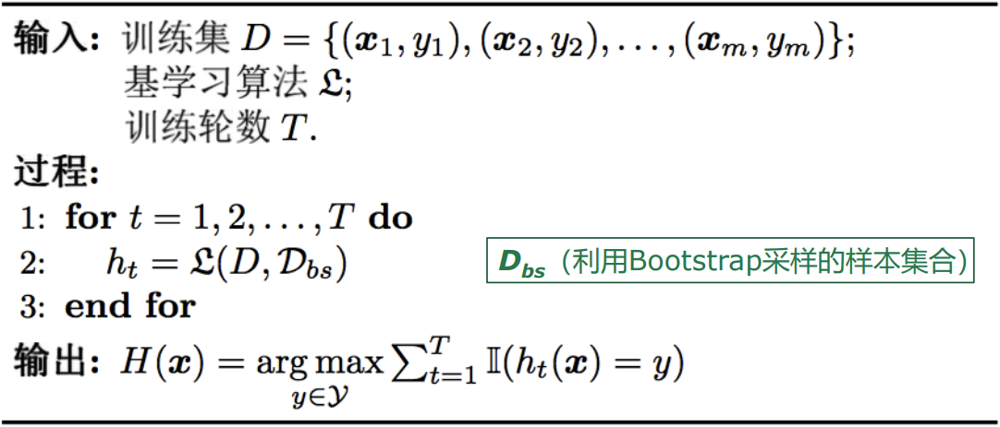
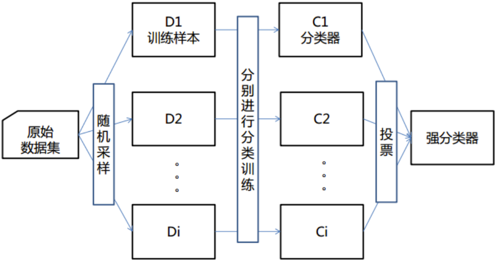

Bagging算法特点
- 时间复杂度低
  - 假定基学习器的计算复杂度为 $O(m)$ ，采样与投票/平均过程的复杂度为 $O(s)$ ，则bagging的复杂度大致为 $T(O(m)+O(s))$ ；
  - 由于 $O(s)$ 很小且T是一个不大的常数；
  - 因此训练一个bagging集成与直接使用基学习器的复杂度同阶。

自助采样（bootstrap sampling）过程还给Bagging带来了另一个优点：由于每个基学习器只使用了初始训练集中约63.2%的样本，剩下约36.8%的样本可用作验证集来对泛化性能进行“包外估计”（out-of-bag estimate）：
$H^{oob}(\pmb{x}) = \argmax_{y \in \mathcal{Y}} \sum_{t=1}^T \mathbb{I}(h_t(\pmb{x}) = y) \cdot \mathbb{I}(\pmb{x} \notin \pmb{D}_t)$ ，
Bagging泛化误差的包外估计为： $\epsilon_{oob} = \frac{1}{|D|} \sum_{(\pmb{x}, y) \in D} \mathbb{I}(H^{oob}(\pmb{x}) \neq y)$ 。

Bagging主要通过样本的扰动来增加基学习器之间的多样性，因此Bagging的基学习器应为那些对训练集十分敏感的不稳定学习算法，例如：神经网络与决策树等。
从偏差-方差分解来看，Bagging算法主要关注于降低方差，即通过多次重复训练提高稳定性。

不同于AdaBoost的是，Bagging可以十分简单地移植到多分类、回归等问题。总的说起来则是：AdaBoost关注于降低偏差，而Bagging关注于降低方差。

### 8.3.2 随机森林
【列选取，选一部分特征】
随机森林（Random Forest，RF）是Bagging的一个扩展变体。RF在以决策树为基学习器构建Bagging集成的基础上，进一步在决策树的训练过程中引入随机属性选择。

随机森林中的树的生成
- 随机且有放回地从训练集中的抽取N个训练样本，形成每棵树；
- 如果每个样本的特征维度为M，指定一个常数 $m<<M$ ，随机地从M个特征中选取m个特征子集，每次树进行分裂时，从这m个特征中选择最优的属性用于划分；
- 注：当m=M时，则基决策树的构建与传统决策树相同；当m=1时，则是随机选择一个属性用于划分；

每棵树都尽最大程度的生长，并且没有剪枝过程
- 随机森林分类效果（错误率）与两个因素有关：
- 森林中任意两棵树的相关性：相关性越大，错误率越大；
- 森林中每棵树的分类能力：每棵树的分类能力越强，整个森林的错误率越低。

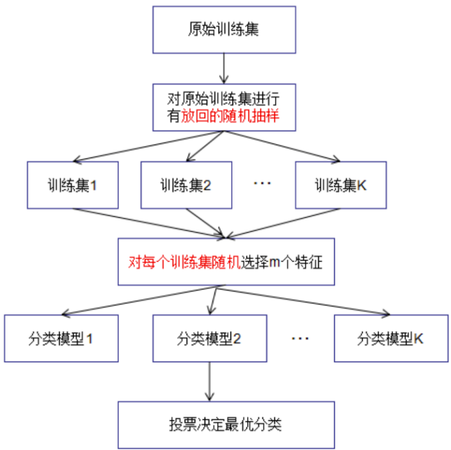

随机森林算法：假如我们的训练集包含了N个样本（Sample），每个样本被D个特征（feature）所描述，那训练一个随机森林主要分为以下几个步骤：
1. 预设模型的超参数，比如森林中有多少树（Num of Learners），每棵树最多几层深度（Max Depth）等。
2. 为了训练每个决策树，我们从完整的数据集(N 个样本，D个feature）中随机采样，选取n个样本，d个feature，从而保证每个决策树看问题的角度都不一样。然后根据每次采样，训练一个决策树。
3. 当每个决策树都完成了训练，输入待测样本集（Test Set），我们再把最后每个树的测试结果整合在一起。对于regression问题，我们通常采用均值的方法将所有结果整合；对于classification问题，我们通常采用mode，即找到所有输出中最多的类别当做最终的输出。

随机森林总结
- 优点
  - 模型随机性强，不容易overfit，抗噪性强，表示对异常点outlier不敏感；
  - 处理高维数据相对更快；
  - 树状结构，模型可解释度高，可以告诉你每个特征的重要性。
- 缺点
  - 模型往往过于General，不具备正确处理过于困难的样本的能力；
  - 模型起点高，但是天花板低。

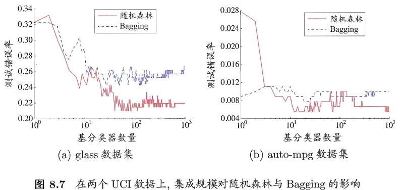

## 8.4 结合策略
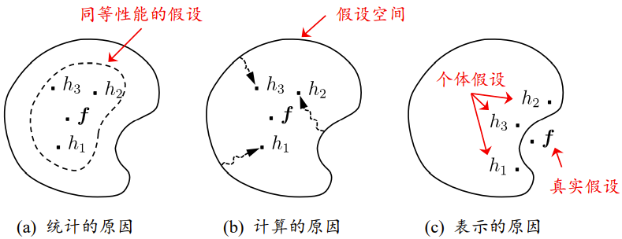
集成学习中学习器的组合可以从三个方面带来好处：
- 统计方面，单学习器可能因误选而导致泛化性能不佳，结合多个学习器会减小这一风险。
- 计算方面，多次运行之后，结合可降低陷入糟糕局部极小点风险。
- 表示方面，结合多个学习器，相应的假设空间有所扩大。有可能学到更好的近似。

### 8.4.1 平均法
【回归问题】

对数值型输出 $h_i(\pmb{x}) \in \mathbb{R}$，最常见的结合策略是使用平均法（averaging）：
- 简单平均法：$H(\pmb{x}) = \frac{1}{T} \sum_{i=1}^T h_i(\pmb{x})$ 。
- 加权平均法：$H(\pmb{x}) = \sum_{i=1}^T w_i h_i(\pmb{x})$ ，其中 $w_i \geq 0$ ，且 $\sum_{i=1}^T w_i = 1$ 。

平均法
- 简单平均法是加权平均法的特例；
- 加权平均法在二十世纪五十年代被广泛使用；
- 集成学习中的各种结合方法都可以看成是加权平均法的变种或特例；
- 加权平均法可认为是集成学习研究的基本出发点；
- 加权平均法未必一定优于简单平均法。

### 8.4.2 投票法
【分类问题】
学习器 $h_i$ 将从类别标记集合 $\{c_1, c_2, \ldots, c_N\}$ 中预测出一个标记，将 $h_i$ 在样本 $\pmb{x}$ 上的预测输出表示为一个N维向量 $(h_i^1(\pmb{x}); h_i^2(\pmb{x}); \ldots; h_i^N(\pmb{x}))$ ，其中 $h_i^j(\pmb{x})$ 是 $h_i$ 在类别标记 $c_j$ 上的输出。
- 绝对多数投票法（majority voting）： $H(\pmb{x}) = \left\{ \begin{array}{ll} c_j &, \text{if } \sum_{i=1}^T h_i^j(\pmb{x}) > \frac{1}{2} \sum_{k=1}^N \sum_{i=1}^T h_i^k(\pmb{x}) \\ \text{reject} &, \text{otherwise} \end{array} \right.$ 。
  - 即若某标记得票过半数，则预测为该标记；否则拒绝预测。
- 相对多数投票法（plurality voting）： $H(\pmb{x}) = c_{\argmax_j \sum_{i=1}^T h_i^j(\pmb{x})}$ 。
  - 即预测为得票最多的标记，若同时有多个标记获最高票，则从中随机选取一个。
- 加权投票法（weighted voting）： $H(\pmb{x}) = c_{\argmax_j \sum_{i=1}^T w_i h_i^j(\pmb{x})}$ 。
  - 与加权平均法类似， $w_i$ 是 $h_i$ 的权重，通常 $w_i \geq 0, \sum_{i=1}^T w_i = 1$ 。

在现实任务中，不同类型个体学习器可能产生不同类型的 $h_i^j(\pmb{x})$ 值，常见的有：
- 类标记： $h_i^j(\pmb{x}) \in \{0, 1\}$ ，若 $h_i$ 将样本 $\pmb{x}$ 预测为类别 $c_j$ 则取值为1，否则取值为0。使用类标记的投票亦称“硬投票”（hard voting）。
- 类概率： $h_i^j(\pmb{x}) \in [0, 1]$ ，相当于对后验概率 $P(c_j|\pmb{x})$ 的一个估计，使用类概率的投票亦称“软投票”（soft voting）。

若基学习器的类型不同，则其类概率值不能直接进行比较；在此种情形下，通常可将类概率输出转化为类标记输出（例如将类概率输出最大的 $h_i^j(\pmb{x})$ 设为1，其他设为0）然后再投票。

### 8.4.3 学习法
当训练数据很多时，一种更为强大的结合策略是使用“学习法”，即通过另一个学习器来进行结合。Stacking是学习法的典型代表。
- 初级学习器：个体学习器
- 次级学习器/元学习器（meta-learner）：用于结合的学习器

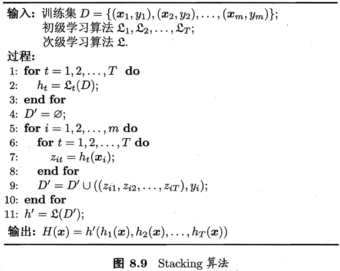

将初级学习器的输出类概率作为次级学习器的输入属性，用多响应线性回归（Multi-response Linear Regression，MLR）作为次级学习算法效果较好。
Stacking通常优于贝叶斯模型平均（Bayesian Model Averaging，BMA）。

## 8.5 多样性

### 8.5.1 误差-分歧分解
欲构建泛化能力强的集成，个体学习器应“好而不同”。

假定我们用个体学习器 $h_1, h_2, \ldots, h_T$ 通过加权平均法结合产生的集成来完成回归学习任务 $f: \mathbb{R}^d \rightarrow \mathbb{R}$ 。

对示例 $\pmb{x}$ ，定义学习器 $h_i$ 的“分歧”（ambiguity）为： $A(h_i|\pmb{x}) = (h_i(\pmb{x}) - H(\pmb{x}))^2$ ，
则集成的“分歧”是： $\overline{A}(\pmb{x}) = \sum_{i=1}^T w_i A(h_i|\pmb{x}) = \sum_{i=1}^T w_i (h_i(\pmb{x}) - H(\pmb{x}))^2$ 。

“分歧”项代表了个体学习器在样本 $\pmb{x}$ 上的不一致性，即在一定程度上反映了个体学习器的多样性。个体学习器 $h_i$ 和集成H的平方误差分别为：
- 个体： $E(h_i|\pmb{x}) = (f(\pmb{x}) - h_i(\pmb{x}))^2$
- 集成： $E(H|\pmb{x}) = (f(\pmb{x}) - H(\pmb{x}))^2$

令 $\overline{E}(h|\pmb{x}) = \sum_{i=1}^T w_i E(h_i|\pmb{x})$ ，表示个体学习器误差的加权均值，有： $\overline{A}(h|\pmb{x}) = \sum_{i=1}^T w_i E(h_i|\pmb{x}) - E(H|\pmb{x}) = \overline{E}(h|\pmb{x}) - E(H|\pmb{x})$ 。
上式对所有样本 $\pmb{x}$ 均成立，令 $p(\pmb{x})$ 表示样本的概率密度，则在全样本上有： $\sum_{i=1}^T w_i \int A(h_i|\pmb{x}) p(\pmb{x}) d\pmb{x} = \sum_{i=1}^T w_i \int E(h_i|\pmb{x}) p(\pmb{x}) d\pmb{x} - \int E(H|\pmb{x}) p(\pmb{x}) d\pmb{x}$ 。

个体学习器 $h_i$ 在全样本上的泛化误差和分歧项分别为：
- 泛化误差： $E_i = \int E(h_i|\pmb{x}) p(\pmb{x}) d\pmb{x}$
- 分歧项： $A_i = \int A(h_i|\pmb{x}) p(\pmb{x}) d\pmb{x}$

集成的泛化误差为： $E = \int E(H|\pmb{x}) p(\pmb{x}) d\pmb{x}$ 。

令 $\overline{E} = \sum_{i=1}^T w_i E_i$ 表示个体学习器泛化误差的加权均值， $\overline{A} = \sum_{i=1}^T w_i A_i$ 表示个体学习器的加权分歧项，有： $E = \overline{E} - \overline{A}$ 。
这个漂亮的式子显示：个体学习器精确性越高、多样性越大，则集成效果越好。称为“误差-分歧分解”（error-ambiguity decomposition）。

为什么不能直接把 $\overline{E} - \overline{A}$ 作为优化目标来求解？
现实任务中很难直接对 $\overline{E} - \overline{A}$ 进行优化：
- 它们定义在整个样本空间上；
- $\overline{A}$ 不是一个可直接操作的多样性度量；
- 上面的推导过程只适用于回归学习，难以直接推广到分类学习任务上去。

### 8.5.2 多样性度量
多样性度量（diversity measure）/差异性度量是用于度量集成中个体分类器的多样性，即估算个体学习器的多样化程度。

对二分类任务， $y_i \in \{-1, +1\}$ ，分类器 $h_i$ 与 $h_j$ 的预测结果联表（contingency table）为（ $a+b+c+d=m$ ）：
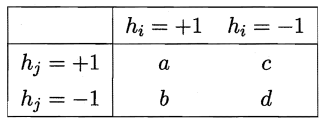

些常见的多样性度量：
- 不合度量（disagreement measure）： $\text{dis}_{ij} = \frac{b+c}{m}$ 。
  - $\text{dis}_{ij}$ 的值域为 $[0, 1]$ ，值越大则多样性越大。
- 相关系数（correlation coefficient）： $\rho_{ij} = \frac{ad-bc}{\sqrt{(a+b)(a+c)(c+d)(b+d)}}$ 。
  - $\rho_{ij}$ 的值域为 $[-1, 1]$ 。若 $h_i$ 与 $h_j$ 无关，则值为 0；若 $h_i$ 与 $h_j$ 正相关则值为正，否则为负。
- Q-统计量（Q-statistic）： $Q_{ij} = \frac{ad-bc}{ad+bc}$ 。
  - $Q_{ij}$ 与相关系数 $\rho_{ij}$ 的符号相同，且 $|Q_{ij}| \leq | \rho_{ij} |$ 。
- $\kappa$ 统计量（$\kappa$-statistic）： $\kappa = \frac{p_1-p_2}{1-p_2}$ 。
  - 两个分类器取得一致的概率： $p_1 = \frac{a+d}{m}$ 。
  - 两个分类器偶然达成一致的概率： $p_2 = \frac{(a+b)(a+c)+(c+d)(b+d)}{m^2}$ 。

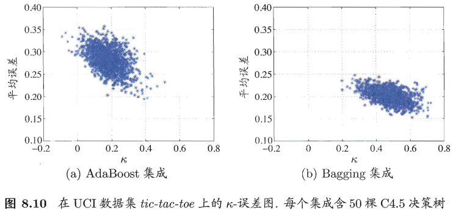

### 8.5.3 多样性增强
数据样本扰动
- 通常是基于采样法（Bagging中的自助采样法、Adaboost中的序列采样）
- 对数据样本的扰动敏感的基学习器（不稳定基学习器）很有效，如：决策树、神经网络等。
- 对数据样本的扰动不敏感的基学习器（稳定基学习器）没有效，如：线性学习器，支持向量机，朴素贝叶斯，k近邻等。

输入数据扰动
- 随机子空间（random subspace）算法从初始属性集中抽取出若干个属性子集，再基于每个属性子集训练一个基训练器。
- 由于冗余属性多，减少一些属性后训练出的个体学习器也不至于太差。若数据只包含少量属性，或者冗余属性很少，则不宜使用输入属性扰动法。

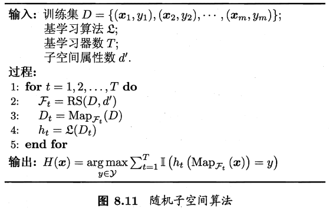

输出表示扰动
- 基本思路：对输出表示进行操纵以增强多样性
- 对训练样本的类标记稍作改动。
  - “翻转法”（Flipping Outpout）：随机改变一些训练样本的标记。
- 对输出表示进行转化。
  - “输出调制法”（Output Smearing）：将分类输出转化为回归输出后构建个体学习器。
- 将原任务拆解为多个可同时求解的子任务。
  - ECOC法：利用纠错输出码将多分类任务拆解为一系列二分类任务来训练基学习器。

算法参数扰动
- “负相关法”（Negative Correlation）：通过正则化项来强调个体神经网络使用不同的参数。
- 不同的多样性增强机制同时使用。
