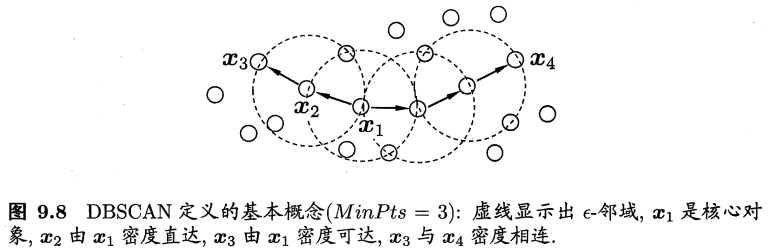

## 9.1 聚类任务
在“无监督学习”（unsupervised learning）任务中研究最多、应用最广的是“聚类”（clustering）。
聚类目标：将数据集中的样本划分为若干个通常不相交的子集（“簇”，cluster）。
聚类既可以作为一个单独过程（用于找寻数据内在的分布结构），也可作为分类等其他学习任务的前驱过程。

形式化描述：假定样本集 $D=\{\pmb{x}_1, \pmb{x}_2, \ldots, \pmb{x}_m\}$ 包含m个无标记样本，每个样本 $\pmb{x}_i = (x_{i1}, x_{i2}, \ldots, x_{in})^T$ 是一个n维的特征向量，聚类算法将样本集D划分成k个不相交的簇 $\{C_l | l=1,2,\ldots,k\}$，其中 $C_{l'} \cap_{l' \neq l} C_l = \emptyset$，且 $D=\bigcup_{l=1}^k C_l$。
相应地，用 $\lambda_j \in \{1,2,\ldots,k\}$ 表示样本 $\pmb{x}_j$ 的“簇标记”（cluster label），即 $\pmb{x}_j \in C_{\lambda_j}$。于是，聚类的结果可用包含m个元素的簇标记向量 $\pmb{\lambda} = (\lambda_1; \lambda_2; \ldots; \lambda_m)$ 表示。

## 9.2 性能度量
聚类性能度量，亦称为聚类“有效性指标”（validity index）。

直观来讲：我们希望“物以类聚”，即同一簇的样本尽可能彼此相似，不同簇的样本尽可能不同。换言之，聚类结果的“簇内相似度”（intra-cluster similarity）高，且“簇间相似度”（inter-cluster similarity）低，这样的聚类效果较好。

聚类性能度量：
- 外部指标（external index）：将聚类结果与某个“参考模型”（reference model）进行比较。
- 内部指标（internal index）：直接考察聚类结果而不用任何参考模型。

对数据集 $D = \{\pmb{x}_1, \pmb{x}_2, \ldots, \pmb{x}_m\}$，假定通过聚类得到的簇划分为 $\mathcal{C}=\{C_1, C_2, \ldots, C_k\}$，参考模型给出的簇划分为 $\mathcal{C}^{*} = \{C_{1}^{*}, C_{2}^{*}, \ldots, C_{s}^{*}\}$。相应地，令 $\pmb{\lambda}$ 与 $\pmb{\lambda}^*$ 分别表示与 $\mathcal{C}$ 和 $\mathcal{C}^{*}$ 对应的簇标记向量。

我们将样本两两配对考虑，定义：
- $a = |SS|, SS = \{\pmb{x}_i, \pmb{x}_j | \lambda_i = \lambda_j, \lambda_i^* = \lambda_j^*, i < j\}$
- $b = |SD|, SD = \{\pmb{x}_i, \pmb{x}_j | \lambda_i = \lambda_j, \lambda_i^* \neq \lambda_j^*, i < j\}$
- $c = |DS|, DS = \{\pmb{x}_i, \pmb{x}_j | \lambda_i \neq \lambda_j, \lambda_i^* = \lambda_j^*, i < j\}$
- $d = |DD|, DD = \{\pmb{x}_i, \pmb{x}_j | \lambda_i \neq \lambda_j, \lambda_i^* \neq \lambda_j^*, i < j\}$

外部指标：
- Jaccard系数（Jaccard Coefficient，JC）： $JC = \frac{a}{a+b+c}$
- FM指数（Fowlkes and Mallows Index，FMI）： $FMI = \sqrt{\frac{a}{a+b} \cdot \frac{a}{a+c}}$
- Rand指数（Rand Index，RI）： $RI = \frac{2(a+d)}{m(m-1)}$

上述性能度量的结果值均在 $[0,1]$ 区间，值越大越好。

考虑聚类结果的簇划分 $\mathcal{C} = \{C_1, C_2, \ldots, C_k\}$，定义：
- 簇 $C$ 内样本间的平均距离： $\text{avg} (C) = \frac{2}{|C|(|C|-1)} \sum_{1 \leq i < j \leq |C|} \text{dist}(\pmb{x}_i, \pmb{x}_j)$
- 簇 $C$ 内样本间的最远距离： $\text{diam} (C) = \max_{1 \leq i < j \leq |C|} \text{dist}(\pmb{x}_i, \pmb{x}_j)$
- 簇 $C_i$ 与簇 $C_j$ 最近样本间的距离： $d_{min} (C_i, C_j) = \min_{\pmb{x}_i \in C_i, \pmb{x}_j \in C_j} \text{dist}(\pmb{x}_i, \pmb{x}_j)$
- 簇 $C_i$ 与簇 $C_j$ 中心点间的距离： $d_{cen} (C_i, C_j) = \text{dist}(\pmb{\mu}_i, \pmb{\mu}_j)$

内部指标：
- DB指数（Davies-Bouldin Index，DBI）： $DBI = \frac{1}{k} \sum_{i=1}^k \max_{j \neq i} (\frac{\text{avg}(C_i) + \text{avg}(C_j)}{d_{cen}(C_i, C_j)})$
- Dunn指数（Dunn Index，DI）： $DI = \min_{1 \leq i < k}\{ \min_{j \neq i} (\frac{d_{min}(C_i, C_j)}{\max_{1 \leq l \leq k} \text{diam}(C_l)})\}$

DBI的值越小越好，而DI则相反，值越大越好。

# 9.3 距离计算
对函数 $\text{dist}(\cdot,\cdot)$ ，若它是一个“距离度量”（distance measure），则需满足一些基本性质：
- 非负性： $\text{dist}(\pmb{x}_i, \pmb{x}_j) \geq 0$ ；
- 同一性： $\text{dist}(\pmb{x}_i, \pmb{x}_j) = 0$ 当且仅当 $\pmb{x}_i = \pmb{x}_j$ ；
- 对称性： $\text{dist}(\pmb{x}_i, \pmb{x}_j) = \text{dist}(\pmb{x}_j, \pmb{x}_i)$ ；
- 直递性/三角不等式： $\text{dist}(\pmb{x}_i, \pmb{x}_j) \leq \text{dist}(\pmb{x}_i, \pmb{x}_k) + \text{dist}(\pmb{x}_k, \pmb{x}_j)$ 。

给定样本 $\pmb{x}_i = (x_{i1}; x_{i2}; \ldots; x_{in})$ 与 $\pmb{x}_j = (x_{j1}; x_{j2}; \ldots; x_{jn})$ ，最常用的是：“闵可夫斯基距离”（Minkowski distance）： $\text{dist}_{mk} (\pmb{x}_i, \pmb{x}_j) = \left( \sum_{u=1}^n |x_{iu} - x_{ju}|^p \right)^{\frac{1}{p}}$ 。
- $p \rightarrow \infty$ 时，得到“切比雪夫距离”（Chebyshev distance）： $\text{dist}_{cb} (\pmb{x}_i, \pmb{x}_j) = \max_{u=1}^n |x_{iu} - x_{ju}|$ ；
- $p = 2$ 时，得到“欧氏距离”（Euclidean distance）： $\text{dist}_{ed} (\pmb{x}_i, \pmb{x}_j) = \| \pmb{x}_i - \pmb{x}_j \|_2 = \sqrt{\sum_{u=1}^n |x_{iu} - x_{ju}|^2}$ ；
- $p = 1$ 时，得到“曼哈顿距离”（Manhattan distance）： $\text{dist}_{man} (\pmb{x}_i, \pmb{x}_j) = \| \pmb{x}_i - \pmb{x}_j \|_1 = \sum_{u=1}^n |x_{iu} - x_{ju}|$ ；
- $p = 0$ 时 $\text{dist}_{ham} (\pmb{x}_i, \pmb{x}_j) = \| \pmb{x}_i - \pmb{x}_j \|_0 = \sum_{u=1}^n \mathbb{I}(x_{iu} \neq x_{ju})$ ；

属性介绍
- 连续属性（continuous attribute）：在定义域上有无穷多个可能的取值；
- 离散属性（categorical attribute）：在定义域上是有限个可能的取值。
- 有序属性（ordinal attribute）：例如定义域为 $\{1,2,3\}$ 的离散属性，“1”与“2”比较接近、与“3”比较远，称为“有序属性”；
- 无序属性（non-ordinal attribute）：例如定义域为 $\{飞机，火车，轮船\}$ 这样的离散属性，不能直接在属性值上进行计算，称为“无序属性”。

对于无序属性可采用VDM（Value Difference Metric）：令 $m_{u, a}$ 表示在属性u上取值为a的样本数， $m_{u, a, i}$ 表示在第i个样本簇中在属性u上取值为a的样本数，k为样本数，则属性u上两个离散值a与b之间的VDM距离为： $\text{VDM}_p (a, b) = \sum_{i=1}^k | \frac{m_{u, a, i}}{m_{u, a}} - \frac{m_{u, b, i}}{m_{u, b}} |^p$ 。

MinkovDM_p（将闵可夫斯基距离与VDM结合处理混合属性）： $MinKovDM_p (\pmb{x}_i, \pmb{x}_j) = (\sum_{u=1}^{n_c} |x_{iu} - x_{ju}|^p + \sum_{u=n_c+1}^n \text{VDM}_p (x_{iu}, x_{ju}))^{\frac{1}{p}}$ 。

“加权距离”（weighted distance）（样本空间中不同属性的重要性不同时），以加权闵可夫斯基距离为例： $\text{dist}_{wmk} (w_1 \cdot |x_{i1} - x_{j1}|^p + \ldots + w_n \cdot |x_{in} - x_{jn}|^p)^{\frac{1}{p}} \quad w_i \ge 1, \quad \sum_{i=1}^n w_i = 1$ 。

## 9.4 原型聚类
原型聚类也称为“基于原型的聚类”（prototype-based clustering)，此类算法假设聚类结构能通过一组原型刻画。
算法过程：通常情况下，算法先对原型进行初始化，再对原型进行迭代更新求解。
接下来，介绍几种著名的原型聚类算法k均值算法、学习向量量化算法、高斯混合聚类算法。

### 9.4.1 k均值聚类
给定样本集 $D = \{ \pmb{x}_1, \ldots, \pmb{x}_m \}$ ，k均值算法针对聚类所得簇划分 $\mathcal{C} = \{C_1, \ldots, C_k\}$ 最小化平方和误差 $E = \sum_{i=1}^k \sum_{\pmb{x} \in C_j} \|\pmb{x} - \pmb{\mu}_j\|_2^2$ ，其中， $\pmb{\mu}_i = \frac{1}{|C_i|} \sum_{\pmb{x} \in C_i} \pmb{x}$ 为簇 $C_i$ 的均值向量。
E值在一定程度上刻画了簇内样本围绕簇均值向量的紧密程度，E值越小，则簇内样本相似度越高。

### 9.4.2 学习向量量化
学习向量量化（Learning Vector Quantization, LVQ）与k均值算法类似，也是试图找到一组原型向量来刻画聚类结构。
与一般聚类算法不同的是，LVQ假设数据样本带有类别标记，学习过程中利用样本的这些监督信息来辅助聚类。

给定样本集 $D = \{ (\pmb{x}_1, y_1), (\pmb{x}_2, y_2), \ldots, (\pmb{x}_m, y_m) \}$ ，LVQ的目标是学得一组n维原型向量 $\{p_1, p_2, \ldots, p_q\}$ ，每个原型向量代表一个聚类簇。

聚类效果：

### 9.4.3 高斯混合聚类
与k均值、LVQ用原型向量来刻画聚类结构不同，高斯混合聚类（Mixture-of-Gaussian）采用概率模型来表达聚类原型。
多元高斯分布的定义：对n维样本空间中的随机向量 $\mathcal{X}$ ，若 $\pmb{x}$ 服从高斯分布，其概率密度函数为： $p(\pmb{x}) = \frac{1}{(2\pi)^{n/2}|\Sigma|^{\frac{1}{2}}} e^{-\frac{1}{2}(\pmb{x}-\pmb{\mu})^T \Sigma^{-1} (\pmb{x}-\pmb{\mu})}$ ，其中， $\pmb{\mu}$ 是n维均值向量， $\Sigma$ 是n维协方差矩阵。也可将概率密度函数记作 $p(\pmb{x}|\pmb{\mu}, \Sigma)$ 。

高斯混合分布的定义： $p_{\mathcal{M}}(\pmb{x}) = \sum_{i=1}^k \alpha_i p(\pmb{x}|\pmb{\mu}_i, \Sigma_i)$ ，
该分布由k个混合分布组成，每个分布对应一个高斯分布。其中， $\pmb{\mu}_i$ 与 $\Sigma_i$ 是第i个高斯混合成分的参数。而 $\alpha_i > 0$ 为相应的“混合系数”， $\sum_{i=1}^k \alpha_i = 1$ 。

假设样本的生成过程由高斯混合分布给出：
- 首先，根据 $\alpha_1, \alpha_2, \ldots, \alpha_k$ 定义的先验分布选择高斯混合成分，其中 $\alpha_i$ 为选择第i个混合成分的概率；
- 然后，根据被选择的混合成分的概率密度函数进行采样，从而生成相应的样本。

模型求解：最大化（对数）似然
$LL(D) = \ln (\prod_{j=1}^m p_{\mathcal{M}}(\pmb{x}_j)) = \sum_{j=1}^m \ln (\sum_{i=1}^k \alpha_i \cdot p(\pmb{x}_j|\pmb{\mu}_i, \Sigma_i))$ ，
- 由 $\frac{\partial LL(D)}{\partial \mu_i} = 0$ 有： $\sum_{j=1}^m \frac{\alpha_i \cdot p(\pmb{x}_j|\pmb{\mu}_i, \Sigma_i)}{\sum_{i=1}^k \alpha_l \cdot p(\pmb{x}_j|\pmb{\mu}_l, \Sigma_l)} (\pmb{x}_j - \pmb{\mu}_i) = 0$ ；
- 由 $\frac{\partial LL(D)}{\partial \Sigma_i} = 0$ 有： $\Sigma_i = \frac{\sum_{j=1}^m \gamma_{ji} (\pmb{x}_j - \pmb{\mu}_i)(\pmb{x}_j - \pmb{\mu}_i)^T}{\sum_{j=1}^m \gamma_{ji}}$ ；

高斯混合聚类算法伪代码：

高斯混合聚类算法聚类效果：

## 9.5 密度聚类
密度聚类也称为“基于密度的聚类”（density-based clustering）。
此类算法假设聚类结构能通过样本分布的紧密程度来确定。
通常情况下，密度聚类算法从样本密度的角度来考察样本之间的可连接性，并基于可连接样本不断扩展聚类簇来获得最终的聚类结果。

接下来介绍DBSCAN这一密度聚类算法。
DBSCAN算法：基于一组“邻域”（neighborhood）参数 $(\epsilon, MinPts)$ 来刻画样本分布的紧密程度。

给定数据集 $D=\{\pmb{x}_1, \pmb{x}_2, \ldots, \pmb{x}_m\}$ ，定义下面几个概念：
- $\epsilon$ 邻域：对 $\pmb{x}_j \in D$ ，其 $\epsilon-$ 邻域包含样本集D中与 $\pmb{x}_j$ 的距离不大于 $\epsilon$ 的样本，即 $N_{\epsilon}(\pmb{x}_j) = \{\pmb{x}_i \in D | \text{dist}(\pmb{x}_i, \pmb{x}_j) \leq \epsilon\}$ 【 $\text{dist}(\cdot,\cdot)$ 默认为欧氏距离】
- 核心对象（core object）：若 $\pmb{x}_j$ 的 $\epsilon-$ 邻域至少包含MinPts个样本，即 $|N_{\epsilon}(\pmb{x}_j)| \geq MinPts$ ，则 $\pmb{x}_j$ 是一个核心对象；
- 密度直达（directly density-reachable）：若 $\pmb{x}_j$ 位于 $\pmb{x}_i$ 的 $\epsilon-$ 邻域中，且 $\pmb{x}_i$ 是核心对象，则称 $\pmb{x}_j$ 由 $\pmb{x}_i$ 密度直达【密度直达关系通常不满足对称性】；
- 密度可达（density-reachable）：对 $\pmb{x}_i$ 与 $\pmb{x}_j$ ，若存在样本序列 $\pmb{p}_i, \pmb{p}_1, \ldots, \pmb{p}_n$ ，其中 $\pmb{p}_1 = \pmb{x}_i$ ，$\pmb{p}_n = \pmb{x}_j$ ，且 $\pmb{p}_{i+1}$ 由 $\pmb{p}_i$ 密度直达，则称 $\pmb{x}_j$ 由 $\pmb{x}_i$ 密度可达【密度可达关系满足直递性，但不满足对称性】；
- 密度相连（density-connected）：对 $\pmb{x}_i$ 与 $\pmb{x}_j$ ，若存在 $\pmb{x}_k$ 使得 $\pmb{x}_i$ 与 $\pmb{x}_j$ 均由 $\pmb{x}_k$ 密度可达，则称 $\pmb{x}_i$ 与 $\pmb{x}_j$ 密度相连【密度相连关系满足对称性】。

“簇”
- 定义：由密度可达关系导出的最大密度相连样本集合。
- 形式化描述：给定邻域参数 $(\epsilon, MinPts)$ ，簇 $C \subseteq D$ 是满足一下性质的非空样本子集：
  - 连接性（connectivity）： $\pmb{x}_i \in C, \pmb{x}_j \in C \Rightarrow \pmb{x}_i$ 与 $\pmb{x}_j$ 密度相连；
  - 最大性（maximality）：若 $\pmb{x}_i \in C$ ， $\pmb{x}_j$ 由 $\pmb{x}_i$ 密度可达， $\Rightarrow \pmb{x}_j \in C$ 。

实际上，若 $\pmb{x}$ 为核心对象，由 $\pmb{x}$ 密度可达的所有样本本组成的集合记为 $X = \{\pmb{x}' \in D | \pmb{x}'$ 由 $\pmb{x}$ 密度可达$\}$ ，则 $X$ 为满足连接性与最大性的簇。

DBSAN算法伪代码：

DBSAN算法聚类效果：

## 9.6 层次聚类
层次聚类（hierarchical clustering）试图在不同层次对数据集进行划分，从而形成树形的聚类结构。数据集划分既可采用“自底向上”的聚合策略，也可采用“自顶向下”的分拆策略。

AGNES算法（自底向上的层次聚类算法）
- 首先，将样本中的每一个样本看做一个初始聚类簇；
- 然后在算法运行的每一步中找出距离最近的两个聚类簇进行合并；
- 该过程不断重复，直到达到预设的聚类簇的个数。

给定聚类簇 $C_i$ 与 $C_j$ ，可通过下面的式子来计算距离：
- 最小距离： $d_{min}(C_i, C_j) = \min_{\pmb{x}_i \in C_i, \pmb{z} \in C_j} \text{dist}(\pmb{x}, \pmb{z})$ ，
- 最大距离： $d_{max}(C_i, C_j) = \max_{\pmb{x}_i \in C_i, \pmb{z} \in C_j} \text{dist}(\pmb{x}, \pmb{z})$ ，
- 平均距离： $d_{avg}(C_i, C_j) = \frac{1}{|C_i| |C_j|} \sum_{\pmb{x}_i \in C_i} \sum_{\pmb{z} \in C_j} \text{dist}(\pmb{x}, \pmb{z})$ 。

AGNES算法树状图：

AGNES算法伪代码：

AGNES算法聚类效果：

